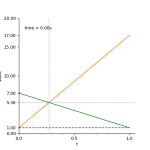

### 17.1.1贝塞尔曲线

### 一阶

如图：点p，0秒的时候在位置7，1秒的时候在位置17。问：0.5秒的时候在哪个位置。

假如点p，是匀速从7到17。

问t秒时点p在什么位置？

运用公式就可算出

* $p(t) = 7(1-t)+17t $

更一般的公式为

* $p(t) = p_0 + t(p_1-p_0) = (1-t)p_0 + t p_1$  $t \in [0,1]$

这就是**一阶贝塞尔**

显示成与时间的关系如图：

以上是起点：7，终点17 的一阶贝塞尔

如果我们以上变换看作是二维空间的x坐标随时间的变换。

另外我们有一个y坐标坐标变换是，起点：5，终点10

即：

组合两个变换：

#### 二阶

二阶贝塞尔是由两个一阶贝塞尔插值得到的。

添加一个控制点如1

我们得到两个一阶贝塞尔  

*  $p_1(t) = 7(1-t)+1t $
*  $p_2(t) = 1(1-t)+17t $

将时刻t的$p_1(t)$ 和 $p_2(t)$作为起点和终点再进行插值得到二阶贝塞尔

* $p_3(t) = p_1(t)(1-t)+p_2(t)t $

代入得：

* $p_3(t) =(1−t)^2*7+ 2(1−t)t*1+t^2*17$

更一般的公式为：

* $ p(t)  =(1−t)^2*p_0+ 2(1−t)t*p_1+t^2*p_2$

导数为

$ p'(t)  =(2t -2)*p_0+(2-4t)*p_1+2tp_2$

如图：

实际中的运动大概是

在$t\approx 0.27$时速度为0，之后开始反向运动。

其速度曲线为：

起始速度为-12，到$t\approx 0.27$时速度为0，后面线性加速到32

以上是起点：7，终点17，控制点1。的二阶贝塞尔

如果我们以上变换看作是二维空间的x坐标随时间的变换。

另外我们有一个y坐标坐标变换是，起点：5，终点10，控制点18

即：

组合两个变换：

绿色线为联立

* $P_{x1} = 7(1-t)+1t $	

* $P_{y1} = 5(1-t)+18t $	

红色线为联立

* $P_{x2} = 1(1-t)+17t $		

* $P_{y2} = 18(1-t)+10t $		

紫色线为联立

* $P_{x3} = P_{x1}(1-t)+P_{x2}t $		

* $P_{y3} = P_{y1}(1-t)+P_{y2}t $		

同样添加另一个维度z 起点1，终点12 控制点15 也是可以的

如图：

### 三阶

由原来的起始点 7，终点17，控制点1

添加一个控制点12

得到顺序[7,1,12,17]

三阶贝塞尔是由两个二阶贝塞尔插值得到的。 即 [7,1,12] 和 [1,12,17] 两个贝塞尔曲线进行 一阶插值。

如图：

而这两个二阶贝塞尔是由三个一阶贝塞尔依次插值得到的。

完整的插值过程如图：

如把以上[7,1,12,20] 的插值过程看作x随t变化

我们再添加一个维度 y 为[5,18, 20,10]

则最终的效果为：

更一般的公式为：

$p(t) = (1−t)^3p_0+ 3t(1−t)^2p_1+ 3t^2(1−t)p_2+t^3p_3$

