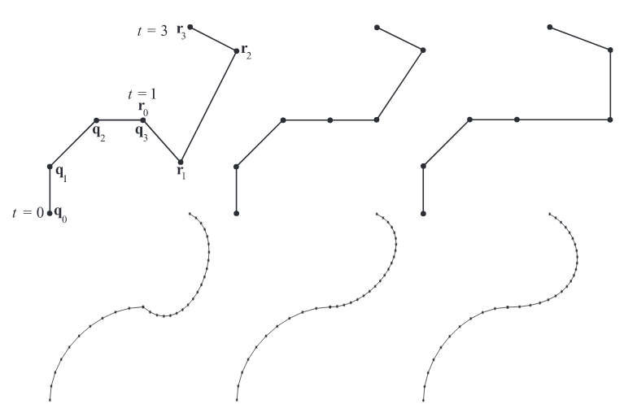
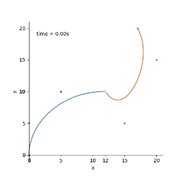

加入我们有两个三阶贝塞尔曲线，每个都是由四个点控制。第一个定义为$q_i$，第二个定义为$r_i$，$i = 0,1,2,3$。设置$q_3 = r_0$ 我们可以将两个曲线连接起来，这个点称为结点。

如图

这种由多个曲线段形成的复合曲线称为**分段贝塞尔曲线**。

我们把这个曲线记为$p(t)$。

**假如**我们想让这个函数满足 $p(0) = q_0$，$p(1) = q_3 = r_0$，$p(3)= r_3$

对于$p(t)  t \in [0,1]$这一段，按照先前的三阶贝塞尔公式代入即可得到对应位置。

* $p(t) = (1−t)^3p_0+ 3t(1−t)^2p_1+ 3t^2(1−t)p^2+t^3p_3 $  $t \in [0,1]$

那么$t \in [1,3]$这一段就需要我们对原有公式进行一个处理

即 $t \in [1,3]$ 归一化得到 $t′=\frac{t−t_1}{t_2−t_1}$  $t’ \in [1,3]$ 

$t_1 = 1, t_2 =3$

所以这个分段曲线的函数为

* $p(t) = (1−t)^3p_0+ 3t(1−t)^2p_1+ 3t^2(1−t)p^2+t^3p_3 $  $t \in [0,1]$
* $p(t) = (1−\frac{t−1}{2})^3p_0+ 3\frac{t−1}{2}(1−\frac{t−1}{2})^2p_1+ 3(\frac{t−1}{2})^2(1−\frac{t−1}{2})p^2+(\frac{t−1}{2})^3p_3 $  $t \in [1,3]$

取几个点做个示例如图：

[0,0] [0,5] [5,10] **[12,10]** [15,5] [20,15] [17,20]

要想在连接点$p(1) = q_3 = r_0$时保持曲线平滑。

