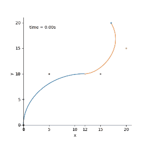
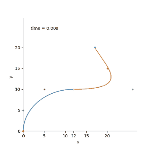

加入我们有两个三阶贝塞尔曲线，每个都是由四个点控制。第一个定义为$q_i$，第二个定义为$r_i$，$i = 0,1,2,3$。设置$q_3 = r_0$ 我们可以将两个曲线连接起来，这个点称为结点。

如图

这种由多个曲线段形成的复合曲线称为**分段贝塞尔曲线**。

我们把这个曲线记为$p(t)$。

**假如**我们想让这个函数满足 $p(0) = q_0$，$p(1) = q_3 = r_0$，$p(3)= r_3$

对于$p(t)  t \in [0,1]$这一段，按照先前的三阶贝塞尔公式代入即可得到对应位置。

* $p(t) = (1−t)^3p_0+ 3t(1−t)^2p_1+ 3t^2(1−t)p_2+t^3p_3 $  $t \in [0,1]$

那么$t \in [1,3]$这一段就需要我们对原有公式进行一个处理

即 $t \in [1,3]$ 归一化得到 $t′=\frac{t−t_1}{t_2−t_1}$  $t’ \in [1,3]$ 

$t_1 = 1, t_2 =3$

所以这个分段曲线的函数为

* $p(t) = (1−t)^3p_0+ 3t(1−t)^2p_1+ 3t^2(1−t)p_2+t^3p_3 $  $t \in [0,1]$
* $p(t) = (1−\frac{t−1}{2})^3p_0+ 3\frac{t−1}{2}(1−\frac{t−1}{2})^2p_1+ 3(\frac{t−1}{2})^2(1−\frac{t−1}{2})p_2+(\frac{t−1}{2})^3p_3 $  $t \in [1,3]$

取几个点做个示例如图：

[0,0] [0,5] [5,10] **[12,10]** [15,5] [20,15] [17,20]

要想在连接点$p(1) = q_3 = r_0$时保持曲线平滑就需要保证在到达和离开$p(1)$的速度方向保持一样，这就需要对两段三阶贝塞尔函数求导。

**第一段**：

* $p'(t) = -3p_0(1-t)^2 + 3p_1(1-t)^2-6p_1t(1-t)+6p_2t(1-t)-3p_2t^2+3p_3t^2$ $t \in [0,1]$

代入$t=1$得：

* $p'(1) = -3p_2 + 3p_3= 3(p_3 - p_2) $ 

**第二段**：

* $p'(t) = 3(- \frac{1}{t_2-t_1})(1-\frac{t-t_1}{t_2-t_1})^2p_0 + 3\frac{1}{t_2-t_1}(1-\frac{t-t_1}{t_2-t_1})^2p_1+6\frac{t-t_1}{t_2-t_1}(1-\frac{t-t_1}{t_2-t_1})(- \frac{1}{t_2-t_1})p_1+6\frac{1}{t_2-t_1}(\frac{t-t_1}{t_2-t_1})(1-\frac{t-t_1}{t_2-t_1})p_2+3(\frac{t-t_1}{t_2-t_1})^2(- \frac{1}{t_2-t_1})p_2+3(\frac{t-t_1}{t_2-t_1})^2(\frac{1}{t_2-t_1})p_3$  $t \in [1,3]$

代入$t=t_1 = 1$得：

* $p'(1) = 3(- \frac{1}{t_2-t_1})p_0 + 3\frac{1}{t_2-t_1}p_1 = 3\frac{1}{t_2-t_1}(p_1-p_0)$ 

可以看出：$q_3$点的速度只与$q_2，q3$的位置有关，$r_0$点的速度只与$r_0,r_1$的位置有关

设$q_3 = r_0$位置为$x_{c},y_{c}$ ，设$q_2$位置为$x_{q2},y_{q2}$ ，设$r_1$位置为$x_{r1},y_{r1}$

则要想**速度方向**一样，代入上述公式：

$\frac{3(y_c - y_{q2})}{3(x_c - x_{q2})} = \frac{3\frac{1}{t_2-t_1}(y_{r1} - y_{c})}{3\frac{1}{t_2-t_1}(x_{r1} - x_{c})}$

即需要$q_2, q_3=r_0, r_1 $三点在一条直线上。

如图：

但是如果想要**速度也一样**则需要：

$(y_c - y_{q2}) = \frac{1}{t_2-t_1}(y_{r1} - y_{c})$

$(x_c - x_{q2}) =\frac{1}{t_2-t_1}(x_{r1} - x_{c})$

即：$r_1-r_0 = (t_2-t_1)(q_3-q_2)$

如果$t_0$到$t_1$段的时间不是[0-1]怎么办
更通用的公式：

$r_1-r_0 = \frac{t_2-t_1}{t_1-t_0}(q_3-q_2)$

