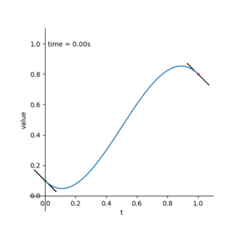
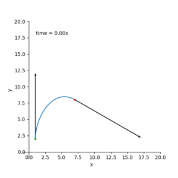

### 17.1.4  Cubic Hermite Interpolation

贝塞尔曲线很好的描述了曲线构造的原理，但是有时候无法预测。这部分我们学习三次埃尔米特插值，这些曲线很容易控制。相较于使用四个控制点的贝塞尔曲线，确定一个三次埃尔米特插值使用

* 起始点：$p_0$

* 终点：$p_1$

* 起始的tangent： $m_0$

* 结束的tangent：$m_1$

三次埃尔米特曲线 表达式为

* $p(t) = (2t^3-3t^2+1)p_0 + (t^3 - 2t^2+t)m_0 + (t^3 -t^2)m_1 + (-2t^3+3t^2)p_1$     $t \in [0,1]$

我们叫$p(t)$埃尔米特曲线段，或三次样条曲线段。这是一个三次插值。在上面的混合函数中$t^3$是最高次幂，由公式得

* $p(0)=p_0，p(1)=p_1，\frac{\partial p}{\partial t}(0)=m_0，\frac{\partial p}{\partial t}(1)=m_1$

对于$p(0)=p_0，p(1)=p_1$，直接代入0,1即可求得。

对于$\frac{\partial p}{\partial t}(0)=m_0，\frac{\partial p}{\partial t}(1)=m_1$，将0,1代入其导函数

* $p'(t) = (6t^2-6t)p_0 + (3t^2 - 4t +1)m_0 + (3t^2 -2t)m_1 + (-6t^2+6t)p_1$     $t \in [0,1]$$

即可。

#### 表达式是如何求出的

首先一元三次函数的基本型为

* $p(t) = at^3 + bt^2 + ct +d$

* $p'(t) = 3at^2+2bt+c $

我们有四个已知量 

* 起始点：$p_0$ 即$t=0,p(0)=p_0$

* 终点：$p_1 $     即$t=1,p(1)=p_1$

* 起始的tangent： $m_0$   即$p'(0) = m_0$

* 结束的tangent：$m_1$  即$p'(1) = m_1$

代入方程得：

* $d=p_0$
* $a + b +c +d = p_1$
* $c =  m_0$
* $3a + 2b + c = m_1$

解得：

* $a =m_1-2p_1+m_0+2p_0$
* $b = 3p_1-3p_0-2m_0-m1$
* $c = m_0$
* $d = p_0$

代入$p(t) = at^3 + bt^2 + ct +d$得

$(m_1-2p_1+m_0+2p_0)t^3 +(3p_1-3p_0-2m_0-m_1)t^2 +m_0t+p_0 $

展开得：

$t^3m_1 - 2t_3p_1+t^3m_0 +2t^3p_0 + 3t^2p_1-3t^2p_0-2t^2m_0-t^2m_1+m_0+p_0$

合并得：

* $p(t) = (2t^3-3t^2+1)p_0 + (t^3 - 2t^2+t)m_0 + (t^3 -t^2)m_1 + (-2t^3+3t^2)p_1$     $t \in [0,1]$

画出曲线方程得：

假如$p_0 = 0.1, p_1 = 0.8 , m_0 = 1, m_1 = 1$可得曲线：

可以看到$m_0,m_1$分别是起始点和终点的斜率，取值范围是 $(-\infin , +\infin)$

我们来运用这个结论来解决一个实际问题：

使物体在1秒内从点$p_0$(1,2) 移动至点$p_1$(7,8) 并使点A出射角度为90度，点B的入射角度为-30度

也就是求解：

* $X(t) = (2t^3-3t^2+1)X_{p0} + (t^3 - 2t^2+t)X_{m0} + (t^3 -t^2)X_{m1} + (-2t^3+3t^2)X_{p1}$     $t \in [0,1]$

* $Y(t) = (2t^3-3t^2+1)Y_{p0} + (t^3 - 2t^2+t)Y_{m0} + (t^3 -t^2)Y_{m1} + (-2t^3+3t^2)Y_{p1}$     $t \in [0,1]$

$X_{p0} = 1，X_{p1} = 7，Y_{p0} = 2，Y_{p1} = 8$

因为出射角度为90度，所以$X(t)$的出射切线$X_{m0}$为0。

$Y_{m0}$我们取10。(不同的取值会影响出射一段时间后是否还更贴近出射点)

$X_{m1}$我们也取10，对应的$Y_{m1} = -\frac{\sqrt{3}}{3}X_{m1}$

画出图像：

想要使曲线平滑且美观，$m_0$和$m_1$的取值很重要，最好是$p_0，p_1$的差值按比例取值