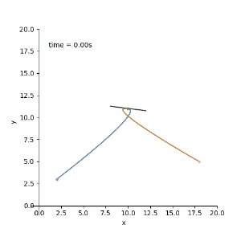

连接多点。

上一节我们已经用埃尔米特方程连接了两个点，接下来我们连接更多的点。

如图，我们只需要像[17.1.3连续分段的贝塞尔曲线](17.1.3连续分段的贝塞尔曲线)那样，使点到达$p_i$时的速度$V_{xin},V_{yin}$(甚至$V_{zin}$)，等于

离开$p_i$时的速度$V_{xout},V_{yout}$。

默认的诶米尔特方程为：

* $p(t) = (2t^3-3t^2+1)p_0 + (t^3 - 2t^2+t)m_0 + (t^3 -t^2)m_1 + (-2t^3+3t^2)p_1$     $t \in [0,1]$

设p点 是在$[t_0,t_1]$时间内，从$p_{i-1}$ 到 $p_i$段。

我们令$t_{n_1} =  \frac{t - t_0}{t_1-t_0}$，即$t_{n_1} \in [0,1]$

* $X(t_{n_1}) =  (2t_{n_1}^3-3t_{n_1}^2+1)X_{p_{i-1}} + (t_{n_1}^3 - 2t_{n_1}^2+t_{n_1})X_{m_{i-1}} + (t_{n_1}^3 -t_{n_1}^2)m_{xin} + (-2t_{n_1}^3+3t_{n_1}^2)X_{p_i} $ $t_{n_1} \in [0,1]$
* $Y(t_{n_1}) =  (2t_{n_1}^3-3t_{n_1}^2+1)Y_{p_{i-1}} + (t_{n_1}^3 - 2t_{n_1}^2+t_{n_1})Y_{m_{i-1}} + (t_{n_1}^3 -t_{n_1}^2)m_{yin} + (-2t_{n_1}^3+3t_{n_1}^2)Y_{p_i} $ $t_{n_1} \in [0,1]$

设p点 是在$[t_1,t_2]$时间内，从$p_{i}$ 到 $p_{i+1}$段。

我们令$t_{n_2} =  \frac{t - t_1}{t_2-t_1}$，即$t_{n_2} \in [0,1]$

* $X(t_{n_2}) =  (2t_{n_2}^3-3t_{n_2}^2+1)X_{p_{i}} + (t_{n_2}^3 - 2t_{n_2}^2+t_{n_2})m_{xout} + (t_{n_2}^3 -t_{n_2}^2)X_{m_{i+1}} + (-2t_{n_2}^3+3t_{n_2}^2)X_{p_{i+1}}$ $t_{n_2} \in [0,1]$

* $Y(t_{n_2}) =  (2t_{n_2}^3-3t_{n_2}^2+1)Y_{p_{i}} + (t_{n_2}^3 - 2t_{n_2}^2+t_{n_2})m_{yout} + (t_{n_2}^3 -t_{n_2}^2)Y_{m_{i+1}} + (-2t_{n_2}^3+3t_{n_2}^2)Y_{p_{i+1}} $ $t_{n_2} \in [0,1]$

想要p点在$p_i$处连续，需要速度方向一样，为了使运动更平滑，我们让他们的x,y方向上的速度分量也相同。

对于**归一化**的诶米尔特曲线。

$p_i$的 

* $V_{xin} = m_{xin}, V_{yin} = m_{yin},V_{xout} = m_{xout},V_{yout} = m_{yout}$ 

对于**未归一化**的诶米尔特曲线。

* $V_{xin} = \frac{1}{t_1-t_0}m_{xin}, V_{yin} = \frac{1}{t_1-t_0}m_{yin},V_{xout} = \frac{1}{t_2-t_1}m_{xout},V_{yout} = \frac{1}{t_2-t_1}m_{yout}$ 

证明上述**未归一化**的诶米尔特曲线在起始点和终点的切线计算成立：

上述问题可转化为：

已知 三次函数$p(t_n) = at_n^3 + bt_n^2 + m_0t_n +d$      $t_n \in[0,1]$在$t_n=0$ 的切线为$m_0$。

$t_n(t) = \frac{t- t_0}{t_1-t_0}$

求$p(t)$在 $t = t_0$时的切线。

根据求导公式的链式法则 $(f\circ g)'(x)=f'(g(x))g'(x)$

* $p'(t) = (p\circ t_n)'(t) = p'(t_n(t))t_n'(t) = \frac{1}{t_1-t_0}p'(t_n)$ $t \in [t_0,t_1]$

代入$t =t_0$得

* $p'(t_0) =\frac{1}{t_1-t_0} m_0$

 更加通用的公式

*  $p'(t) = \frac{1}{t_1-t_0}p'(t_n)$ $t \in [t_0,t_1]$

$p'(t_n)$即归一化的诶米尔特曲线的导数。

解决了这个问题。

我们令$V_{xin} = V_{xout}, V_{yin} = V{yout}$

$m_{xi}$：$p_i$点$x$分量的速度

$m_{yi}$：$p_i$点$y$分量的速度

即：$m_{xi}=\frac{1}{t_1-t_0}m_{xin} = \frac{1}{t_2-t_1}m_{xout}，m_{yi}= \frac{1}{t_1-t_0}m_{yin} = \frac{1}{t_2-t_1}m_{yout}$ 

有了这个我们可以去解决实际问题。

如：让点p依次平滑经过 a(2,3) b(10,11) c(18,5)  所用时间为 a->b 2秒 b-c 3秒

可得ab段函数：

* $t_{n_1} = \frac{t}{2}$    $t \in [0,2]$

* $X(t_{n_1}) =  (2t_{n_1}^3-3t_{n_1}^2+1)*2 + (t_{n_1}^3 - 2t_{n_1}^2+t_{n_1})X_{m_{i-1}} + (t_{n_1}^3 -t_{n_1}^2)m_{xin} + (-2t_{n_1}^3+3t_{n_1}^2)* 10 $ $t_{n_1} \in [0,1]$

* $Y(t_{n_1}) =  (2t_{n_1}^3-3t_{n_1}^2+1)*3 + (t_{n_1}^3 - 2t_{n_1}^2+t_{n_1})Y_{m_{i-1}} + (t_{n_1}^3 -t_{n_1}^2)m_{yin} + (-2t_{n_1}^3+3t_{n_1}^2)*11 $ $t_{n_1} \in [0,1]$

bc段函数：

* $t_{n_2} = \frac{t-2}{3}$  $t \in [2,5]$
* $X(t_{n_2}) =  (2t_{n_2}^3-3t_{n_2}^2+1)*10 + (t_{n_2}^3 - 2t_{n_2}^2+t_{n_2})m_{xout} + (t_{n_2}^3 -t_{n_2}^2)X_{m_{i+1}} + (-2t_{n_2}^3+3t_{n_2}^2)*18$ $t_{n_2} \in [0,1]$
* $Y(t_{n_2}) =  (2t_{n_2}^3-3t_{n_2}^2+1)*11 + (t_{n_2}^3 - 2t_{n_2}^2+t_{n_2})m_{yout} + (t_{n_2}^3 -t_{n_2}^2)Y_{m_{i+1}} + (-2t_{n_2}^3+3t_{n_2}^2)*5 $ $t_{n_2} \in [0,1]$

且有：

* $\frac{1}{2} m_{xin} = \frac{1}{3} m_{xout}$
* $\frac{1}{2} m_{yin} = \frac{1}{3} m_{yout}$

可以看到，这样并不能唯一确定这个分段曲线，我们还需要起点$p_{i-1}$的出射速度($\frac{1}{2}X_{m_{i-1}}$,$\frac{1}{2}Y_{m_{i-1}}$)，终点$p_{i+1}$的入射速度($\frac{1}{3}X_{m_{i+1}}$,$\frac{1}{3}Y_{m_{i+1}}$)。以及$p_i$的速度($m_{xi},m_{yi}$)。

这里我们将起始点和终点的速度设为0。  $p_i$点的速度为$p_{i-1}$到$p_{i+1}$的平均速度

即：

$m_{xi} = \frac{X_{p_{i+1}} - X_{p_{i-1}}}{t_2-t_0} = \frac{18-2}{5} = \frac{16}{5}$

$m_{yi} = \frac{Y_{p_{i+1}} - Y_{p_{i-1}}}{t_2-t_0} = \frac{5-3}{5}= \frac{2}{5}$

得到最终函数：

ab段：

* $t_{n_1} = \frac{t}{2}$    $t \in [0,2]$

* $X(t_{n_1}) =  (2t_{n_1}^3-3t_{n_1}^2+1)*2  + (t_{n_1}^3 -t_{n_1}^2)*\frac{16}{5}*2 + (-2t_{n_1}^3+3t_{n_1}^2)* 10 $ $t_{n_1} \in [0,1]$

* $Y(t_{n_1}) =  (2t_{n_1}^3-3t_{n_1}^2+1)*3 + (t_{n_1}^3 -t_{n_1}^2)*\frac{2}{5}*2 + (-2t_{n_1}^3+3t_{n_1}^2)*11 $ $t_{n_1} \in [0,1]$

bc段函数：

* $t_{n_2} = \frac{t-2}{3}$  $t \in [2,5]$
* $X(t_{n_2}) =  (2t_{n_2}^3-3t_{n_2}^2+1)*10 + (t_{n_2}^3 - 2t_{n_2}^2+t_{n_2})*\frac{16}{5}*3  + (-2t_{n_2}^3+3t_{n_2}^2)*18$ $t_{n_2} \in [0,1]$
* $Y(t_{n_2}) =  (2t_{n_2}^3-3t_{n_2}^2+1)*11 + (t_{n_2}^3 - 2t_{n_2}^2+t_{n_2})*\frac{2}{5}*3 + (-2t_{n_2}^3+3t_{n_2}^2)*5 $ $t_{n_2} \in [0,1]$

画出轨迹图：

思考：如果我们觉得经过$p_i$的"山峰"太陡峭，想平滑一点，怎么处理

即，经过$p_i$点时x分量速度更大了，我们在保持$m_{yi}$不变的情况下，使$m_{xi}$乘以一个倍数，如2，

得到结果如图：

或者使$m_{xi}$ 乘以 -1。如图

或者将$p_{i-1} ,  p_i, p_{i+1}$ 做成一个**闭环**。使起点$p_{i-1}$的出射速度($\frac{1}{2}X_{m_{i-1}}$,$\frac{1}{2}Y_{m_{i-1}}$)，终点$p_{i+1}$的入射速度($\frac{1}{3}X_{m_{i+1}}$,$\frac{1}{3}Y_{m_{i+1}}$)，为其前后两点的距离/时间，假如$p_{i+1}$到$p_{i-1}$ 所用时间为$[t_2,t_3]= [5,9]$

$\frac{1}{2}X_{m_{i-1}} = \frac{X_{p_{i}} - X_{p_{i+1}}}{{t_3 -t_2}} = \frac{10-18}{5} = -2$

$\frac{1}{2}Y_{m_{i-1}} = \frac{Y_{p_{i}} - Y_{p_{i+1}}}{t_3 -t_2} = \frac{11-5}{4}= \frac{3}{2}$

$\frac{1}{2}X_{m_{i+1}} = \frac{X_{p_{i-1}} - X_{p_{i}}}{{t_3 -t_2}} = \frac{2-10}{4} = -2$

$\frac{1}{2}Y_{m_{i-1}} = \frac{Y_{p_{i-1}} - Y_{p_{i}}}{{t_3 -t_2}} = \frac{3-11}{4}= -2$

结果如图：

