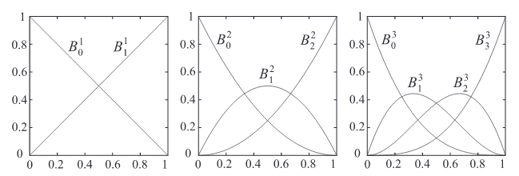
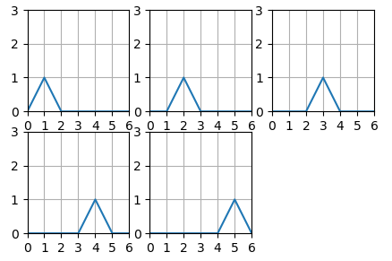
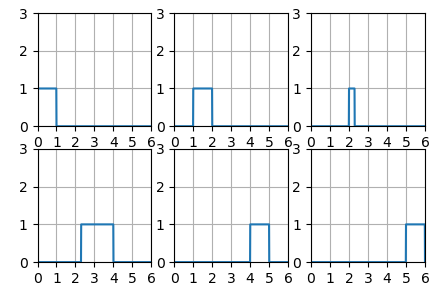
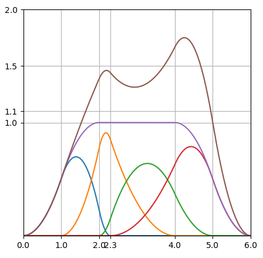

### 1.动机

贝塞尔有几个缺点

* 随着点的数量增加，插值的阶数就越高，计算也更复杂。
* 点数量的增加也会使曲线不够贴合点
* 不够局部，更改一个点的位置会影响整个曲线的。

B样条就是为了克服以上缺点诞生的。

### 2.形式上相似

B样条在形式上与贝塞尔曲线非常相似

我们由贝塞尔曲线来逐渐理解B样条。

#### 2.1 贝塞尔的公式

**贝塞尔曲线就是不同时刻对控制点取不同的分量得到当前时刻值**

先看贝塞尔的公式：$p_i$ 是控制点

一阶：$p(t) =(1-t)p_0 + t p_1$  $t \in [0,1]$

二阶：$ p(t)  =(1−t)^2*p_0+ 2(1−t)t*p_1+t^2*p_2 $  $t \in [0,1]$

三阶：$p(t) = (1−t)^3p_0+ 3t(1−t)^2p_1+ 3t^2(1−t)p_2+t^3p_3$    $t \in [0,1]$

N阶：$p(t) =\sum_{i=0}^{n} B_{i}^{n}(t)p_i$      $t \in [0,1]$     $B_{i}^{n}(t) = \binom{n}{i} t^i(1-t)^{n-i}= \frac {n!}{i!(n-i)!}t^i(1-t)^{n-i}$

这里n+1 就是控制点的个数。 如n=2  那么就是一个3控制点的二阶贝塞尔

将其中的对各个控制点取的比例绘成函数图如下：



函数满足$\sum_{i=0}^{n} B_{i}^{n}(t) = 1$

#### 2.2 B样条的公式

**B样条也是不同时刻对控制点取不同的分量得到当前时刻值**

一阶：$C(u) = N_{0,1}(u)*p_0 + N_{1,1}(u)*p_1+ ....+ N_{n,1}(u)*p_n$

二阶：$C(u) = N_{0,2}(u)*p_0 + N_{1,2}(u)*p_1+ ....+ N_{n,2}(u)*p_n$

三阶：$C(u) = N_{0,3}(u)*p_0 + N_{1,3}(u)*p_1+ ....+ N_{n,3}(u)*p_n$

k阶：$C(u) =\sum_{i=0}^{n} N_{i,k}(u)*p_i$   

这里k是阶数， n+1 是控制点的个数  如有4个控制点的二阶B样条  那么  k=2，n=3

这里$u$暂时取为[0,7]，可以理解为时刻

将其中的对各个控制点取的比例绘成函数图如下：


第一幅是$N_{i,1}$的函数曲线依次是 $N_{0,1}(u)，N_{1,1}(u)，N_{2,1}(u)，N_{3,1}(u)，N_{4,1}(u)，N_{5,1}(u)$

第二幅是$N_{i,2}$的函数曲线依次是 $N_{0,2}(u)，N_{1,2}(u)，N_{2,2}(u)，N_{3,2}(u)，N_{4,2}(u)$

第三幅是$N_{i,3}$的函数曲线依次是 $N_{0,3}(u)，N_{1,3}(u)，N_{2,3}(u)，N_{3,3}(u)$

函数局部满足$\sum N_{i,k}(u) = 1$

贝塞尔的$B_{i}^{n}(t)$是插值得到的，那么B样条的$N_{i,n}$ 是如何得到的呢，这个我们稍后讲

### 3.  从例子中理解

如果我们得到一个由4个点控制的二阶B样条。

那么从上面的公式可得

$C(u) = N_{0,2}(u)*p_0 + N_{1,2}(u)*p_1+ N_{2,2}(u)*p_2+ N_{3,2}(u)*p_3$

#### 3.1 x-u曲线
u理解为时间

假如我们控制点$p_i$ 为x=[1.1,1.7,1.2,2]

那么代入后绘制x-u曲线就是


参考$N_{0,2}(u)$(PS:2指二阶)函数图是从0向上爬升的，这就造成$C(u)$是从0出发，同理到$[u_5,u_6)$区间到0 结束，

看样子是[0->1.1->1.7-> 1.2->2->0]

这与我们[1.5->2->1.6->1.1]的预期不符。这个后面我们会解决

#### 3.2 y-u曲线

多加一个维度y= [1.5,2,1.6,1.1]

那么代入后绘制y-u曲线就是


#### 3.3 x-y曲线

绘制成x-y的曲线就是


可以看到4个控制点 以及一条曲线。u可以理解为时间t。

对应到$N_{i,2}(u)$函数分量图。


[0,2)秒对应x-y图的蓝色段

[2,4)秒对应x-y图的橙色段

[4,6)秒对应x-y图的绿色段

我们真正用到的是[2,4] 的橙色段。


这段区间满足$\sum_{i=0}^{n} N_{i}^{n}(t) = 1$，我们称作**定义域**。


接下来要解决有几个问题：

1. $N_{i,k}$是如何得到的

 	1. 使用上应该是时间应该从0开始而不是从2开始
 	2. 调整一个节点的位置会影响哪段曲线
 	3. 能否使曲线与起点和终点重合
 	4. 推广到更高次的使用

### 4. $N_{i,k}$是如何得到的

插值得到的。

u 可以理解成t，即时间。

#### 4.1 公式

这里有

$N_{i,0}(u)\left\{\begin{matrix}
1  &   u_i \leq u<u_{i+1} \\ 
0 & otherwise
\end{matrix}\right.$ 

$N_{i,k}(u) = \frac {u-u_i}{u_{i+k}-u_i}N_{i,k-1}(u) + \frac{u_{i+k+1} - u}{u_{i+k+1}- u_{i+1}}N_{i+1,k-1}(u)$

公式乍一看很复杂。我们一步步来看。

#### 4.2 递归

按照上面一小节**3  从例子中理解**的例子，我们用到了$N_{0,2},N_{1,2},N_{2,2},N_{3,2},$

$N_{0,2}(u)$要怎么得到，按照公式来使用到了$N_{0,1}(u)$和$N_{1,1}(u)$

而$N_{0,1}(u)$又是从$N_{0,0}(u)$和$N_{1,0}(u)$得到的，这是一个递归公式，最后会递归到$N_{i,0}(u)\left\{\begin{matrix}
1  &   u_i \leq u<u_{i+1} \\ 
0 & otherwise
\end{matrix}\right.$ 

#### 4.3 结构

大致结构如下

```
# [u0, u1)  N(0,0)  \
#                     N(0,1)  \
# [u1, u2)  N(1,0)  <            N(0,2) \
#                     N(1,1)  <          N(0,3) \
# [u2, u3)  N(2,0)  <            N(1,2) <          N(0,4) \
#                     N(2,1)  <          N(1,3) <          N(0,5)
# [u3, u4)  N(3,0)  <            N(2,2) <          N(1,4) /
#                     N(3,1)  <          N(2,3) /
# [u4, u5)  N(4,0)  <            N(3,2) /
#                     N(4,1)  /
# [u5, u6)  N(5,0)  /
#
# .......
```

#### 4.4 函数图

为了更直观的表达，我们定义u的具体范围以及间隔来画出$N_{i,k}(u)$的函数图。

定义u为[0,1,2,3,4,5,6]。这里间隔相同的我们成为均匀节点。非均匀节点我们后面再讲。

##### 4.4.1 画出$N_{i,0}$

根据$N_{i,0}(u)\left\{\begin{matrix}
1  &   u_i \leq u<u_{i+1} \\ 
0 & otherwise
\end{matrix}\right.$  画出 $N_{i,0}(u)$


##### 4.4.2 画出$N_{i,1}$

$N_{i,1}$是由公式$N_{i,k}(u) = \frac {u-u_i}{u_{i+k}-u_i}N_{i,k-1}(u) + \frac{u_{i+k+1} - u}{u_{i+k+1}- u_{i+1}}N_{i+1,k-1}(u)$

代入得到$N_{i,1}(u) = \frac {u-u_i}{u_{i+1}-u_i}N_{i,0}(u) + \frac{u_{i+2} - u}{u_{i+2}- u_{i+1}}N_{i+1,0}(u)$

* $N_{i,0}$ 在[i,i+1]区间有值。 $\frac {u-u_i}{u_{i+1}-u_i}$仔细看就是 ${u-u_i}$ 的长度占这个区间长度的比例 。然后再用这个比例*$N_{i,0}(u)$
* $N_{i+1,0}$ 在[i+1,i+2]区间有值   $\frac{u_{i+2} - u}{u_{i+2}- u_{i+1}}$仔细看就是${u_{i+2} - u}$的长度占这个区间长度的比例 *$N_{i+1,0}(u)$

结果如图：



##### 4.4.3 画出$N_{i,2}$

$N_{i,2}$是由公式$N_{i,k}(u) = \frac {u-u_i}{u_{i+k}-u_i}N_{i,k-1}(u) + \frac{u_{i+k+1} - u}{u_{i+k+1}- u_{i+1}}N_{i+1,k-1}(u)$

代入得到$N_{i,2}(u) = \frac {u-u_i}{u_{i+2}-u_i}N_{i,1}(u) + \frac{u_{i+3} - u}{u_{i+3}- u_{i+1}}N_{i+1,1}(u)$

* $N_{i,1}$ 在[i,i+2]区间有值。 $\frac {u-u_i}{u_{i+2}-u_i}$仔细看就是 ${u-u_i}$ 的长度占这个区间长度的比例 。然后再用这个比例*$N_{i,1}(u)$
* $N_{i+1,1}$ 在[i+1,i+3]区间有值   $\frac{u_{i+2} - u}{u_{i+2}- u_{i+1}}$仔细看就是${u_{i+2} - u}$的长度占这个区间长度的比例 *$N_{i+1,1}(u)$

结果如图：


插值过程我们取   $N_{0,1} N_{1,1}$插值出$N_{0,2}$的过程：


### 5. 定义域

前面我们说过  局部分量和满足$\sum N_{i,k}(u) = 1$的区间我们称作**定义域**。那么这个定义域的范围是多少呢？

#### 5.1 求节点范围

对于 n+1 个控制点，k阶的 B样条，我们需要多少个节点呢。

 n+1 我们需要求 $N_{0,k}(t),N_{1,k}(t),...,N_{n,k}(t)$

参考**4.3 结构** 。我们需要的

* u范围是$[u_0，u_{n+k+1}]$

#### 5.2 求定义域范围

还是参考**4.3 结构** 。我们需要的

* 定义域范围是 $[u_{k}, u_{n+1}]$

* 即$\sum_{k}^{n+1} N_{i,k}(u) = 1$

### 6. 时间能否从0开始

也就是定义域$[u_{k}, u_{n+1}]$从 $u_0$开始。

那就需要我们将原来u范围$[u_0，u_{n+k+1}]$一起调整下。将下标同时减k

得

* u范围$[u_{-k}，u_{n+1}]$
* 定义域范围$[u_{0}，u_{n+1-k}]$

公式也就变成了$C(u) =\sum_{i=-k}^{n-k} N_{i+k,k}(u)*p_{i+k}$

如果我们想得到4节点 的2阶 B样条， 那么均匀节点u可以设置为[-2,-1,0,1,2,3,4]

u定义域是[0,2]

### 7. 调整控制点$P_i$的值会影响哪部分曲线

既然是局部的，那么我们移动一个点的位置只会影响有限区间范围的曲线

对于k阶B样条，调整$p_i$的值，

根据公式$C(u) =\sum_{i=0}^{n} N_{i,k}(u)*p_i$   。只要 $N_{i,n}$的值不为0，都会对$C(u)$的值造成影响。

那么$N_{i,n}$的值在哪个区间不为0呢。参考参考**4.3 结构** 

区间为

* $[u_i,u_{i+k+1}]$

### 8. 能否使曲线与起点和终点重合

#### 8.1 起终点的u的定义域

根据公式$C(u) =\sum_{i=0}^{n} N_{i,k}(u)*p_i$

* u范围是$[u_0，u_{n+k+1}]$
* 定义域范围是 $[u_{k}, u_{n+1}]$

#### 8.2 根据公式添加冗余点

$C(u_k) =\sum_{i=0}^{n} N_{i,k}(u_k)*p_i$   $u = u_k$

这时   $N_{k,k}(u_k),N_{k,k}(u_k),...,N_{n,k}(u_k)$


紫色的为各个分量之和

参考这张图，$u = u_k $时 取N分量 只有 $N_{0,k}, N_{1,k}...,N_{k-1,k}$的分量不为0。

因为$\sum_{k}^{n+1} N_{i,k}(u) = 1$

这时只要$p_0,p_1,...,p_{k-1}$  都为同一个值 $p_0$ ，那么就可以保证起点 $u_{k}$时的值为$p_0$。

终点也是类似$p_{n-k+1},...,p_{n-1},p_{n}$  都为同一个值 $p_n$，那么就可以保证起点 $u_{n+k+1}$时的值为$p_n$。

#### 8.3 对比效果

例如：控制点$p_i$ 为x=[1.1,1.7,1.2,2]

画出x(u)，如下


可以看到在定义域 $[u_{k}, u_{n+1}]$ 即 [2,4] 内起点和终点的值并不是1.1，2

按照刚刚的结论添加冗余点x=[1.1,1.1,1.7,1.2,2,2]

画出x(u)，如下:


添加一个维度y= [1.5,1.5,2,1.6,1.1,1.1]


可以看到在小点在起点和终点有个减速。这是它的速度是0。参照刚刚的x(u)图，起始点和终点的切线(即速度)是0。

能不能设置初速度呢，这个问题以后再解决吧。

#### 8.4 另一种方式

之前我们设置的u都是均匀节点，可以通过将$[u_0,u_k]$这部分区间进行挤压，也是能达到$C(u_k) = p_0$ 的效果，这个后面再说。


### 9.非均匀节点

#### 9.1区间长度不等

$N_{i,0}$对于0阶均匀区间的基函数图 $Ums =[0,1,2,3,4,5,6]$

调整为非均匀 $Ums =[0,1,2,2.3,4,5,6]$



$N_{i,1}$


$N_{i,2}$


画到一张图里


可以看到定义域区间$[u_2,u_4]$，基函数的和依然是1(紫色线)

我们将四个控制点设置为 [ 1, 1.5, 1.1, 2]，以便我们能在一张图里看到**基函数**，**控制点**，以及最终函数$C(u)$



均匀节点的图像：


相比于均匀节点的图像，非均匀的节点的图像

* 在密度高的节点附近如[2,2,3]，变化率变高，即速度变化变快。
* 密度低的节点附近如[2.3,4], 变化率变慢，即速度变化变慢。

注意$N_{1,2}$基函数(橙黄色)的变化，随着密度变化，$[u_2,u_3)$ 区间内$N_{1,2}$分量变高趋近1， $N_{0,2}$(蓝色)$N_{2,2}$(绿色)分量变低趋近0。

这就使$C(u) = N_{0,2}*1 + N_{1,2}*1.5 + N_{2,2}*1.1+N_{3,2}*2$

在$[u_2,u_3)$区间内的值越来越接近1*1.5 即$P_1$

启发：

* 可以压缩[0,2) 的区间 使$N_{0,2}$的分量趋近1，起点更接近于1。即$P_0$
* 可以压缩[4,6) 的区间 使$N_{3,2}$的分量趋近1，终点更接近于2。即$P_3$
* 压缩至重合也就变成了重节点


可以看到压缩后曲线起点和终点能和控制点重合了。

但是这种方式在高阶情况的曲线过渡并不好。

如果我们想让曲线经过起始点和终点，不妨使用**8.2 根据公式添加冗余点**

#### 10.重节点

重节点感觉是区间长度不等的一个极限情况。


