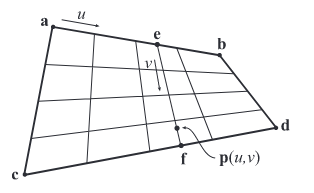
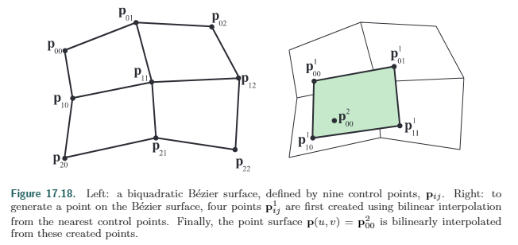
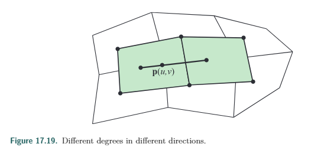
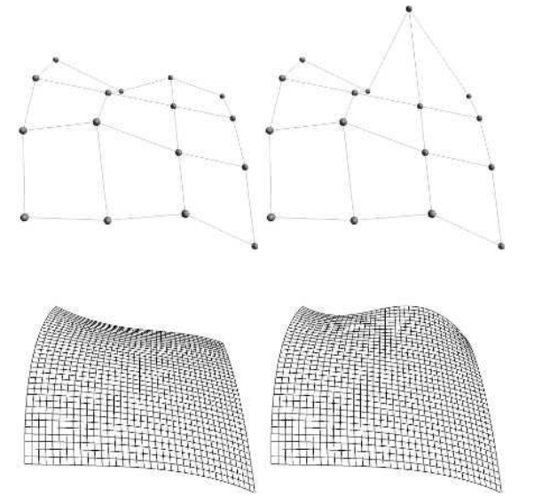

### 17.2.1贝塞尔面片

17.1.1介绍了贝塞尔曲线的概念，将使用一个参数扩展成使用两个，就形成了曲面。把线性插值扩展成**双线性插值**。原本使用的两个点进行插值，这里我们用四个分别叫$\mathbf{a},\mathbf{b},\mathbf{c},\mathbf{d} $，如下图所示，原来的参数叫$t$，现在我们使用两个新的参数$(u,v)$，使用$u$作为参数插值 $\mathbf{a} \& \mathbf{b}$和$\mathbf{c} \& \mathbf{d}$，得到结果$\mathbf{e} $和$\mathbf{f} $

* $\mathbf{e} = (1- u) \mathbf{a}  + u\mathbf{b} $，    $\mathbf{f}= (1-u)\mathbf{c} +u\mathbf{d}  $

然后，使用参数$v$，对$\mathbf{e} $和$\mathbf{f} $进行插值，叫得到了**双线性插值**的公式

* $\mathbf{p}(u,v) = (1-v)\mathbf{e} + v\mathbf{f}$

  ​			$=(1-u)(1-v)\mathbf{a}+u(1-v)\mathbf{b}+(1-u)v\mathbf{c}+uv\mathbf{d}$

这个和纹理映射的双线性方程是一样的。描述了一个简单的空间参数表面。表面上的点是使用不同(u,v)构造的。

可以表示成$(u,v) \in [0,1]\times [0,1]$，当这个区域是矩形时，这个表面通常称作**面片**(patch)

3x3的格子可以进行**重复双线性插值**

左上角四个点进行一次uv插值得到$\mathbf{p}^1_{00}$，同理获得其他三个点，最后将得到的四个点进行插值得到$\mathbf{p}^2_{00}$

上述重复双线性插值是decastel-jau算法的推广

左图的0阶应该写为$\mathbf{p}^0_{00}$，只不过右上角为0的**阶数**标记被忽略了。规律就是**k**阶点是由**k-1**阶的**四个点**根据**uv**插值得到，公式为

*  $\mathbf{p}^k_{i,j}(uv) = (1-u)(1-v)\mathbf{p}^{k-1}_{i,j} + u(1-v)\mathbf{p}^{k-1}_{i,j+1}+(1-u)v\mathbf{p}^{k-1}_{i+1,j}+uv\mathbf{p}^{k-1}_{i+1,j+1}$

  $k=1...n$,  $i=0...n-k$,  $ j = 0...n-k$

这种递归的形式也可以想贝塞尔曲线插值那样展开最终表示成全用**0阶**表示的公式

* 公式略

长宽不一样的也可以使用重复双线性插值，比如3x2，如图

#### 单独看一条边

每一个面片的边界都由**边界上**的**控制点**构成的**贝塞尔曲线**来描述。

#### 在内部

就像贝塞尔插值出的曲线在控制点组成的**凸包**内部一样，**贝塞尔曲面**也在**控制点**组成的**凸包内部**(凸包体内部)。(用于碰撞的前置检测？)。

#### 变换

先变换控制点，再用插值算出其他点的值 会比 先插值得到其他点的值再执行变换快一点。

#### 法线

求u方向上的偏导，再求v方向上的偏导，两者的叉乘就是未归一化的法线。

#### 移动控制点

1. 多阶插值改变一个点对面片影响有限，(这点和贝塞尔曲线插值差不多)。
2. 离控制点最近的插值部分变动较大
3. 整个面片的位置都有变动 (1.不止可以插值位置，也可以颜色等  2.因为每个控制点都有构成面片的分量 所以牵一发动全身)

#### 有理贝塞尔面片

像有理贝塞尔曲线一样推广到n阶。

* 公式略

