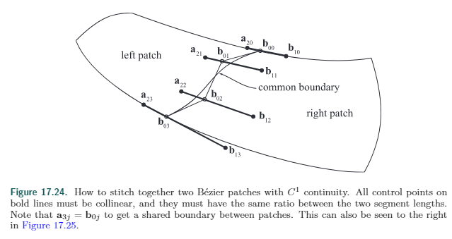

#### 连续性

$C^0$连续：函数曲线不间断

$C^1$连续：函数曲线的导数不间断

$C^2$连续：函数曲线的2阶导数不间断

...

G0​点连续：是指曲面或曲线点点连续。曲线无断点，曲面相接处无裂缝。

G1相切连续：是指曲面或曲线点点连续，并且所有连接的**线段**、曲面片之间都是相切关系。**参考线段切线**

G2曲率连续：是指曲面或曲线点点连续，并且其曲率分析结果为连续变化。**曲线上每一点曲率连续**

G3曲率变化率连续：是指曲面或曲线点点连续，并且其曲率曲线或曲率曲面分析结果为相切连续。

#### 贝塞尔曲面连续性

当使用贝塞尔曲面构造复杂的模型时，经常会使用多种不同的贝塞尔曲面。这个有点像[17.1.3连续分段的贝塞尔曲线](17.1.3连续分段的贝塞尔曲线.md)

那么如何保证曲面是连续的呢。

如果保证每条边满足连续分段的贝塞尔曲面是不是就可以连续了。

举个类似的**例子**，如图有两个4x4的**双三次插值**的贝塞尔曲面,左边的控制点表示为$\mathbf{a}_{ij}$,右边的为$\mathbf{b}_{ij}$，$0 \le i,j \le 3$,这两个曲面相接。那么就是有一条边上的控制点完全重合，即$\mathbf{a}_{3j} = \mathbf{b}_{0j}$，这保证了$C^0$连续。

为了保证$C^1$连续，我们需要约束$\mathbf{a}_{2j} $和$\mathbf{b}_{1j}$ 的相对位置。和17.1.3一样，要保证每一组$\mathbf{a}_{2j}，\mathbf{b}_{0j}$，和$\mathbf{b}_{1j}$，是**共线**的，还要保证有相同的比例$||\mathbf{a}_{2j}−\mathbf{b}_{0j}||=k||\mathbf{b}_{0j}−\mathbf{b}_{1j}||$，因为左右两边的贝塞尔曲面的横向**参数$u$**，都是在[0,1] (参考17.1.3的参数t)，所以这里的k取1。(否则就只是G1连续)

#### 贝塞尔三角形的连续性

更复杂。