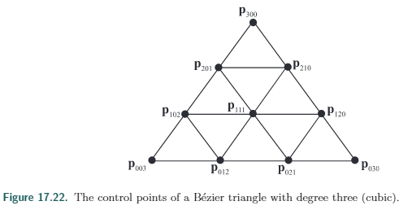
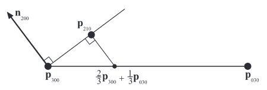

PN (Point - Normal)

PN三角形的目的就是给出三角形网格**每个顶点**的**法线**，以获得更好的表面效果

也被叫做**N-面片**

假设我们有三角形顶点为 $\mathbf{p}_{300}$，$\mathbf{p}_{030}$，$\mathbf{p}_{003}$，对应的法线分别为$\mathbf{n}_{200}$，$\mathbf{n}_{020}$，$\mathbf{n}_{002}$。

基本的思想是使用这些信息计算出各个控制点。

原n阶伯恩斯坦公式为

* $\mathbf{p}(u,v) = \sum_{i+j+k= n}B_{i,j,k}^n(u,v)\mathbf{p}_{i,j,k}$

这里代入3, 并令$w=1-u-v$

* $\mathbf{p}(u,v) = \sum_{i+j+k= 3}B_{i,j,k}^3(u,v)\mathbf{p}_{i,j,k}$

  ​			$=u^3\mathbf{p}_{300} +v^3\mathbf{p}_{030}+w^3\mathbf{p}_{003}+3u^2v\mathbf{p}_{210}+3u^2w\mathbf{p}_{201}+3uv^2\mathbf{p}_{120}+3v^2w\mathbf{p}_{021}+3uw^2\mathbf{p}_{012}+3uw^2\mathbf{p}_{102}+6uvw\mathbf{p}_{111}$

上图$\mathbf{p}_{003}，\mathbf{p}_{030}，\mathbf{p}_{300}$组成一个PN三角形

两个三角形共边即$C^0$连续，使用共边的短点逆向得出的**控制点**(如$\mathbf{p}_{102}，\mathbf{p}_{201}$) 也**共用**就能保证$C^0$连续，要保证$C^1$连续则需要考虑更多东西。

已知$\mathbf{p}_{300}，\mathbf{p}_{030}$，和$\mathbf{p}_{300}$的法线$\mathbf{n}_{200}$ 如果我们要计算$\mathbf{p}_{201}$

* $\mathbf{p}_{201}$会作为三阶贝塞尔曲线插值的一个控制点。
* **方向**： 如果要保证插值出的曲线**出射速度**(参考17.1.3连续分段的贝塞尔曲线的三阶贝塞尔函数求导)垂直于$\mathbf{n}_{200}$ ，那么只要保证$\mathbf{p}_{201}$在$\mathbf{n}_{200}$垂线上即可。其他点也类似
* **距离**：$\frac{1}{3}$处的位置可能是为了平均吧。

如下图：

先得到$\frac{1}{3}$处的位置，然后将其投影到垂直于$\mathbf{n}_{200}$的线上即为$\mathbf{p}_{201}$的位置。

可以使用公式(假设这里$\mathbf{n}_{200}$是归一化的)

* $\mathbf{p}_{201}=\frac{1}{3}(2\mathbf{p}_{300}+\mathbf{p}_{030}-(\mathbf{n}_{200}\cdot(\mathbf{p}_{030}-\mathbf{p}_{300}))\mathbf{n}_{200})$

其他点都可以使用类似计算方式，最后只剩$\mathbf{p}_{111}$，

* $\mathbf{p}_{111} = \frac{1}{4}(\mathbf{p}_{210}+\mathbf{p}_{120}+\mathbf{p}_{102}+\mathbf{p}_{201}+\mathbf{p}_{021}+\mathbf{p}_{012})-\frac{1}{6}(\mathbf{p}_{300}+\mathbf{p}_{030}+\mathbf{p}_{003})$

与其他9个点都有关。

点的位置计算出了，点的法线也需要计算。

根据17.2.2贝塞尔三角面 的伯恩斯坦多项式对于uv的偏导可以计算出法线。Vlachos等一些人选择了一个二次方程，如下

* 

