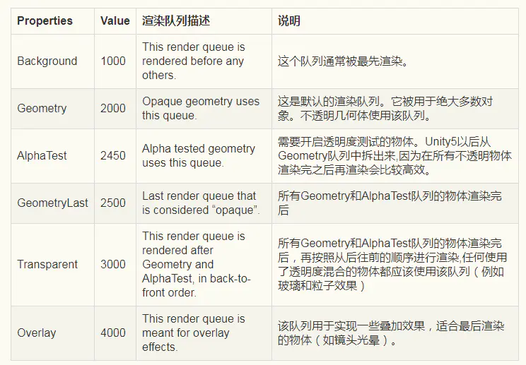
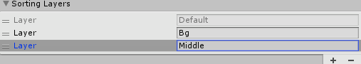
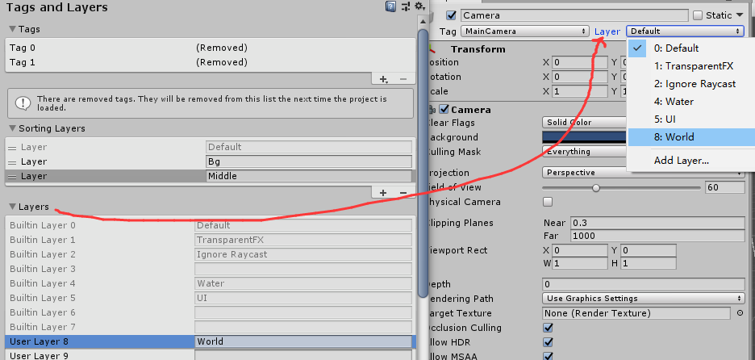
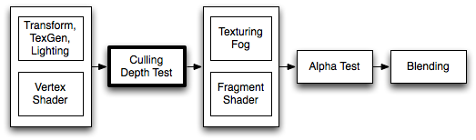
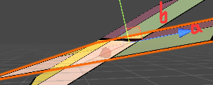
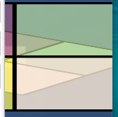
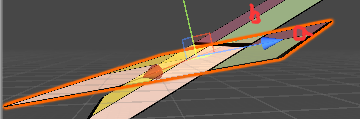
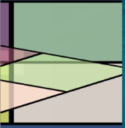
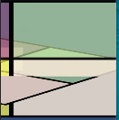
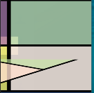

GPU管线渲染顺序




这个总结的很好https://blog.csdn.net/u012149999/article/details/81135505

依次按条件先后顺序进行排序渲染处理。先按上层条件排序，如上层条件相同，则进入下层条件牌序，最终分出先后

Camera Depth: 越小越优先

|---1.RenderQueue 2500以下（含2500），优先于RenderQueue 2500以上

|----|---1. Sorting Layer/Order in Layer 按照Sorting Layer/Order in Layer 设置的值，越小越优先

​		         无此属性，等同于 Sorting Layer=default ,Order in Layer=0 参与排序

|----|----|---1. RenderQueue， 越小越优先

|----|----|----|---1. RenderQueue 相等，由近到远排序优先

|---2.RenderQueue 2500以上

|----|---1. Sorting Layer/Order in Layer 按照Sorting Layer/Order in Layer 设置的值，越小越优先

​		         无此属性，等同于 Sorting Layer=default ,Order in Layer=0 参与排序

|----|----|---1. RenderQueue， 越小越优先

|----|----|----|---1. RenderQueue 相等，由远到近排序优先


值得**注意**的有**3点**是：

* Sorting Layer是通过Project Settings->Tags and Layers 自己设置的层级，

  用来设置渲染顺序的。

  **区别于**Layers，如图

  这个是设置物体的层级，用来做物体或特效等是否对摄像机可见，射线碰撞什么的。。(ps,这里也能新加tag用于标记物体)

* **Sorting Layer/Order in Layer** ：其实是两个关键字排序，先按Sorting Layer排序(越小越优先渲染)，相同的再比较Order in Layer(也是越小越优先渲染)

  * `Renderer`有属性可以**设置** 这两个的值，包括继承`Renderer`的`MeshRenderer`，`ParticleSystemRenderer`，`CanvasRenderer`，都可以设置这两个值

  * 但是`CanvasRenderer`**一般**都是在透明层(UGUI自带shader)，而且通过画布(Canvas)也可以设置这两个属性，透明和不透明的排序要先于`Sorting Layer/Order in Layer`

  * 如果自定义了上图的Sorting Layers，那么可以通过设置`Renderer`的**具体代码**为，

    ```
    _renderer1.sortingLayerName = "Middle";
    _renderer1.sortingOrder = 1;
    _renderer2.sortingLayerName = "Bg";
    _renderer2.sortingOrder = 1;
    ```

    也可以：

    ```
    _renderer1.sortingLayerID = SortingLayer.NameToID("Middle");//SortingLayer.id
    _renderer1.sortingOrder = 1;
    _renderer2.sortingLayerID = SortingLayer.NameToID("Bg");
    _renderer2.sortingOrder = 1;
    ```

    注：**区分下**SortingLayer.id(系统分配的唯一值)和SortingLayer.value(自己定义的layer值，如上面Bg就是1)

* 一般Unity自带的shader和我们写的shader，对于**不透明**的物体，都会开启写深度即`ZWrite On`，这导致渲染的顺序倒**不太影响**显示结果，前面的总是遮挡住后面的。(可能会影响性能，先绘制后面的片元被遮挡后作了无用的计算)

  但是**透明的**就会有影响，因为不写深度，渲染顺序会**极大影响**界面显示。

注意事项：

Sprite组件和Canvas组件 默认使用的Shader未写入z缓冲，但是进行z缓冲深度测试 默认 RenderQueue 均为 Transfront=3000


#### ZWrite 和 ZTest




上面是GPU剔除和深度测试流程图。‘

观察上图：

在进行**顶点变换后**，会进行**剔除和深度测试**，然后在进行**片元着色**的运算。然后进行**Alpha Test**(这个Shader入门精要的教程里是写在片元着色里的，设置一个阈值并判断该片元Alpha是否符合条件返回全透明或完全不透明的rgb)。最后进行的**Blending**，是将结果与颜色缓存进行混合运算并写入颜色缓存。


#### 1.剔除

剔除：不渲染背面。如果一个物体是封闭的，那么摄像机一般是看不到背面的。

```
Cull Back | Front | Off   //剔除背面，前面，或者关闭剔除
```

#### 2.写深度

```
ZWrite On | Off
```

控制是否将此对象的像素写入深度缓冲区（默认值为 `_On_`）。如果要绘制实体对象，请将其保留为 on。如果要绘制半透明效果，请切换到 `ZWrite Off`。

不写深度就会有一个问题，**片元无法**使用深度信息**区分前后**，只能通过渲染顺序(物体由远及近)进行Blend，即结果只能是**整体判断前后**a在b前，或b在a前，没有交叉的情况。

b在a前结果：

a在b前结果：

##### 如果透明开启写深度会怎么样：

b在a前结果：b的一部分没通过深度测试

a在b前结果：先渲染的b，b的右上部分写入深度后，a的右上部分没通过深度测试

两者相较取其轻，最后还是不写深度。

上面使用的RenderQueue 都是3000，如果我们将**后面的物体改成3001**，因为RenderQueue 的优先级要比物体的远近高， 所以会**先渲染**3000的(**前面**那个)，这样就会造成**后面遮挡前面**的效果。’

**注：这里的深度测试默认为LEqual**，即距离近的可以通过深度测试

**注：RenderQueue越小的越先渲染(区分完透明和不透明后)**

#### 3.深度测试

```
ZTest Less | Greater | LEqual | GEqual | Equal | NotEqual | Always
```

应如何执行深度测试。默认值为` _LEqual_`（将前方或远处的对象作为现有对象绘制；隐藏其后面的对象）。

Always：总是通过测试，即每次都绘制

UGUI中的默认材质里深度测试会是这种形式`ZTest [unity_GUIZTestMode]`，这种意味着可以在外部设置深度测试类型，Canvas 类会在 Screen Space Overlay模式时设置成Always，其他模式设置成LEqual。

如果我们想使用**C#脚本**在**外部改变**一些**渲染设定**也可以通过这种方式如

```
// In shader
ZTest [_myCustomCompare]

// In C# script
m_Material.SetInt("_myCustomCompare", (int)UnityEngine.Rendering.CompareFunction.LessEqual);
```


#### 4.UGUI，其Color的透明度是如何实现的

Image.cs **脚本**里设置顶点及其颜色， `vh.AddVert(xx, color32, xx);`

UI/Default.shader UGUI的默认材质**shader**里通过`float4 color  : COLOR;` 语义接收颜色，并使用这个值与纹理的采样颜色相乘。这样就能调节**颜色和透明度**了。

这个shader内部定义"Queue"="Transparent" ，即RenderQuene是3000，也就是正常的**透明渲染流程**

#### 5.**Sorting Layer/Order in Layer** 确定后为什么z还会影响层级

**Sorting Layer/Order in Layer** 原本就是影响渲染顺序，渲染顺序的情况确定后还有ZTest会影响层级的观感。


