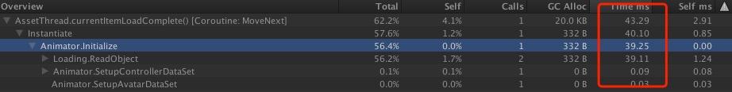

### Animator.Initialize  
Q:使用Profile调试时会看到Animator.Initialize这个耗时很大，这个有什么建议么?Animator.Instance 是因为Animator过多造成的吗？
  
A:由图中可知，Animator.Initialize主要是在Instantiate实例化时引起（**实际上，GameObject.Active操作也会引起Animator.Initialize**），而其具体的耗时原因是**相关资源（主要是AnimationClip资源）的加载所致**。因此，我们的建议如下：  
>1. 对GameObject的Instantiate实例化操作进行检测，对于频繁Instantiate的GameObject尝试进行缓存；  
2. 对Animator Controller中的AnimationClip资源进行精简，可尝试动态加载和替换Animator Controller中的AnimationClip；  
3. 由（1）引申出来，对于已经在缓存池中通过GameObject.Active操作造成的Animator.Initialize开销，建议通过Active/Deactive Animator组件来代替Active/Deactive GameObject，这种操作可以避免Animator.Initialize时内部组织结构创建的开销，进而降低Animator.Initialize时的CPU开销。  
****
