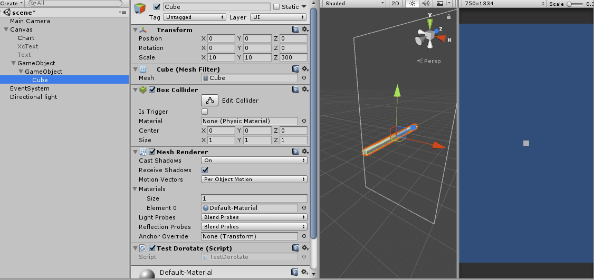
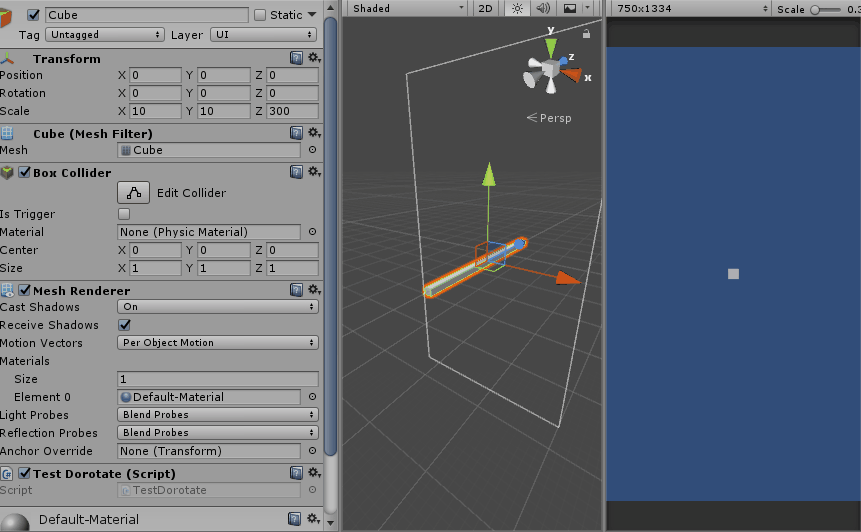
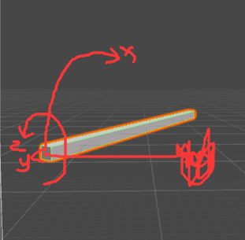
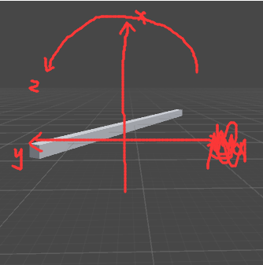
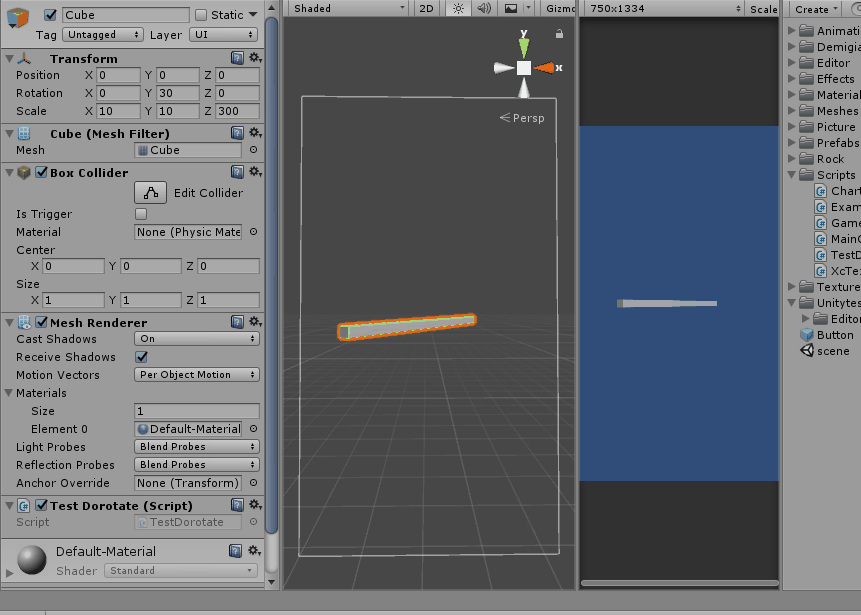
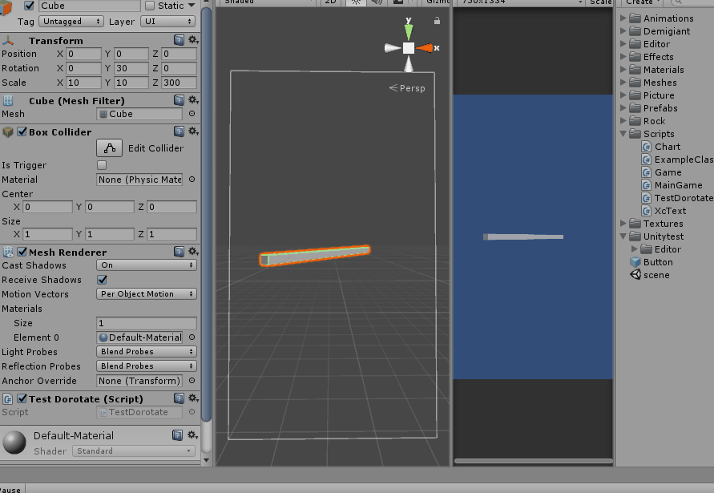
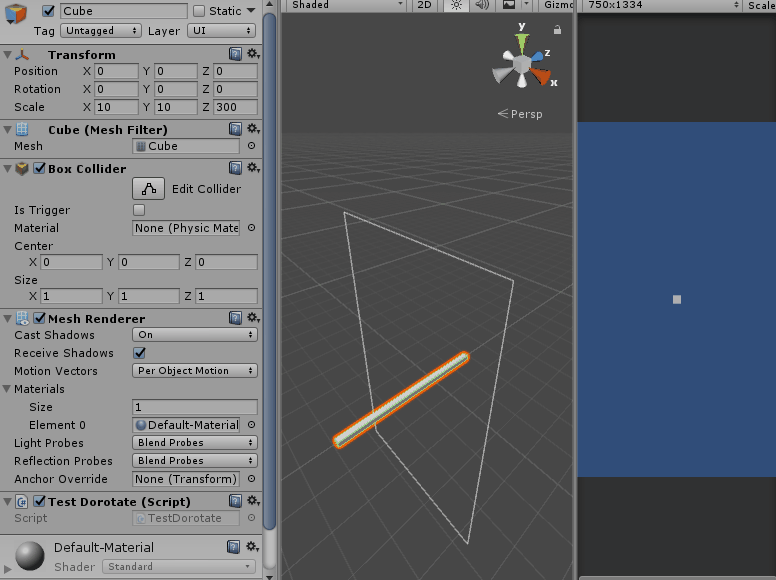

## DOTween -Tweener Api
##### 1.SetDelay(float delay)
等待一段时间再执行，如transform.DOMoveX(4, 1).SetDelay(1);
##### 2.SetSpeedBased(bool isSpeedBased = true)  
设置基于恒定速度的移动，这时候duration 代表的是每秒移动的单位。如果想速度为定值，设置ease为Ease.Linear.(动画启动或加入Sequence后设置不再生效)
##### 3.Sequence

    Sequence mySequence = DOTween.Sequence();//重点，不新建DOTween.Sequence()的话一些插入时间的操作是不生效的
    mySequence.Append(transform.DOMoveX(45, 1))//1秒内x移动到45
		.AppendInterval(2)//移动到45位置后等待2秒
      .AppendCallback(()=>Debug.Log("CallBack"))//上个操作结束后打印CallBack
      .Append(transform.DORotate(new Vector3(0, 180, 0), 1))上个操作结束后旋转
      .PrependInterval(2)//mySequence整个Sequence开始后等待两秒
      .Insert(10, transform.DOScale(new Vector3(3, 3, 3), mySequence.Duration()));在整个Sequence开始后的第10秒Scale变为3倍

##### 4.Complete(bool withCallbacks = false)  
立即完成，当withCallbacks参数为true时(仅在Sequences中)，Sequence的callbacks会被执行，当使用Complete后的结果与预期的不太相符时，可以查看下是否是没有执行callback造成的。  
##### 5.SetRelative(bool isRelative = true)  
如设置为true，则前面的Domove是相对位移。(作用于整个Tween or Sequence)(startValue + endValue)  
`transform.DOMoveX(4, 1).SetRelative();`

---
### 1.DORotate
`DORotate(Vector3 to, float duration, RotateMode mode)`  
####RotateMode的四个选项:
#####1)Fast:旋转不会超过360，如果目标为 (360,1,1)  将会折合成 (0,0,1)，里面的参数是目标位置
	Vector3 v1 = new Vector3(49, 390, 0);
	transform.DORotate(v1, 2, RotateMode.Fast);

#####2)FastBeyond360:旋转会超过360
	Vector3 v1 = new Vector3(49, 390, 0);
	transform.DORotate(v1, 2, RotateMode.FastBeyond360);

上面两个坐标变换都是以世界坐标系为准，所以如果旋转结果与预想的不太一样可以查看下父物体的角度是不是都为0

LocalAxisAdd 与 WorldAxisAdd 区别，一个以自身坐标系为准，一个以世界坐标系为准，如图：
  
**local**  
  
**world**  
(画得有点丑。见谅)
#####3)LocalAxisAdd: 以自身坐标系为准旋转物体。这里vector参数代表含义为旋转角度而不是目标角度。以下述代码为例，即以ZXY(unity定义的顺序，顺序不同结果也可能不同)为旋转顺序，将z旋转20度，x旋转360度，y旋转0度(此顺序是unity官方顺序，存疑)
    Vector3 v1 = new Vector3(360, 0, 20);
    transform.DORotate(v1, 2, RotateMode.LocalAxisAdd);
  

#####4)WorldAxisAdd: 以世界坐标系为准(vector参数代表世界坐标系下的值)旋转物体。这里vector参数代表含义为旋转角度而不是目标角度。一下述代码为例，即以ZXY(unity定义的顺序，顺序不同结果也可能不同)为旋转顺序，将z旋转20度，x旋转360度，y旋转0度(此顺序是unity官方顺序，存疑)
	Vector3 v1 = new Vector3(360, 0, 20);
	transform.DORotate(v1, 2, RotateMode.WorldAxisAdd);
  
恩，和预想的差不多，不过怎么有种嘚瑟的感觉  

---
四种模式大概就是这样，可以注意到后面两种模式其实也是FastBeyond360的模式。另外，用这种选转方式避免不了一个叫万向锁的东西.举个栗子：  

    Vector3 v1 = new Vector3(90, 0, 0);
    Vector3 v2 = new Vector3(0, 90, 0);
    transform.DORotate(v1, 2).OnComplete(() => transform.DORotate(v2,5));
这里我们先将x旋转90度，再将y旋转90度。上图：  
   
哎？不对呀，为什么路线这么诡异。这就是万向锁的问题了。

---  

##### 方向  
举起你的左手，对，就是左手定则。  
用左手握住对应的轴，大拇指朝坐标轴正方向，四个手指的方向就是正了。

