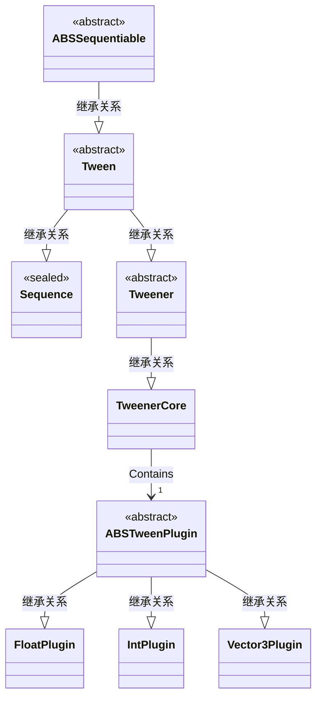

#### Q：seq里面的tween怎么更新的

1. tween在创建时(TweenManager.GetTweener<T1, T2, TPlugOptions>())会被加入TweenManager.\_activeTweens中
2. seq在实例化时(DOTween.Sequence())会被加入\_seq._sequencedObjs中

将tween加入到seq时

1. 从TweenManager._activeTweens中移除tween

更新所有TweenManager.\_activeTweens时会更新到seq，这时

1. seq调用内部_sequencedObjs里存的tween进行更新

放到 Sequence类的列表_sequencedObjs中

#### Q：出错后的报错怎么转为的waring？

使用safemode后(DOTween.useSafeMode = true)，所有的回调都会使用try..catch来执行。这就避免了直接抛出错误还改为记录错误

而DOTween默认使用safemode

#### Q：所有的Tween都是TweenCore吗？

所有带有插值移动的Tween都是使用的TweenCore，

虽然Sequence也继承Tween，但是最后还是使用\_sequencedObjs储存的TweenCore进行更新

#### Q：DoRotate解析

四种模式：

* **Fast**：

  参数endValue，为**结束时的欧拉角**

  指导思想是，分别对于结束值endValue.x,endValue.y,endValue.z

  changV = endV - startV

  让changV 变化最小

  * changV三个分量 大于360度的都可以取余  如：730 -> 10

  * changV三个分量  大于180度都可以等效成360-180     如：190 -> -170

  但是对于endValue设置为负数的情况好像考虑不周，实测旋转情况类似FastBeyond360

  * 有万向锁的[问题](1.DOTween.md)

* **FastBeyond360**：

  参数endValue，为**结束时的欧拉角**

  changV  =  endV - startV

  按时间插值。 

* **WorldAxisAdd**：

  参数为一个旋转操作：

  如：`transform.DOLocalRotate(new Vector3(60,70,80), 2,RotateMode.WorldAxisAdd);`

  

* **LocalAxisAdd**：

  参数为一个旋转操作：

  如：`transform.DOLocalRotate(new Vector3(60,70,80), 2,RotateMode.LocalAxisAdd);`

  * 旋转结果：
    * 和调用unity自带API` transform.Rotate(new Vector3(60,70,80),Space.Self);`结果一样，可以参考[rotate](../../API/5.translate and rotate.md)
    * 解释为：以自身坐标轴为参考($O_t$)按照左手定则将transform绕z旋转80度，绕x旋转70度，绕z旋转60度。(过程中一直参考$O_t$坐标系)。**的结果**
    * 注意这里仅是结果。

  * 旋转过程：

    使用了四元数相乘进行处理

  

  

  

  

