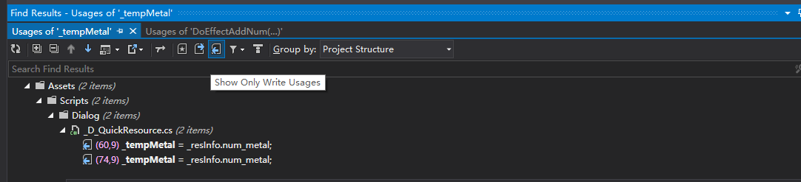

## Resharper快捷键  
刚找到一张图   
  

* Ctrl + -   向后导航

* Ctrl + Shift + -  向前导航

* Ctrl + U  或 Alt + Home 找到类/方法 的父方法/类

* Alt + F7 查找所有引用

* Ctrl + [  光标所在的方法或类即外扩一层

* Ctrl + Shift + BackSpace 回到上次修改

* Ctrl + Shift + Alt + BackSpace 查看最近的改动

* Ctrl +Alt + B 找 此类/方法 的子类/方法实现(重写)

* Ctrl + Alt + F7 查找此类/方法 的所有引用

* ######查看是 引用或者修改
  
	
* ######更正建议  
  如果你突然想用 RegularExpression, 但没有事先在文件头加上using System.Text; 那你需要做的是到文件开头, 加上这句, 再回到刚才编缉的地方继续, 心细一点的, 离开当前编辑位置时会设一个bookmark(Ctrl+k, Ctrl+k), 加完using语句后用 Ctrl+K, Ctrl+N 向下遍历所有的bookmark可以再直观地回来, 回来后可能还需要再用Ctrl+k, Ctrl+k把bookmark去掉, 它的使命已经完成. 或者, 在你大脑的高速缓存中记下当前的行号, 用Ctrl+G 直接回到这一行, 这个方法再高效, 但是有可能需要把你大脑里原来位于高速缓存中的其它内容交换到次级存储上, 而有了resharper, 它会在你输入完RegularExpression.之后把其颜色标为红色, 显示一个tooltip, **告诉你按Alt + Enter加入所缺的名字空间, 你只需要一个按键, 光标位置纹丝不动, 一切都已经搞掂了, 你继续你的代码, 它保障不必要的东西不去打断你要干的正事.**

* ######修改变量名
	 F2, 熟悉吧, 在Explorer中它是微软定义的修改文件名的快捷键. 可以修改的有函数参数, 类名, 函数名, field名, 局部变量名等等我没用过的.修改类名时, 如果当前类所在的文件跟类同名, 它还会提示你是否把文件名也一块改了. 酷!
  修改局部变量名时, 所有对这个局部变量的引用同时得到修改。  

* ######代码模板, 环绕代码
  你写下一段代码, 突然想对它加上try/catch/finally的保护, 或者觉得它只应该在满足某个条件时才被执行, 你需要一个if, 或者你已经写了if + statement, 但由于一开始以为这个statement永远只是一个单独的语句所以没有{}, 但随后又意识到最好还是保持风格的一致, 那只需要在当前的statement行上(对于单行代码不需要先选中), 或选中这段代码, 按Ctrl + Alt + J, 点击其中列出来的模板即可.

* ctrl + b ，go to next usage 需要设置smart 跳转。 https://www.jetbrains.com/help/resharper/Navigation_and_Search__Go_to_Declaration.html#smart  

  resharper -> option -> Environment | Search & Navigation  ->Iterate usages 