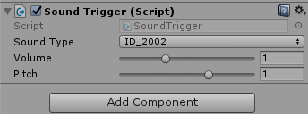

## 绝地声音实现步骤
* 1.`InitManagers()`游戏主入口初始化Managers。  为每种音源新建AudioSource
* 2.`AudioManager.PlaySound()`播放背景根据从配置表载入的配置or数据音乐或音效

每个按键挂一个Sound Trigger脚本表明音效类型(即id)，通过`Game.Instance.AudioManager.PlaySound(parameter)`播放。

> **1) InitManagers()里加入AudioManage脚本。**
脚本在Awake时会添加AudioSource，AudioListener组件，等。  一般AudioListener只有1个

---

音源类型：

同一种音源类型同一时刻只能播放一个音源，即同一种音源类型共用AudioSource

一般分为：

背景音乐

环境音

操作声音(UI声音等)

提示音
....