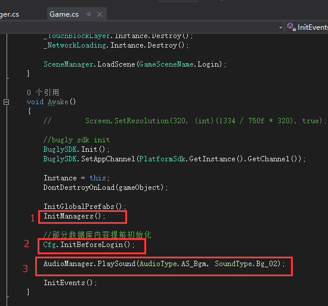
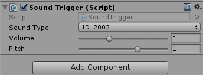
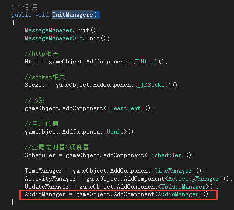

## 绝地声音实现步骤
* 1.`InitManagers()`游戏主入口初始化Managers。  
* 2.`Cfg.InitBeforeLogin()`从配置表(数据库)里载入音效类，里面含有类型，路径，音量，描述等字段
* 3.`AudioManager.PlaySound()`播放背景根据从配置表载入的配置or数据音乐或音效

  
每个按键挂一个Sound Trigger脚本表明音效类型(即id)，通过`Game.Instance.AudioManager.PlaySound(parameter)`播放。

--- 

> **1) InitManagers()里加入AudioManage脚本。**
  
脚本在Awake时会添加AudioSource，AudioListener组件，等。
