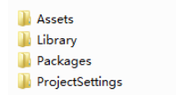
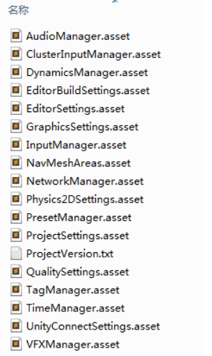
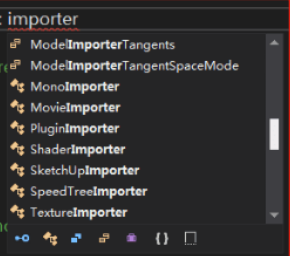
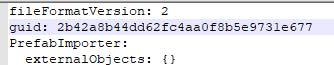
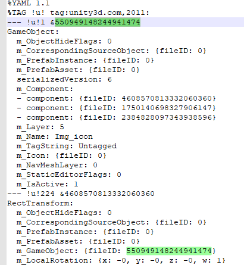
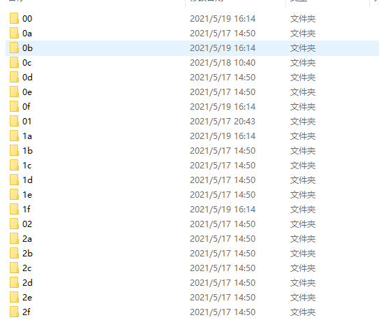

### 一. 什么是Assets

#### 1.Assets目录

原文链接https://blog.uwa4d.com/archives/USparkle_Addressable1.html

工程一般有四个目录

他们的作用分别是：

* Assets

  Unity工程实际的资源目录，所有项目用到的资源，代码，配置，库等原始资源只有放置在这个文件夹才会被Unity认可和处理 

* Library

  存放Unity处理完毕的资源，大部分的资源导入到Assets目录之后，还需要通过Unity转化成Unity认可的文件，转化后的文件会存储在这个目录

* Packages

  这个是2018以后新增的目录，用于管理Unity分离的packages组件见https://zhuanlan.zhihu.com/p/77058380

* ProjectSettings

  这个目录用于存放Unity的各种项目设定

  

当你的工程开始有脚本文件的时候，还会增加一个**obj**的目录用于代码编译。所以当你要迁移一个工程，或者将工程复制给别人的时候，只需要将Assets，Packages以及ProjectSettings三个目录备份即可。(SVN提交同理)。至于Library会在Unity打开的时候进行检查和自动转化。

另外，实际的项目开发期间，我们可能要针对不同的平台进行打包，比如PC包和安卓包。**那么复制两份工程，一份设置为PC平台，一份设置为安卓平台，**效率会远远大于需要时再切换平台，因为你每次切换到不同的平台，Unity都需要全部重新处理一遍内置资源，非常耗时。

#### 2.AssetBundle

抛开所有其他的理解，单从英文命名来看，这是一种捆绑包，是对Asset进行归档的格式，概念更趋向于我们使用Zip或者RAR等格式对资源或者目录进行压缩，加密，归档，存储等等。

而区别就在于Zip等压缩格式是针对文件的，而AssetBundles则是针对Unity的Asset。但如果再转换一下概念来裂解，其实Zip操作归档的是操作系统能识别的文件，而AssetBundles操作归档的则是Unity能识别的文件。这么理解，二者的作用几乎是一致的。

做了铺垫之后，我们再看一下Unity官方是怎么定义的。

**AssetBundles是一个包含了特殊平台，非代码形式Assets的归档文件。**

这里有几个重要信息，首先它是一个**归档**文件(即捆绑形式的文件类型)，其次它拥有**平台的差异**性，再次它不包含代码，最后它存储的是Unity的**Assets**。

到目前为止，我们一直在提及Assets，那么究竟Assets是什么呢？ 以及它在Unity整个引擎中占据的位置又是什么呢？

#### 3.Unity资产

**Windows操作系统识别文件**是通过后缀名实现的。**在系统中注册后缀名和对应的处理软件**，那么双击文件的时候系统就会调用指定的软件解析和处理文件。如果没有在系统中注册，或者后缀被删除了，那么操作系统将无法识别这个文件。

Unity的Asset也是一样，我们把一个Asset叫做一个资产，可以理解为Unity能够识别的文件。这里其实又包含了两种类型，一种是Unity**原生支持的格式**，比如：材质球；一种是需要**经过Unity处理之后才能支持**的，比如：FBX。对于**需要处理**才能支持的格式，Unity都**提供了导入器(Importer)**。如下图，代码里输入Importer可以看到有很多个种类的导入器。

要注意，所有的资产原始文件都必须要放在Unity工程的Assets目录，然后经过Unity处理之后存放在Library目录下。

### 二. Assets的识别和引用

作为资产文件，Assets有非常多的类型，比如：材质球，纹理贴图，音频文件，FBX文件，各种动画，配置或者Clip文件等等。我们通常习惯于在Unity里进行拖拽，新增，修改，重命名甚至变更目录等等各式各样的操作，但不管你在Unity引擎里如何操作(不包括删除)，那些相关的引用都不会丢失。这是为什么呢？

#### 1. Assets和Objects

在进行后面的阐述之前，先统一一下概念，包括如果在后面的章节里提到，都会遵循这里统一的概念。**Assets**这里以及后续的内容都指**Unity的资产**，可以意指为Unity的Projects窗口里看到的单个文件(或者文件夹)。而**Objects**这里我们指的是**从UnityEngine.Object继承的对象**，它其实是一个可以序列化的数据，用来描述一个特定的资源的实例。它可以代表任何Unity引擎所支持的类型，比如：Mesh，Sprite，AudioClip 或 AnimationClip (也就是所有继承了UnityEngine.Object的类的**实例**都可以通过序列化的方式被存储，但是我们一般不在脚本new 出实例，而是在unity场景中建立实例，或者导入实例 ScriptableObject.CreateInstance？)

大多数Objects都是Unity内置支持的，但有两种除外：

* ScriptableObject
  * 用来提供给开发者进行自定义数据格式的类型。从该类继承的格式，都可以像Unity的原生类型一样进行序列化和反序列化，并且可以从Unity的Inspector窗口进行操作。(ScriptableObject直接继承UnityEngine.Object，就像我们从Unity的Inspector窗口操作的MonoBehaviour，是间接继承UnityEngine.Object)
* MonoBehavior
  * 提供了一个指向MonoScript的转换器。MonoScript是一个Unity内部的数据类型，它不是可执行代码，但是会在特定的命名空间和程序集下，保持对某个或者特殊脚本的引用。

Assets和Objects之间是**一对多**的关系，比如一个Prefab我们可以认为是一个Asset，但是这个Prefab里可以**包含很多个Objects**，比如：如果是一个UGUI的Prefab，里面就可能会有很多个Text，Button，Image等组件。

#### 2.File GUIDs 和 Local IDs

熟悉Unity的人都知道，UnityEngin.Objects之间是可以互相引用的。这就会存在一个问题，这些互相引用的Objects有可能是**在同一个Asset里**，也有可能是**在不同的Assets里**。比如UGUI的一个Image需要引用一张Sprite Atlas(使用Unity打包的图集)里的Sprite，这就要求Unity必须有健壮的资源标识，能稳定地处理不同资源的引用关系。除此之外，Unity还必须考虑这些资源标识应该与平台无关，不能让开发者在切换平台的时候还需要关注资源的引用关系，毕竟它自己是一个跨平台部署的引擎。

基于这些特定的需求，Unity把序列化拆分成两个表达部分。第一部分叫做File GUID，标识这个资产的位置，这个GUID是由Unity根据内部算法自动生成的，并且存放在原始文件的同目录，同名但后缀为.meta的文件里。

这里需要注意几个点：

* 第一次导入资源的时候Unity会自动生成.meta。
* 在Unity的面板里移动位置，Unity会自动帮你同步.meta文件。
* 在Unity**打开的情况**下，**单独删除.meta**，Unity可以确保**重新生成**的GUID和现有的**一样**
* 在Unity关闭的情况下，移动或者删除.meta文件，Unity无法恢复到原有的GUID，也就是说**引用会丢失**。(如果没有SVN找回的话，简直是工程灾难)

确定了资产文件之后，还需要一个Local IDs来表示当前的Objects在资产里的唯一标识。File GUID确保了资产在整个Unity工程里唯一，Local ID确保Objects在资产里唯一，这样就可以通过二者的组合去快速找到对应的引用。

 

Unity还在内部维护了一张资产**GUID和路径的映射表**，每当有新的资源进入工程，或者删除了某些资源，又或者调整了资源路径，Unity的编辑器都会自动修改这个映射表以便正确地记录资产位置。所以如果.meta文件丢失或者重新生成了不一样的GUID，Unity就会丢失引用，在工程内的表现就是某个脚本显示"Missing"，或者某些贴图材质的丢失导致场景出现粉红色。

#### 3. Library中的资源位置

前面我们提到了非Unity支持的格式，需要由导入器进行资源转换。之所以要分到这个小节来讲位置是因为它涉及到了File GUID。之所以需要对资源转换和存储，也是为了方便下一次启动的时候不需要再处理资源，比较每次导入资源是巨耗时的操作。简单来讲，所有的**转换结果**都会存储在**Library/metadata/目录下**，以File GUID的前两位进行命名的文件夹里。比如这样：

**注意：原生支持的Assets资源也会有同样的存储过程，只是不需要再导入器进行转化而已。**

#### 4. Instance ID

File GUID和Local ID确实已经能够在编辑器模式下帮助Unity完成它的规划了，与平台无关、快速定位和维护资源位置以及引用关系。但若投入到运行时，则还有比较大的性能问题。也就是说运行时还是需要一个表现更好的系统。于是Unity又弄了一套缓存(还记得前面那套缓存嘛？是用来记录GUID和文件的路径关系的)。PersistentManager用来把File GUIDs和Local IDs转化为一个简单的、Session唯一的整数，这些整数就是Instance ID。Instance ID用于运行时，相当于Object的唯一id，可以看到UnityEngine.Object 也有获取的接口`GetInstanceID()`，Instance ID很简单，就是一个递增的整数，每当有新对象需要在缓存里注册的时候，简单的递增就行。有关PersistentManager的详细分析，参见[《深度剖析PersistentManager.Remapper内存占用》](https://edu.uwa4d.com/course-intro/0/113)

简单来说：PersistentManager会维护**Instance ID和File GUID、Local ID的映射关系**，定位Object源数据的位置以及维护**内存中**(如果有)**Object的实例**。只要系统解析到一个Instance ID，就能快速找到代表这个Instance ID的已加载对象。如果Object没有被加载，File GUID和Local ID 也可以快速地定位到指定的Asset资源从而即时进行资源加载。本来这章节的内容我是打算整体配图讲解的，但我发现两篇已经完稿并且配图的大佬文章，所以就不重复造车了，直接给出链接：

一篇是UWA Blog的文章：[《Unity文件、文件引用、Meta详解》](https://blog.uwa4d.com/archives/USparkle_inf_UnityEngine.html)

另外一篇是来自腾讯GAD的：[《程序丨入门必看：Unity资源加载及管理》](https://mp.weixin.qq.com/s/0XFQt8LmqoTxxst_kKDMjw?)

另外Unity的Prefab或者meta文件都是使用YAML的语法格式存储的，因为放了传送门链接，所以这里就不细讲了，有关YAML的语法详情，大家可以参考：https://baike.baidu.com/item/YAML/1067697?fr=aladdin

### 三. 资源生命周期

到目前为止我们已经搞清楚了Unity的Asset在编辑器和运行时的关联和引用关系。那么接下来我们还要关注一下这些资源的生命周期，以及在内存中的管理方式，以便大家能更好的管理加载时长和内存占用。

#### 1. Object加载

当Unity的应用程序启动的时候，PersistentManager的缓存系统会对项目立刻要用到的数据(比如：启动场景里的这些或它的依赖项)，以及所有包含在Resouces目录的Objects进行初始化。如果在运行时导入了Asset或者从AssetBundle(比如：远程下载下来的)**加载Object都会产生新的Instance ID**。

另外Object在满足下列条件的情况时会自动加载，比如：

* 某个Object的Instance ID被间接引用了
* Object当前没有被加载进内存
* 可以定位到Object的源位置(File GUID和Local ID)

另外，如果File GUID和Local ID没有Instance ID，或者有Instance ID，但是对应的Objects已经被卸载了，并且这个Instance ID引用了无效的File GUID和Local ID，那么这个Objects的引用会被保留，但是实际Objects不会被加载。在Unity的编辑器会显示为："Missing"引用，而在运行时根据Objects类型不一样，有可能会是空指针，有可能会丢失网格或者纹理贴图导致场景或者物体显示粉红色。

#### 2. Object卸载

除了加载之外，Objects会在一些特定情况下被卸载。

1. 当没有使用的Assets在执行清理的时候，会自动卸载对应的Object。一般是由切场景或者手动调用了`Resource.UnloadUnusedAssets`的API的时候触发的。但是这个过程只会卸载那些没有任何引用的Objects。
2. 从Resources目录下加载的Objects可以通过调用`Resources.UnloadAsset`API进行显式的卸载。但这些Object的Instance ID会保持有效，并且仍然会包含有效的File GUID和LocalID。当任何Mono的变量或者其他Objects持有了被`Resource.UnloadAsset`卸载的Objects的引用之后，这个Object在**被直接或者间接引用之后会被马上加载**。
3. 从AssetBundles里得到的**Objects**在执行了`AssetBundle.Unload(true)` API之后，会立刻自动的被卸载，并且这会立刻让这些Objects的File GUID、Local ID以及Instance ID立马失效。任何识图访问它的操作都会触发一个`NullReferenceException`。但如果调用的是AssetBundle.Unload(false)API，那么生命周期内的Objects不会随着AssetBundle一起被销毁，但是Unity会**中断File GUID、Local ID和对应Object的Instance IDs之间的联系**，也就是说，如果这些Objects在未来的某些时候被销毁了，那么当再次对这些Objects进行引用的时候，是没法再自动进行重加载的。

另外，如果Objects中断了它和源AssetBundle的联系之后，那么再次加载相同Asset，Unity也不会复用先前加载的Objects，而是会重新创建Instance ID，也就是说内存里会有多份冗余的资源。(也就是如果游戏中正在使用的某个资源所在的AB包被卸载后AssetBundle.Unload(false)， 如果再次加载AB包，那么这个资源在内存中中就存在了两份)

