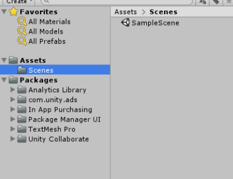
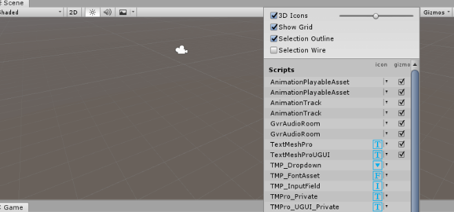

原文链接：https://blog.uwa4d.com/archives/USparkle_Addressable2.html

#### 一. 特殊的工程目录

先看下Unity默认空工程的目录。如下图：

##### 1.新工程的默认目录

在比较老的版本中，Unity创建空工程之后，就只有一个空的Assets。现在，在Assets里默认有了一个Scenes目录，然后里面有一个SampleScene的默认空白场景。在Assets的平级，有一个Packages目录，这个是2018跟随PackagesManager一起出现的，里面展示的是**当前工程引入的Packages**。不过要注意的是，这个目录是只读的，不能操作。所有的改变都是通过PackagesManager的窗口进行变化。当然你也可以手动到磁盘的对应目录去修改它的Json文件，虽然也能达到效果，但是不推荐大家这么做。

##### 2.Unity的特殊目录

虽然新工程默认给了一个Scenes的目录，但其实这个目录并没有特殊意义。你可以把场景存放在任意的自定义目录下面。

1.Editor

第一个介绍的就是这个目录。这个目录是用来辅助开发的，可以是一个，也可是有很多个，可以在任意的自目录下面。主要作用就是可以编译Unity编辑器模式下提供的脚本和接口，用于**辅助研发**，创建各种资源检查，生成工具，以及自定义Unity的工具栏，窗口栏等等。Editor目录下的所有脚本都不会被编译到正式发布包里，很多很多优秀的插件都是需要通过Unity提供的编辑器下的扩展接口来实现功能扩展的。

2.Editor Default Resources

这个需要和Editor配合使用。一个扩展面板或者工具光秃秃的也不好看，配上一些美化**资源**之后会让你的**插件**或者工具格局更高。要注意的是，这个目录只能是唯一的，并且只能放在Assets的根目录下。

3.Plugins

这个目录是存放代码之外的库文件的。比如引入的**第三方代码**，SDK接入的各种jar包，.a文件，.so文件.framwork文件等等，这些库文件会在Unity编译的时候链接到你的DLL里。(比如Dotween)

4.Resources

这个和Editor一样，可以在Assets下的任何目录下，并且可以有任意多份。所有Resources目录下的文件都会直接**打进一个特殊的Bundles中**，并且在游戏启动时，会生成一个序列化映射表，并加载进内存中。

##### 5.Gizmos

这个目录其实比较简单，就是可以辅助你在Unity的Scene视窗里显示一些辅助标线，图标或者其他的表示，用来辅助开发定位资源。比如

按钮在Scene窗口的最右上角。要注意的是，因为是Scene视窗的，所以Game视窗和发布之后都不会看到。

##### 6.SteamingAssets

这个文件是Unity的一个重要文件。Unity发布程序或者游戏，资源随包出去的时候，只有2个地方，一个就是Resources目录，另一个就是StreamingAssets。这个目录的资源，文件或者任何东西，都会**原封不动**的复制到最终的Apk或者iOS的包内。(所以db放在这下面)

除了上面这些特殊目录之外，如果是一个正常的工程，还会有很多其他导入的插件、或者自定义目录。

参考https://zhuanlan.zhihu.com/p/77058380

#### 二. Resources详解

我觉得，Resources之所以能被广泛地使用，是因为它的使用非常简单，并且是**同步加载**。一般来说，正式的商业项目，对外发布资源的时候都是使用AssetBundle的方式进行。

AssetBundles的方式有很多缺点，比如：

* 无法直观地看到包内的资源情况
* 异步加载，需要写比较繁琐的回调处理。
* 调试的时候，无法通过Hierarchy直接定位到资源。
* 使用之前需要花费时间进行打包，尤其是在开发的时候，调整资源频繁，如果忘记打包可能导致Bug。

(解决办法：Unity中使用`AssetDatabase.LoadAssetAtPath`， 发布时使用AssetBundle)

前面我们也说了，Unity处理资源就2种方式，Resources和AssetBundles。那么既然AssetBundle开发期这么不好用，大部分时候就使用Resources代替了。

那么问题来了，使用Resources就没问题了嘛。

##### 1.Resources目录的最佳实践

在讲缺点之前，先看一下Unity官方对于Resources使用的最佳实践：

不！要！使！用！它！

不要惊讶，这就是官方的态度。出于几点原因，Unity并不希望大家过度使用Resources，是因为

* Resources内的资源会增加应用程序的启动时间和构建时长。
* Resources内的资源无法增量更新，这是现在手机游戏开发的致命点。

所以官方建议，使用AssetBundles。

其实也不用太在意了，经过多年的开发，其实早就累积了解决方案。后面会稍微提一下，但是最大的解决方案还是我们这个系列的主题Addressable Asset System。不过这是后话了。

##### 2.哪些情况我们可以使用Resources

Resources有它的致命性缺点，但是存在即合理。它还是有它的一些使用场景的，比如：

* 某些资源是项目整个生命周期都必须要用的。
* 有些很重要，但是却不怎么占内存的。
* 不怎么需要变化，并且不需要进行平台差异化处理的。
* 用于系统启动时候最小引导的。

另外还有一种情况就是，当你需要给老板快速展示一些效果，或者要快速完成Demo，或者要写一些教程，文章，分享展示方案的时候，使用Resources可以节省时间。但是要注意，一旦你决定要把既定的工程用于正式生产的时候，请一定把它用AssetBundles重写

##### 3.Resources的序列化

如前文所说，构建项目的时候，所有的Resources目录下的文件会被合并为一个序列化文件。改文件会有自己的metadata信息和索引信息。内部用红黑树实现资源查找，用于索引相应的File GUID和Local ID，并且它还要记录在序列化文件中的偏移量。

官方的实际测试数据，一个拥有10000个Assets的Resources目录，在低端移动设备上的初始化需要5-10秒甚至更长。但其实，这些Assets并不会在一开始就全部用到。

##### 5.开发中的替代方案

前面把Resources和AssetBundles不变的地方都说了一遍，那么有没有一种方案，既可以在开发时候快速加载，又没有Resources那些缺点呢？有的，其实就是**AssetDatabase**。

这是一个Unity在编辑器模式下的资源加载类，它提供了常规资源的Create，Delete，Save，Load等常用接口，并且是同步加载。所以我们只需要自己写一个资源加载类，用宏区分Editor模式，在Editor直接使用AssetDatabase进行资源加载，然后模拟一个异步回调，让它看起来跟AssetBundles加载流程相似，然后在非Editor模式下，调用正常的AssetBundles加载就可以了。

虽然这个资源管理器写起来会很烦，但是一旦流程调试对了，后面就不用再管了。至于AssetDatabase也不展开讲了，找了一个比较详细的文档，大家可以参考：https://www.jianshu.com/p/2cae2f082f66

除了AssetDatabase这个方案之外，另外一个就是这系列文章的主题Addressable Asset System了。这个是2018之后官方引入的，把我刚才说的那些做了封装和组合，并且解决了开发中对资源管理的一些痛点，不过在讲这个之前呢，还需要插入一章内容，讲解一下AssetBundles的系统知识。

