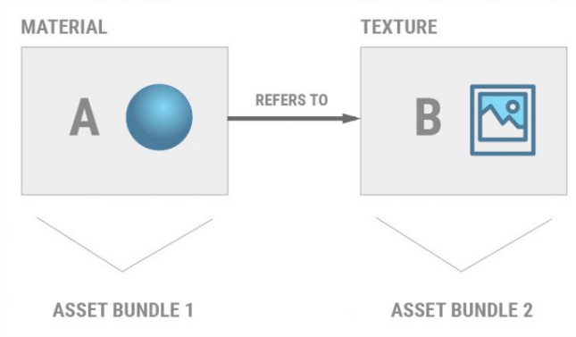

原文地址：https://blog.uwa4d.com/archives/USparkle_Addressable3.html

#### 三、AssetBundle原理

**AssetBundle系统提供了一种压缩文件的格式，可以把一个到多个文件进行索引和序列化。**

Unity项目在交付安装之后，会通过AssetBundle对不包含代码的资源进行更新。这就允许开发人员先提交一个小的应用程序包，将运行时内存压力降到最低，并有选择地加载针对不同终端用户社会优化后的内容。

##### 3.1 AssetBundle结构

总的来说，AssetBundle就像传统的压缩包一样，由两个部分组成：**包头和数据段**。

**包头**包含有关AssetBundle的信息，比如**标识符、压缩类型和内容清单**。清单是一个以Objects name为键的查找表。每个条目都提供一个字节索引，用来指示该Objects在AssetBundle数据段的位置。在大多数平台上，这个查找表是用平衡搜索树实现的。具体来说，Windows和OSX派生平台(包括iOS)都采用了红黑树。因此，构建清单所需的时间会随着AssetBundle中Assets的数量增加而线性增加。

**数据段**包含通过序列化AssetBundle中的Assets而生成的原始数据。如果指定LZMA为压缩方案，则对所有序列化Assets后的完整字节数组进行压缩。如果指定了LZ4，则单独压缩单独Assets的字节(不压缩包头？)。如果不使用压缩，数据段将保持为原始字节流。

在Unity5.3之前，是无法对AssetBundle中单独Objects进行压缩的。因此，如果在5.3之前的Unity版本被要求从压缩的AssetBundle中读取一个或者多个对象时，Unity必须解压整个AssetBundle。通常，Unity会缓存AssetBundle的解压缩副本，以提高在相同AssetBundle上的后续加载请求的加载性能。

##### 3.2 加载AssetBundles

AssetBundles可以通过四个不同的API进行加载。但受限于两个标准，这四个API的行为是不同的。两个标准如下：

* AssetBundles的压缩方式：LZMA，LZ4，还是未压缩的
* AssetBundle的加载平台

而四个API分别是：

* `AssetBundle.LoadFromMemory(Async optional)`
* `AssetBundle.LoadFromFile(Async optional)`
* `UnityWebRequest's DownloadHandlerAssetBundle`
* `WWW.LoadFromCacheOrDownload(on Unity 5.6 or older)`

下面来详细讲一下4个API的区别

**3.2.1 AssetBundle.LoadFromMemory(Async)**

Unity的建议是---**不要使用这个API**

`LoadFromMemory(Async)`是从托管代码的字节组里加载AssetBundle。也就是说你要提前用其它的方式将资源的二进制数组加入到内存中。然后该接口会将源数据从托管代码字节数组复制到新分配的、连续的本机内存块中

但如果AssetBundle使用了LZMA压缩类型，它将在复制时解压AssetBundle。而未压缩和LZ4压缩类型的AssetBundle将逐字节的完整复制。

之所以不建议使用该API是因为，此API消耗的最大内存量将至少是AssetBundle的两倍；本机内存中的一个副本，和`LoadFromMemory(Async)`从托管字节数组中复制的一个副本。

因此，从通过此API创建的AssetBundle加载的资产将在内存中冗余三次；一次在托管字节数组中，一次在AssetBundle的栈内存副本中，第三次在GPU或者系统内存中，用于Asset本身。

注意：在Unity5.3.3之前，这个API被称为`AssetBundle.CreateFromMemory`。但功能没有改变。

**3.2.2 AssetBundle.LoadFromFile(Async)**

LoadFromFile是一种高效的API，用于从本地存储(如硬盘或SD卡)加载未压缩或LZ4压缩格式的AssetBundle。

在桌面独立平台、控制台和移动平台上，API将**只加载AssetBundle的头部**，并将**剩余的数据留在磁盘上**。

AssetBundle的Objects会按需加载，比如：加载方法(例如：AssetBundle.Load)被调用或其InstanceID被间接引用的时候。在这种情况下，不会消耗过多的内存。

但在Editor环境下，API还是会把整个AssetBundle加载到内存中，就像读取磁盘上的字节和使用`AssetBundle.LoadFromMemoryAsync`一样

如果在Editor中对项目进行了分析，此API可能会导致在AssetBundle加载期间出现内存尖峰，但这不影响设备上的性能，在做优化之前，这些尖峰应该在设备上重新再测试一遍。

要注意，这个API**只针对未压缩或LZ4压缩格式**，因为前面说过了，如果使用LZMA压缩，它是针对整个生成后的数据包进行压缩的，所以在未解压之前是无法拿到AssetBundle的头信息的。

注意：这里曾经有过一个历史遗留问题，即在Unity5.3或更老版本的Android设备上，当试图从Streaming Assets路径加载AssetBundles时，此API将失败。这个问题已在Unity5.4中解决。

在Unity5.3之前，这个API被称为AssetBundle.CreateFromFile。其功能没有改变。

**3.2.3 AssetBundleDownloadHandler**

DownloadHandlerAssetBundle的操作是通过UnityWebRequest的API来完成的。

UnityWebReques API允许开发者人员精确地指定Unity应如何处理下载的数据，并允许开发人员消除不必要的内存使用。使用UnityWebRequest下载AssetBundle的最简单方法是调用`UnityWebRequest.GetAssetBundle`。

就实战项目而言，最有意思的类是DownloadHandlerAssetBundle。它使用工作线程，将下载的数据流存储在一个固定大小的缓冲区内，然后根据下载处理程序的配置方式将缓冲数据放到临时存储或AssetBundle缓存中。

所有的这些操作都发生在非托管代码中，消除了增加堆内存的风险。此外，该下载处理程序并不会保留所有下载字节的栈内存副本，从而进一步减少了下载AssetBundle的内存开销。

LZMA压缩的AssetBundles将在下载和缓存的时候更改为LZ4压缩。这个可以通过设置Caching.CompressionEnable属性来更改。

如果将缓存信息提供给UnityWebRequest对象，一旦有请求的AssetBundle已经存在于Unity的缓存中，那么AssetBundle将立即可用，并且此API的行为将会与AssetBundle.LoadFromFile相同操作。

在Unity5.6之前，UnityWebRequest系统使用了一个固定的工作线程池和一个内部作业系统来防止过多的并发下载，并且线程池的大小是不可配置的。在Unity5.6中，这些安全措施已经被删除，以便适应更现代化的硬件，并允许更快地访问HTTP响应代码和报头。

##### 3.2.4 WWW.LoadFromCacheOrDownload

这是一个很古老的API了，从Unity 2017.1开始，就只是简单地包装了UnityWebRequest。因此，使用Unity 2017.1或更高版本的开发者应该直接使用UnityWebRequest来工作。Unity已经放弃了对改接口的维护，并可能在未来的某个版本中移除。

所以下面说的这些内容只适合于Unity 5.6或更老的版本。

WWW.LoadFromCacheOrDownload允许从远程服务器和本地存储加载对象。也可以通过文件//URL从本地存储加载文件。如果AssetBundle存在于Unity Cache中，则此API的行为将与AssetBundle.LoadFromFile完全相同。

如果AssetBundle尚未缓存，则WWW.LoadFromCacheOrDownload会将从它的源文件读取AssetBundle。如果AssetBundle被压缩过，它会使用工作线程进行解压缩并写入缓存中。否则，它将通过工作线程直接写入缓存。

在缓存AssetBundle之后，WWW.LoadFromCacheOrDownload将从缓存的、解压缩的AssetBundle加载头信息。然后，和AssetBundle.LoadFromFile加载AssetBundle行为相同。

此缓存会在WWW.LoadFromCacheOrDownload和UnityWebRequest之间共享。一个API下载的任何AssetBundle也可以通过另一个API获得。

虽然数据将通过固定大小的缓冲区解压缩并写入缓存，但WWW对象会在本机内存中保留AssetBundle字节的完整副本。这个额外副本被保留的原因是因为要支持WWW.bytes字节属性。

由于在WWW对象中缓存AssetBundle的字节的内存开销，所以，实际项目开发中AssetBundles应该要保持较少的体积以便减少内存。

与UnityWebRequest不同的是，每次调用这个API都会产生一个新的工作线程。因此，在手机等内存有限的平台上，最好限定一次只能下载一个AssetBundle，以避免内存激增。而在其它平台也要小心创建过多的线程。如果需要下载5个以上的AssetBundles，建议在脚本代码中创建和管理下载队列，以确保只有少数几个AssetBundle同时下载。

##### 3.2.5 建议

（1）一般来说，只要有可能，就应该使用AssetBundle.LoadFromFile。这个API在速度、磁盘使用和运行时内存使用方面是最有效的。

（2）对于必须下载或热更新AssetBundles的项目，强烈建议对使用Unity 5.3或更高版本的项目使用UnityWebRequest，对于使用Unity 5.2或更老版本的项目使用WWW.LoadFromCacheOrDownload。

（3）当使用UnityWebRequest或WWW.LoadFromCacheOrDownload时，要确保下载程序代码在加载AssetBundle后正确地调用Dispose。另外，C#的using语句是确保WWW或UnityWebRequest被安全处理的最方便的方法。

（4）对于需要独特的、特定的缓存或下载需求的大项目，可以考虑使用自定义的下载器。编写自定义下载程序是一项重要并且复杂的任务，任何自定义的下载程序都应该与AssetBundle.LoadFromFile保持兼容。

### 3.3 从AssetBundles中加载Assets

到这里，我们已经能够获得AssetBundles了，那么接下来就是要**从AssetBundles里获取Assets**。

Unity提供了三个不同的API从AssetBundles加载UnityEngine.Objects，这些API都绑定到AssetBundle对象上，并且这些API具有同步和异步变体：

- LoadAsset (LoadAssetAsync)
- LoadAllAssets (LoadAllAssetsAsync)
- LoadAssetWithSubAssets (LoadAssetWithSubAssetsAsync)

并且这些API的同步版本总是比异步版本快至少一个帧（其实是因为异步版本为了确保异步，都至少延迟了1帧），异步加载每帧会加载多个对象，直到它们的时间切片切出。

加载多个独立的UnityEngine.Objects时应使用LoadAllAsset。并且只有在需要加载AssetBundle中的大多数或所有对象时，才应该使用它。与其它两个API相比，LoadAllAsset比对LoadAsset的多个单独调用略快一些。因此，如果要加载的Asset数量很大，但如果需要一次性加载不到三分之二的AssetBundle，则要考虑将AssetBundle拆分为多个较小的包，再使用LoadAllAsset。

加载包含多个嵌入式对象的复合Asset时，应使用LoadAssetWithSubAsset，例如嵌入动画的FBX模型或嵌入多个精灵的sprite图集。也就是说，如果需要加载的对象都来自同一Asset，但与许多其它无关对象一起存储在AssetBundle中，则使用此API。

任何其它情况，请使用LoadAsset或LoadAssetAsync。

##### 3.3.1 低层级的加载细节

Object加载是在主线程上执行，但数据从工作线程上的存储中读取。任何不触碰Unity系统中线程敏感部分（脚本、图形）的工作都将在工作线程上转换。例如，VBO将从网格创建，纹理将被解压等等。

从Unity 5.3开始，Object加载就被并行化了。在工作线程上反序列化、处理和集成多个Object。当一个Object完成加载时，它的Awake回调将被调用，该对象的其余部分将在下一个帧中对UnityEngine可用。

同步AssetBundle.Load方法将暂停主线程，直到Object加载完成。但它们也会加载时间切片的Object，以便Object集成不会占用太多的毫秒帧时间。应用程序属性设置毫秒数的属性为

Application.backgroundLoadingPriority。
ThreadPriority.High：每帧最多50毫秒
ThreadPriority.Normal：每帧最多10毫秒
ThreadPriority.BelowNormal：每帧最多4毫秒
ThreadPriority.Low：每帧最多2毫秒

从Unity 5.2开始，加载多个对象的时候，会一直进行直到达到对象加载的帧时间限制为止。假设所有其它因素相等，Asset加载API的异步变体将总是比同步版本花费更长的时间，因为发出异步调用和对象之间有最小的一帧延迟。

#### 3.3.2 AssetBundle依赖项

根据运行时环境的不同，使用两个不同的API自动跟踪AssetBundles之间的依赖关系。在UnityEditor中，可以通过AssetDatabaseAPI查询AssetBundle依赖项。AssetBundles分配和依赖项可以通过AssetImportAPI访问和更改。在运行时，Unity提供了一个可选的API，通过基于ScriptableObject的**AssetBundleManifest** API加载在AssetBundle构建过程中生成的依赖信息。

当一个或多个AssetBundle的UnityEngine.Objects引用了一个或者多个其它AssetBundle的UnityEngine.Objects，那么这个AssetBundle就会依赖于另外的AssetBundle。AssetBundles充当由它包含的每个对象的FileGUID和LocalID标识的源数据。

因为一个对象是在其Instance ID第一次被间接引用时加载的，而且由于一个对象在加载其AssetBundle时被分配了一个有效的Instance ID，所以加载AssetBundles的顺序并不重要。相反，在加载对象本身之前，重要的是加载包含对象依赖关系的所有AssetBundles。Unity不会尝试在加载父AssetBundle时自动加载任何子AssetBundle。

**示例：**
假设Material A引用Texture B。Material A被打包到AssetBundle1中，Texture B被打包到AssetBundle2中：

在本用例中，AssetBundle2必须在Material A从AssetBundle1中加载之前先加载。这并不意味着AssetBundle 2必须在AssetBundle 1之前加载，或者Texture B必须从AssetBundle 2中显式加载。在将Material A从AssetBundle 1加载之前加载AssetBundle 2就足够了。

简单来说就是**AssetBundle之间的加载没有先后，但是Asset的加载有**。

有关AssetBundle依赖项的详细信息，请[参阅手册页](https://docs.unity3d.com/Manual/AssetBundles-Dependencies.html?_ga=2.168691873.1408835506.1571651191-1030292064.1564583003)。

##### 3.3.3 AssetBundle manifests

当使用BuildPiine.BuildAssetBundles API执行AssetBundle构建管线时，Unity会序列化一个包含每个AssetBundle依赖项信息的对象。此数据存储在单独的AssetBundle中，其中包含AssetBundleManifest类型的单个对象。

此Asset将存储在与构建AssetBundles的父目录同名的AssetBundle中。如果一个项目将其AssetBundles构建到位于(Projectroot)/Build/Client/的文件夹中，那么包含清单的AssetBundle将被保存为(Projectroot)/build/client/Client.manifest。

包含Manifest的AssetBundle可以像任何其它AssetBundle一样加载、缓存和卸载。

AssetBundleManifest对象本身提供GetAllAssetBundles API来列出与清单同时构建的所有AssetBundles，以及**查询特定AssetBundle的依赖项**的两个方法：

- AssetBundleManifest.GetAllDependencies返回AssetBundle的所有层次依赖项，其中包括AssetBundle的直接子级、其子级的依赖项等。
- AssetBundleManifest.GetDirectDependations只返回AssetBundle的直接子级

请注意，这两个API分配的都是字符串数组。因此，最好是在性能要求不敏感的时候使用。

##### 3.3.4 建议

在多数情况下，最好在玩家进入应用程序的性能关键区域（如主游戏关卡或世界）之前**加载尽可能多的所需对象**。这在移动平台上尤为重要，因为在移动平台上，访问本地存储的速度很慢，并且在运行时加载和卸载对象会触发垃圾回收。