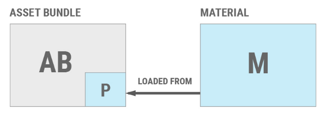
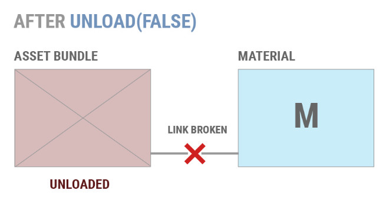
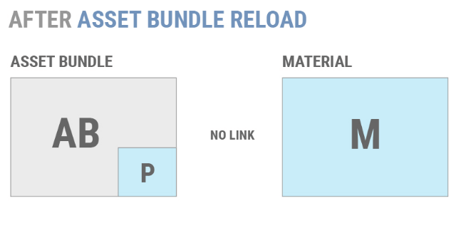

原文地址：https://blog.uwa4d.com/archives/USparkle_Addressable3.html

#### 四、AssetBundle最佳实践

上一节，我们介绍了AssetBundle的基础原理，并且讲解了从加载AssetBundle到加载Asset的各种过程，以及底层API实现等细节内容，这一节，我们会讨论下在实际使用AssetBundles的过程中遇到的问题以及解决方案。

##### 4.1 管理已经加载的Assets

在一些内存敏感的环境中，严格控制加载对象的大小和数量是至关重要的。当对象从活动场景中被移除时，Unity并不会自动卸载对象。Assets的清理工作是在特定时间触发的，当然也可以手动触发（其实就是GC了）。

AssetBundle必须要小心管理。在本地存储（通过Unity缓存或通过AssetBundle.LoadFromFile加载的文件）里的文件支持的AssetBundle具有最小的内存开销，很少超过几十K字节。但是，如果存在大量的AssetBundles，这种开销仍然会成为问题。

由于大多数项目允许用户重复体验游戏内容（例如重新打一个关卡），因此了解何时加载或卸载AssetBundle就变得非常重要。如果AssetBundle卸载不当，则会导致内存中的对象产生冗余副本。而在某些情况下，不适当地卸载AssetBundles也会导致不良行为，例如纹理丢失。

在管理Asset和AssetBundle时，最重要的一点是**调用AssetBundle.unload时的方式**，unload参数为true或false。

此API将卸载正在调用的AssetBundle的包头信息。unload参数决定是否也卸载从此AssetBundle实例化的所有对象。如果设置为**true**，那么**从AssetBundle创建的所有对象也将立即卸载**，即使它们目前正在活动场景中被引用。

举个例子，假设Material M是从AssetBundle AB加载的，并且假设M当前在活动场景中。

如果调用了AssetBundle.Unload(True)，则M将从场景中移除，销毁并卸载。但是，如果调用AssetBundle.Unload(False)，则AB的包头信息将被卸载，但M将保持在场景中，并且仍然是可用的。调用AssetBundle.Unload(False)**破坏了M和AB之间的链接**。如果AB稍后再次加载，则AB中包含的对象的新副本将会被加载到内存中。

如果AB稍后再次加载，将会重新加载AssetBundle的头信息的新副本。然而，M不是从这个新的AB拷贝加载的。Unity并没有在AB和M的新副本之间建立任何联系。

如果调用AssetBundle.LoadAsset()来重新加载M，Unity不会将旧的M副本作为AB中数据的实例。因此，Unity将加载一个新的副本的M，所以此时将会有两个相同的副本M在现场。

对于大多数项目来说，这样的结果是不可取的。大多数项目应该使用AssetBundle.Unload(True)，并采用一种方法来确保对象不被复制。两种常见的方法是：
（1）在应用程序的生命周期内定义一个合适的节点，并在此期间卸载不需要的AssetBundle，例如在关卡切换或加载屏幕期间。这是最简单和最常见的选择。
（2）**维护单个对象的引用计数**，并仅当所有组成对象都未使用时才卸载AssetBundles。这允许应用程序在不重复内存的情况下卸载和重新加载单个对象。(也就是场景中不存在M且没有M的引用时，卸载AB.Unload(True))

如果应用程序必须使用AssetBundle.Unload(False)，那么只能通过两种方式卸载各个对象：

（1）在场景和代码中消除对不需要的对象的所有引用。完成后，调用Resources.UnusedAsset。
（2）非附加加载场景。这将销毁当前场景中的所有对象并调用Resources.UnusedAsset。

如果项目有明确定义的节点，玩家可以等待对象加载和卸载，例如在游戏模式或关卡之间切换，则可以根据需要，卸载尽可能多的对象和加载新对象。

最简单的方法是将项目的**离散块打包到场景中**，然后将这些场景与所有依赖项一起构建到AssetBundles中。应用程序可以切换到“loading”场景，从而完全卸载包含旧场景的AssetBundles，然后加载包含新场景的AssetBundles。

虽然这是最简单的流程，但却需要很复杂的AssetBundles管理。由于每个项目是不同的，Unity尚没有提供通用的AssetBundles设计模式。

在决定如何将对象分组到AssetBundles时，如果必须同时加载或更新对象，则通常最好将对象捆绑到AssetBundles中。例如，考虑一个角色扮演游戏。个别的地图和裁剪场景可以按场景分组成AssetBundles，但有些对象可能会存在于很多其它场景则不能划分进去。

AssetBundles可以用来提供肖像画，游戏中的UI，以及不同的角色模型和纹理。这些稍后需要的Objects和Assets可以分组到第二组AssetBundles中，这些Assets在**启动时加载**，并在应用程序的生命周期内**保持加载状态**。

另一个问题可能会出现，如果Unity必须在AssetBundle卸载后从AssetBundle中重新加载一个对象。在这种情况下，重新加载将失败，该对象将以（Missing）对象的形式出现在Unity编辑器的层次结构中。

这主要会发生在Unity失去并试图恢复对其图形上下文的控制时，例如当移动应用程序被挂起或用户锁定他们的PC时。在这种情况下，Unity必须重新上传纹理和渲染到GPU。如果这些Asset的源AssetBundle不可用，则应用程序会将场景中的相关对象呈现为洋红色。

#### 4.2 发布

客户端发布项目的AssetBundles有两种基本方法：**和项目一起安装或安装后再下载它们。**

在安装时还是安装后交付AssetBundles，取决于项目将运行的平台的功能和限制。移动项目通常选择先安装后下载，以减少初始安装大小，并保持低于相关平台下载的大小限制（比如苹果商店和谷歌商店会对4G模式下最大能下载的包做限制）。控制台和PC项目通常在初始安装时附带AssetBundles。

良好的架构应该允许项目在安装后再进行资源热更，而不用管AssetBundles最初是如何发布的。有关这方面的更多信息，请参见“[Unity 手册](https://docs.unity3d.com/Manual/AssetBundles-Patching.html?_ga=2.161080382.2009813986.1571904029-1030292064.1564583003)”中的“Patching with AssetBundles”一节。

##### 4.2.1 随项目发布

与项目一起发布AssetBundles是最简单的，因为它不需要额外的代码进行下载和管理。项目在安装时包含AssetBundles，有两个主要原因：

- 减少项目构建时间并允许更简单的迭代开发。如果这些AssetBundles不需要和应用程序本身分开更新，可以通过将AssetBundles存储在Streaming Assets中，将AssetBundles包含在应用程序中。请参阅下面的**Streaming Assets**部分。
- 发布可更新内容的初始修订版。这通常是为了节省终端用户在最初安装后的时间，或者作为以后修补的基础。Streaming Assets在这种情况下并不理想。但是，如果不选择编写自定义下载和缓存系统，则可以从Streaming Assets将可更新内容的初始修订加载到Unity缓存中（请参阅下面的缓存启动部分）。

**（1）Streaming Assets**

在安装时将任何类型的内容（包括AssetBundles）包含在一个Unity应用程序里，最简单的方法是在构建项目之前将内容构建到/Asset/StreamingAsset/文件夹中。构建时StreamingAsset文件夹中包含的任何内容都将复制到最终的应用程序里。

在运行时，可以通过属性Application.StreamingAssets访问本地存储上StreamingAsset文件夹的完整**路径**。然后，可以通过AssetBundle.LoadFromFile在大多数平台上**加载**AssetBundles。

Android开发者：在Android上，StreamingAsset文件夹中的Asset存储在APK中，如果它们被压缩，可能需要更多的时间来加载，因为存储在APK中的文件可以使用不同的存储算法。并且所使用的算法还可能因Unity版本而异。

你可以使用一个归档程序（如7-zip）来打开APK，以确定这些文件是否被压缩。如果是，你会看到AssetBundle.LoadFromFile()执行得更慢。

可以使用UnityWebRequest.GetAssetBundle作为解决方案检索缓存版本。通过使用UnityWebRequest，AssetBundle将在第一次运行时被解压缩和缓存，从而使后续执行速度更快。不过要注意，这会占用更多的存储空间，因为AssetBundle会被复制到缓存中。或者，导出Gradle项目，并在构建时向AssetBundles添加一个extension。然后，就可以编辑build.gradle文件并将该extension添加到noCompress部分。完成之后，就能够直接使用AssetBundle.LoadFromFile()，而不必再消耗解压缩的性能成本了。

注意：在某些平台上，StreamingAsset是只读的。如果安装后需要更新项目的AssetBundles，请使用WWW.LoadFromCacheOrDownload或编写自定义下载程序。

##### 4.2.2 安装后下载

将AssetBundles传递到移动设备的最好方法是在应用程序安装后再下载它们。这就允许在安装后再更新游戏内容，而不必强迫用户重新下载整个应用程序。在许多平台上，应用程序二进制文件必须经过昂贵而漫长的重新认证过程。因此，开发一个良好的分离下载系统是至关重要的。

交付AssetBundles最简单的方法是将它们放在某个Web服务器上，并通过UnityWebRequest发布。Unity将自动在本地存储上缓存下载的AssetBundles。如果下载的AssetBundle是LZMA压缩的，那么AssetBundle将以未压缩或重新压缩的形式存储在缓存中，就像LZ 4一样（依赖Caching.compressionEnabled设置），以便将来更快地加载。如果下载的包是LZ 4压缩的，AssetBundles将被压缩存储。如果缓存被填满，Unity将从缓存中删除最近使用最少的AssetBundle。

通常建议在允许的情况下使用UnityWebRequest，或者只有在使用Unity 5.2或更老版本时才使用WWW.LoadFromCacheOrDownload。只有当内置API的内存消耗、缓存行为或性能对于特定项目是不可接受的时候，或者项目必须运行特定于平台的代码才能满足其需求时，才需要对自定义下载系统进行扩展。

可能会阻碍使用UnityWebRequest或WWW.LoadFromCacheOrDownload的情况示例：

- 当需要对AssetBundle缓存进行颗粒度控制时。
- 当项目需要实现自定义压缩策略时。
- 当项目希望使用特定于平台的API来满足某些需求时，例如在不活动时才加载流数据。比如，使用iOS的后台任务API下载数据。
- 当AssetBundles必须在不具备SSL支持条件（如PC）的平台上通过SSL交付时。

##### 4.2.3 建立缓存

Unity有一个内置的AssetBundle缓存系统，可以用来缓存通过UnityWebRequest API下载的AssetBundles，该API的重载会接受一个AssetBundle版本号作为参数。这个数字不是存储在AssetBundles里的，也不是由AssetBundles系统生成的。

缓存系统跟踪传递给UnityWebRequest的最后一个版本号。当使用版本号调用此API时，缓存系统通过比较版本号来检查是否存在缓存的AssetBundle。如果这些数字匹配，系统将加载缓存的AssetBundle。如果数字不匹配，或者没有缓存的AssetBundle，那么Unity将下载一个新的副本。此新副本将与新的版本号相关联。

**缓存系统中的AssetBundle只通过它们的文件名来标识**，而不是通过下载它们的完整URL。这意味着具有相同文件名的AssetBundle可以存储在多个不同的位置，例如CDN。只要文件名相同，缓存系统就会将它们识别为相同的AssetBundle。

每个应用程序都需要确定将版本号分给AssetBundles的考量，然后将这些编号传递给UnityWebRequest。数字可能来自某些唯一标识符，例如crc值。请注意，虽然AssetBundleManifest.GetAssetBundleHash()也可用于此目的，但我们不建议将此函数用于版本控制，因为它只提供了估计，而不是真正的计算。

有关更多细节，请参见“[Unity 手册](https://docs.unity3d.com/Manual/AssetBundles-Patching.html?_ga=2.152096058.2009813986.1571904029-1030292064.1564583003)”中的“Patching with AssetBundles”部分。

在Unity 2017.1中，允许开发人员从多个缓存中选择一个活动缓存，缓存API已经被扩展成为可以提供更细颗粒度的控制了。以前的Unity版本只能修改Caching.expenationDelay和Caching.AvailableDiskSpace来删除缓存项（这些属性保留在Cache类的Unity2017.1中）。

expirationDelay是自动删除AssetBundle之前必须经过的最小秒数。如果在此期间没有访问过AssetBundle，则将自动删除它。

MaximumAvailableDiskSpace指定缓存在开始删除最近使用的AssetBundles之前，可以使用的本地存储空间的大小（以字节为单位）。当达到限制时，Unity将删除缓存中最近打开的AssetBundle（或通过Caching.MarkAsUsed标记）。Unity会删除缓存的AssetBundle，直到有足够的空间完成新的下载为止。

**（1）Cache基础**

因为AssetBundles是通过它们的文件名来标识的，所以可以使用应用程序附带的AssetBundles来“初始化”缓存。为此，将每个AssetBundle的初始或基本版本存储在/Asset/StreamingAsset/中。该过程与前面“随项目发布”的详细流程相同。

在应用程序第一次运行时，可以通过从Application.streamingAssetsPath 加载AssetBundles来填充缓存。从那时起，应用程序可以正常地调用UnityWebRequest（UnityWebRequest也可以用于最初从StreamingAsset路径加载AssetBundles）。

##### 4.2.4 自定义下载器

编写自定义下载器可以让应用程序完全控制如何下载、解压缩和存储AssetBundles。由于所涉及的工程工作并不简单，我们建议只对较大的团队采用这种方法。在编写自定义下载程序时有四个主要注意事项：

- 下载机制
- 存储位置
- 压缩类型
- 补丁

有关Patching AssetBundles的信息，请参阅“[Unity手册](https://docs.unity3d.com/Manual/AssetBundles-Patching.html?_ga=2.126619022.2009813986.1571904029-1030292064.1564583003)”中的“Patching with AssetBundles”一节。

**（1）下载**
对于大多数应用程序来说，HTTP是下载AssetBundles的最简单方法。然而，实现基于HTTP的下载机并不是简单的任务.自定义下载程序必须避免过多的内存分配、过多的线程使用和过多的线程唤醒。由上一节中WWW.LoadFromCacheOrDownload部分详尽描述的原因来看，Unity的WWW类是不合适的。

在编写自定义下载程序时，有三个选项：

- C#的HttpWebRequest和WebClient类
- 自定义本地插件
- Asset存储包

**C# 类**

如果应用程序不需要HTTPS/SSL支持，C#的WebClient类可以为下载AssetBundles提供最简单的机制，它能够异步地将任何文件直接下载到本地存储，而不需要过多的托管内存分配。

要用WebClient下载AssetBundle，请分配类的一个实例，并将AssetBundle的URL传递给它以下载和目标路径。如果需要对请求的参数进行更多的控制，则可以使用C#的HttpWebRequest类编写下载器：

- 从HttpWebResponse.GetResponseStream获取一个字节流。
- 在堆栈上分配一个固定大小的字节缓冲区。
- 从响应流读取到缓冲区。
- 使用C#的File.IOAPI或任何其他流IO系统将缓冲区写入磁盘。

**Asset Store插件**

有一些商店的Asset插件提供了基于非托管代码的实现，通过HTTP、HTTPS和其他协议下载文件。在编写用于Unity的自定义本机代码插件之前，建议对可用的AssetStore插件进行评估。

**自定义原生插件**

编写自定义的原生插件是最耗时，但是，是Unity下载数据最灵活的方式。由于编程时间要求高，技术风险高，只有当没有其他方法能够满足应用程序的需求时，才推荐这种方法。例如，如果应用程序必须在Unity中没有C#SSL支持的平台上使用SSL通信，则可能需要定制原生插件。

**（2）存储**

在所有平台上，Application.PersistentDataPath指向一个可写的位置，该位置可以用于存储在应用程序运行之间需要持久化的数据。在编写自定义下载程序时，强烈建议使用Application.PersistentDataPath的子目录来存储下载的数据。

Application.streamingAssetPath位置不可写，对于AssetBundle缓存来说是一个尴尬的问题。StreamingAssetPath的示例位置包括：

- OSX：在.app包内；不可写
- Windows：安装目录(例如程序文件)；通常不可写
- iOS：在.ipa包内；不可写
- Android：在.apk文件中；不可写

#### 4.3 Asset配置策略

决定如何将项目的Asset划分为AssetBundles很复杂。但如果能采用一种简单化的策略还是很有诱惑力的，比如将所有对象放在自己的AssetBundle中，或者只使用一个AssetBundle，但是这个解决方案有很大的缺点：

- AssetBundle太少了
- 增加运行时内存使用
- 增加加载时间
- 需要更大的下载量
- 有太多的AssetBundle组合
- 增加构建时间
- 使开发变的复杂
- 增加下载总时间

所以，最关键的就是如何将对象分组到AssetBundles中。主要策略是：

- 逻辑实体
- 对象类型
- 并发内容有关这些分组策略的更多信息可在“[手册](https://docs.unity3d.com/Manual/AssetBundles-Preparing.html?_ga=2.134881650.2009813986.1571904029-1030292064.1564583003)”中找到。

#### 4.4 常规的陷阱

本节讲几个在使用AssetBundles的项目中常见的几个问题。

##### 4.4.1 Asset冗余

Unity 5的AssetBundle系统会在某个Objects被构建进AssetBundles的时候查找它的所有依赖，此依赖关系信息用于确定将包含在AssetBundles中的Objects集，并且会被打进AssetBundles中。

显式分配给AssetBundle的Objects将只被构建到该AssetBundle中。当Objects的AssetImporter将其AssetBundleName属性设置为非空字符串时，该Objects将被“显式分配”。这可以通过在Objects的检查器中选择AssetBundle来完成，也可以从Editor脚本中进行。

Objects还可以通过将其定义为AssetBundle构建映射的一部分来分配给AssetBundle，该映射将与重载的BuildPiine.BuildAssetBundles()函数一起使用，该函数接受AssetBundleBuild数组。

在AssetBundle中未显式分配的Objects，将会包含在其它任何一个或者多个未标记的AssetBundles中。

例如，如果两个不同的Objects被分配给两个不同的AssetBundles，但都具有对公共依赖Objects的引用，那么该依赖Objects会被复制到两个AssetBundles中。重复的依赖关系也会被实例化，这意味着依赖Objects的两个副本将被视为具有不同标识符的不同Objects。这将增加应用程序的AssetBundles的总大小。如果应用程序同时加载了这两个Objects，就会导被依赖对象加载两边，并保存在内存里。

有几种方法可以解决这个问题：

（1）确保构建在不同AssetBundles中的Objects不共享依赖关系。任何具有共享依赖关系的Objects都可以放在相同的AssetBundle中，而不用产生依赖项副本。对于具有许多共享依赖项的项目，此方法通常不可行。它可能导致产生大块的并且少量的AssetBundles，如果要更新，必须频繁重建或者重新下载。

（2）把AssetBundles分类，这样就不会同时加载两个共享依赖项的AssetBundles。这种方法可能适用于某些类型的项目，例如基于关卡的游戏。但是，它仍然不必要地增加了项目的AssetBundles的大小，并且增加了构建时间和加载时间。

（3）确保所有依赖Assets都内置到自己的Assets中。这完全消除了冗余资产的风险，但也带来了复杂性。应用程序必须跟踪AssetBundles之间的依赖关系，并确保在调用任何AssetBundle.LoadAssetAPI之前加载正确的AssetBundles。

可以通过位于UnityEditor命名空间中的AssetDatabaseAPI跟踪对象依赖关系。正如名称空间所暗示的那样，此API仅在UnityEditor中可用，而在运行时不能使用。GetDependents可用于定位特定对象或资产的所有直接依赖项。请注意，这些依赖项可能有它们自己的依赖项。此外，AssetImportAPI还可以用于查询分配任何特定Objects的AssetBundle。

通过组合AssetDatabase和AssetImportAPI，可以编写一个编辑器脚本，以确保将AssetBundle的所有直接或间接依赖项分配给AssetBundles，或者确保没有两个AssetBundles共享未分配给AssetBundle的依赖项。由于Asset副本的内存成本，建议所有项目都有这样的脚本。

##### 4.4.2 Sprite atlas冗余

任何自动生成的Sprite图集都将被分配给AssetBundle，其中包含生成Sprite图集的Sprite Objects。如果Sprite Objects被分配给多个AssetBundles，那么Sprite图集将不会分配给AssetBundle并将产生副本。如果Sprite Objects没有分配给AssetBundle，那么Sprite图集也不会分配给AssetBundle。

为了确保Sprite图集不被复制，请检查所有被标记在同一个Sprite图集中的Sprite都被分配到同一个AssetBundle中。请注意，在Unity 5.2.2p3和更老的版本中，自动生成的Sprite图集永远不会分配给AssetBundle。因此，它们将包括在任何包含其组成精灵的AssetBundle中，也包括引用其组成精灵的任何AssetBundle。由于这个问题，强烈建议所有Unity 5项目使用Unity的Sprite Packer升级到Unity 5.2.2p4，5.3或任何更新版本的Unity。

##### 4.4.3 Android纹理

由于Android生态系统中的设备硬件分化很多，所以通常需要将纹理压缩成几种不同的格式。虽然所有Android设备都支持ETC 1，但ETC 1不支持带有alpha通道的纹理。如果一个应用程序不需要OpenGL ES 2的支持，那么最干净的解决方法就是使用ETC 2，这是所有Android OpenGL ES 3设备所支持的。

很多应用程序需要在不支持ETC 2的旧设备上发布。解决这个问题的一种方法是使用Unity5的AssetBundle变体（有关其它选项的详细信息，请参阅Unity的Android优化指南）。

要使用AssetBundle变体，所有不能使用ETC 1进行完全压缩的纹理必须隔离到只有纹理的AssetBundles中。接下来，使用DXT 5、PVRTC和ATITC等特定供应商的纹理压缩格式，创建这些AssetBundles的足够变体，以支持Android生态系统中不具备ETC 2功能的切片。对于每个AssetBundle变体，需要包含的纹理的TextureImporter设置更改为适合该变体的压缩格式。

在运行时，可以使用SystemInfo.SupportsTextureFormatAPI检测到对不同纹理压缩格式的支持。此信息应用于选择和加载AssetBundle变体，以支持的对应压缩纹理格式。

更多关于Android纹理压缩格式的信息可以在[这里](https://developer.android.com/guide/topics/graphics/opengl.html#textures)找到。

##### 4.4.4 iOS文件句柄过渡使用

当前版本的Unity已经不受此问题影响了。

在Unity 5.3.2p2之前的版本中，在加载AssetBundle的整个时间里，Unity都会为AssetBundle保存一个打开的文件句柄。在大多数平台上，这不是一个问题。但是，iOS限制进程的文件句柄的数量最多同时打开255。如果加载AssetBundle导致超出此限制，则加载调用将失败，出现“打开文件句柄太多”错误。

对于试图将其内容划分为数百或数千个AssetBundle的项目来说，这是一个常见的问题。

对于无法升级到修补版本的Unity项目，临时解决方案是：

- 通过合并相关AssetBundle来减少正在使用的AssetBundle的数量。
- 使用AssetBundle.Unload(False)关闭AssetBundle的文件句柄，并手动管理加载对象的生命周期。

#### 4.5 AssetBundle变体

AssetBundle系统的一个关键特点是引入了AssetBundle变体。变体的目的是允许应用程序调整其内容以更好地适应其运行时环境。变体允许不同AssetBundle文件中的不同UnityEngine.Objects在加载对象和解析实例ID引用时显示为“相同”对象。从概念上讲，它允许两个UnityEngine.Objects看起来共享相同的FileGU ID&Local ID，并通过字符串变体ID标识实际的UnityEngine.Object。

该系统有两个主要用例：

（1）变体简化了适用于给定平台的AssetBundle的加载。

- 例如：构建系统可能会创建一个包含高分辨率纹理和复杂着色器的AssetBundle，适用于独立的DirectX 11 Windows构建，以及第二个AssetBundle，其内容保真度较低，适用于Android。在运行时，项目的资源加载代码可以为其平台加载适当的AssetBundle变体，传递给AssetBundle.Load API的对象名称不需要更改。

（2）变体允许应用程序在同一个平台上加载不同的内容，但使用不同的硬件。

- 这是支持多种移动设备的关键。iPhone 4无法在任何real-world的应用程序中保证和最新iPhone相同的内容保真度。
- 在Android上，AssetBundle变体可以用来解决屏幕纵横比和设备间DPI的巨大差别。

**4.5.1 局限**

AssetBundle变体系统的一个关键限制是，它要求从不同的Asset构建变体。即使这些Asset之间的唯一变化是它们的导入设置，这个限制也是合理的。如果在变量A和变体B中构建的纹理之间的唯一区别是在Unity纹理导入器中选择的特定纹理压缩算法，则变量A和变体B仍然必须是完全不同的Asset。这意味着变量A和变体B必须是磁盘上的单独文件。

这一限制使大型项目的管理变得复杂，因为必须将特定Asset的多个副本保存在源代码管理中。当开发人员希望更改Asset的内容时，必须更新Asset的所有副本。对于这个问题，没有非常好的解决办法。

大多数团队会实现他们自己的AssetBundle变体。这是通过构建带有定义良好后缀的AssetBundles文件名来完成的，以便标识给定的AssetBundle表示的特定变体。自定义代码在构建这些Asset时以编程方式更改Asset的导入设置。一些开发人员已经扩展了他们的自定义系统，使其也能够更改附加在Prefabs上的组件的参数。

#### 4.6 压缩还是不压缩？

是否压缩AssetBundle需要考虑几个重要问题，其中包括：

- 加载时间：当从本地存储或本地缓存加载时，未压缩的AssetBundles加载速度比压缩的AssetBundles快得多。
- 构建时间：在压缩文件时，LZMA和LZ 4非常慢，统一编辑器依次处理AssetBundles。拥有大量资产Bundles的项目将花费大量的时间压缩它们。
- 应用程序大小：如果AssetBundles是在应用程序中提供的，那么压缩它们将减少应用程序的总大小。或者，AssetBundles可以在安装后下载。
- 内存使用：在Unity 5.3之前，Unity的所有解压缩机制都要求在解压缩之前将整个压缩的AssetBundles加载到内存中。如果内存使用很重要，请使用未压缩或LZ 4压缩AssetBundles。
- 下载时间：只有当AssetBundles很大时，或者用户处于带宽受限的环境（例如在低速或计量连接上下载）时，才可能需要压缩。如果只有几十兆字节的数据通过高速连接传输到PC机，那么就有可能忽略压缩。

**4.6.1. Crunch压缩**

主要由DXT压缩纹理组成的使用Crunch压缩算法的AssetBundles应该是算非压缩的。

#### 4.7 AssetBundles and WebGL

WebGL项目中的所有AssetBundle解压缩和加载必须发生在主线程上，因为Unity的WebGL导出选项目前不支持工作线程。使用XMLHttpRequest将AssetBundles的下载委托给浏览器。一旦下载，压缩的AssetBundles将被解压在Unity的主线程上，因此会根据包的大小而延迟Unity内容的执行。

Unity建议开发人员用小型AssetBundles，以避免出现性能问题。与使用大型AssetBundles相比，这种方法还具有更高的内存效率。UnityWebGL只支持LZ 4-压缩和未压缩的AssetBundles，但是，可以将gzip/brotli压缩应用于由Unity生成的包上。在这种情况下，您需要相应地配置Web服务器，以便在浏览器下载时解压文件。更多[细节请戳这里](https://docs.unity3d.com/Manual/webgl-deploying.html?_ga=2.163659836.2009813986.1571904029-1030292064.1564583003)。

如果您使用的是Unity 5.5或更老版本，请考虑避免对AssetBundles使用LZMA，而使用LZ 4进行压缩，这对按需解压缩非常有效的。Unity 5.6删除了LZMA作为WebGL平台的压缩选项。

封面图来源：AssetBundle Reporter
Unity AssetBundle冗余检测与资源分析
https://lab.uwa4d.com/lab/5ba010eb02004fb659bb4610