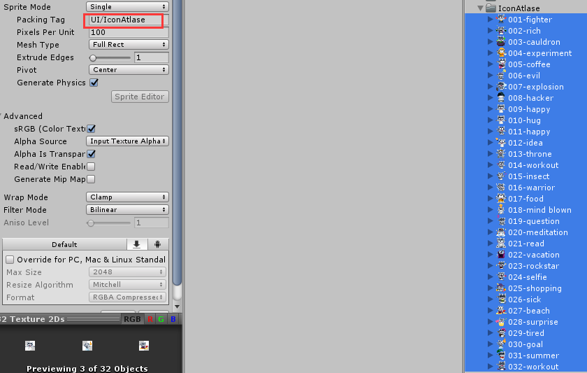
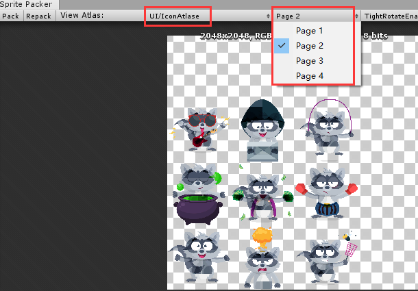
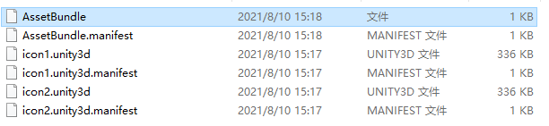
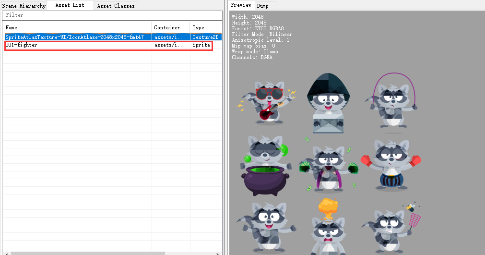
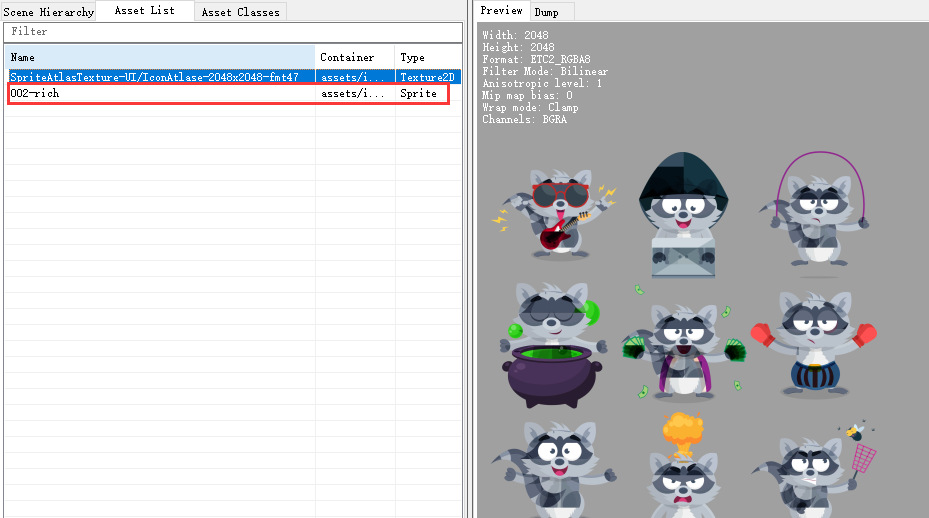

使用SpritePack的默认图集，打AB包时，AB包中包含的Sprite会被打包成图集包含进AB包
在使用时也是直接使用的图集。

所以如果一个图集里的**一个Sprite**被**打进不同AB包**，那么这个**图集**里对应的那张纹理，也会被复制后**打进对应AB包**，这就造成了冗余。

验证：

#### 1.设置Sprites图集tag



#### 2.查看图集打包结果



打包出了四页 2048x2048的图集。(这四页同属于一个图集)

#### 3.将同属于一个图集的sprite打进不同AB包

```C#
public static void BuildAB()
{
    //ab包后缀名
    var AssetBundleExtName = ".unity3d";
    var op = BuildAssetBundleOptions.DisableWriteTypeTree | BuildAssetBundleOptions.ChunkBasedCompression;
    //图标资源1
    var ab1 = new AssetBundleBuild();
    ab1.assetBundleName = "icon1"+ AssetBundleExtName;//ab包名称
    ab1.assetNames = new []{"Assets/IconAtlase/001-fighter.png"};//资源路径
    //图标资源2
    var ab2 = new AssetBundleBuild();
    ab2.assetBundleName = "icon2" + AssetBundleExtName;//ab包名称
    ab2.assetNames = new []{"Assets/IconAtlase/002-rich.png"};//资源路径
    var builds = new AssetBundleBuild[2]{ab1,ab2};
    //AB输出全路径
    var oPath = Path.GetDirectoryName(Application.dataPath) + "/PersistentDataSim/AssetBundle";
    //目标平台
    var target = BuildTarget.Android;
    //打包
    BuildPipeline.BuildAssetBundles(oPath, builds, op, target);
}
```

这里将"001-fighter.png"打包进AB包"icon1.unity3d"

"002-rich.png"打包进AB包"icon2.unity3d"

#### 4.使用UnityStudio查看打包结果

打包结果



打开"icon1.unity3d"



打开"icon2.unity3d"



#### 5.结论：

一个图集里的**一个Sprite**被**打进不同AB包**，那么这个**图集**里对应的那张纹理，也会被复制后**打进对应AB包**，这就造成了冗余。

同属于一个图集的sprites要打进一个AB包

