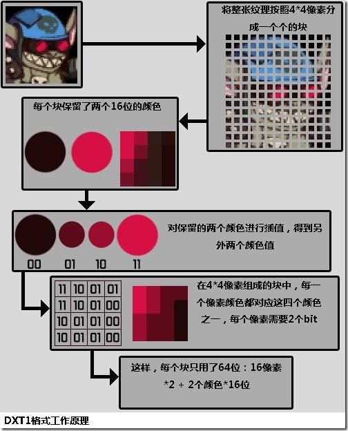

### 纹理压缩格式   
[参考链接](https://www.cnblogs.com/fuckgiser/p/5497013.html) 
  
在photoShop对一张图用不同的输出格式对应输出图片大小如图，不同图片因为其包含的信息复杂度不同， 最终压缩结果可能不太一样。   
这样可以很好的节约带宽和下载时间，但是这类压缩存在一个致命缺陷，他们都是基于整幅图片下进行的压缩，比如霍夫曼编码等。  

* 这样像素和像素之间在解码的过程中存在依赖关系，无法直接实现单个像素级别的解析，这就发挥不了显卡的并发能力  
* 更重要的是问题在于无论是png还是jpeg最终在显存中解码后都是RGBA的纹理格式，因此并无法减少显存的占用率。比如一张256\*256的RGBA纹理，无论是png还是jpg格式，虽然文件大小不一样，在显卡中的大小仍然是256\*256\*4的显存空间。(256\*256个像素再乘以一个像素的RGBA，每一个通道用一个字节表示即 0-255)  

正是因为传统的图片格式并没有考虑显卡的这种特性，所以很难满足三维应用中的要求。基于这些问题，如下**四点**可以作为我们选择纹理压缩格式的衡量标准。  

* **解析速度** 在纹理操作中，读取纹理数据是关键步骤，所以解码速度至关重要。

* **随机读取数据** 能快速的随机读取任意像素

* **压缩率和纹理质量** 既要保证一个不错的压缩效果，也要把纹理损失控制在一定范围内

* **压缩速度** 通常纹理压缩在渲染前已经提前准备好，所以如果压缩的速度比解析速度慢，也是可以接受的。  

#### 简单纹理格式
RGBA8888 每个像素4字节，RGBA通道各占用8位
RGBA4444 每个像素2字节，RGBA通道各占用4位
RGB888 每个像素3字节，RGB通道各占用8位，无透明通道
RGB565 每个像素2字节，RGB通道各占用5/6/5位，无透明通道
RGBA5551 每个像素2字节，RGB通道各占用5位，透明通道1位，所以要么完全透明要么不透明

#### 调色板技术
最初想到的就是调色板技术，这个思路很简单，在当时硬件能力不高的情况下也非常的好用，类似GIF格式，通常保存一个8位或4位的调色板。为什么没有16位的调色板，因为16位的RGB的效果本身就相对不错，所以16位调色板的意义并不大。如下是调色板原理示意。   
  
对于纹理中颜色个数不超过256，或者愿意适当删减，将颜色数目控制在256以内的话，调色板还是非常高效的压缩技术，相比RGBA的颜色格式要少87.5%的空间。当然，颜色越丰富，效果损失越严重。  

目前主流的纹理压缩格式，比如DXT，PVR和ETC纹理压缩在原理上如出一辙，但在细节上会有很多独特的改善。  
原理图：  
  
上图是纹理压缩原理图，对于一张原始纹理，会创建两张小纹理A和B，可以认为是原始纹理的缩略图，同时还有一个矩阵M，M的行列和原始纹理的长宽一致，里面的值类似于调色板中的索引，实现纹理A和纹理B的混合。示意图如下：  
  

ImageB 是由原图每4\*4=16个像素中取最亮颜色组成的图  
ImageA 是由原图每4\*4=16个像素中取最暗颜色组成的图  
矩阵M，大小与原纹理长宽一致并存有索引。  
可以结合下图理解。  
#### DTX  
DXT是一种有损纹理压缩算法，微软的Direct中支持，DXT的格式包括DXT1~DXT5，其中DXT1和DXT5较为多见，后面会做详细讨论。可以说DXT是目前应用最广泛的纹理压缩格式，可以认为所有的PC端显卡都支持DXT压缩，维基百科说记录，该专利有效期到2017年10月2号。  
  
如上图，DXT的压缩思路也比较一致，有两个Color A(00)/B(11)，而4\*4矩阵中的索引比较简单，在DXT不同的格式中，差值的因子稍有不同，比如在DXT1中，差值得到的另外两个颜色的公式为：C2=  2/3\*C0 + 1/3\*C1, C3 =  1/3\*C0 + 2/3\*C1，这里有一个小技巧，尽管分母是3，但都会近似到2的N次幂，比如2/3约等于5/8  
DXT算法非常容易理解，而且整体看上去效果不错，但如果对局部特写，会发现在细节上会有很多丢失，这也是算法本身导致的，毕竟每个块只有两个颜色，而其他颜色都是在这两个颜色区间的差值，如果当前区域内还有其他显著颜色则必然会有丢失。  
  
这种信息的丢失主要集中在比较细的边界中，但DXT1在压缩率上是RGB的6倍，这种问题可以通过提高纹理分辨率的方式来解决，高宽放大41%，这样整个纹理是以前的2倍，但压缩率还能保持为3倍，也是可以接受的。

#### PVR&ETC
也许是出于专利和商业角度，也许确实DXT在移动端确实无法满足要求，DXT并没有在移动端得到很大的支持，相反，在iOS设备中支持的是PVR压缩，在Android中支持的是ETC压缩。下面详细介绍一下PVR的压缩和ETC解压缩的过程。  
DXT在细节上缺陷明显，最重要的原因是当把纹理分为4\*4像素的区域块后，每个块之间都是独立的，尽管这极大的简化了压缩算法，但却丢失了相邻块之间这种普遍的相似性。这是算法本身导致的，而PVR则会考虑该区域块对应的右侧，下侧和右下侧的三个区域块的关联性。   
  
如上，是PVR中一个block的结构图，同样的两张Color A/B，这里会有透明模式和非透明模式，这种策略是可取的，首先不用单独增加透明度的字段，尽管透明度的增加会牺牲RGB的质量，但在透明情况下，RGB的作用并不如在不透明情况下那样重要，这种损失也是可以接受并弥补。

首先，在生成Color A/B时，会对原始纹理做一些处理（最简单的就是翻转或旋转90度），得到一张delta image，这个delta可以用来调整生成的Color A/B，比如最简单的一个方式就是点乘每个delta向量。  
然后基于Color A/B来计算该block中对应的M，相比于DXT1中的1/3和2/3，PVR中对应的值分别为：  
  

最后：  
  
第二列就是平均每个像素占的bit位数  

#### ASTC
从IOS9(A8架构)Apple 手机开始支持ASTC压缩格式 ，如果考虑放弃Apple 6代之前的手机兼容问题了，可以直接使用了。相对于PVRTC2/4而言，ASTC(4X4)的压缩比会增加到0.25，不过显示效果也会好很多，而且不需要把图片设置为方形。  
[Using ASTC Texture Compression for Game Assets ](https://developer.nvidia.com/astc-texture-compression-for-game-assets)说明的比较详细，也给出了一些使用上的建议，即针对不同贴图类型给出不同的压缩方案。  
ARM的参考资料：[ASTC: The Future of Texture Compression](chrome-extension://cdonnmffkdaoajfknoeeecmchibpmkmg/static/pdf/web/viewer.html?file=https%3A%2F%2Fwww.arm.com%2Ffiles%2Fevent%2FDeveloper_Track_5_ASTC-The_Future_of_Texture_Compression.pdf)