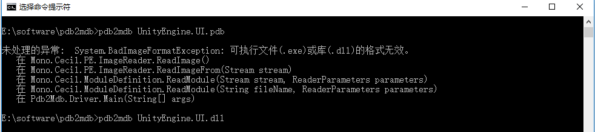

## 调试UGUi代码
如果需要调试UGUI代码，理论上只需要将dll和mdb文件拷贝到对应位置即可。  

1.[下载](https://bitbucket.org/Unity-Technologies/ui/downloads/?tab=branches)对应版本的UGUI源码  
2.生成对应的Dll和pdb文件。  
3.将pdb转换成mdb。[下载工具](https://gist.github.com/jbevain/ba23149da8369e4a966f)  
  
注意：执行的指令是 pdb2mdb xxx.dll  
4.备份原有文件，将生成的dll及mdb替换掉原有文件。  
PS:只修改vs里的引用不起作用，需替换掉UNITY安装路径下UnityEngine.UI.dll和UnityEngine.UI.dll.mdb两个文件。  
参考路径：C:\Program Files\Unity\Editor\Data\UnityExtensions\Unity\GUISystem  
5.调试完成还原原有文件

#### 方法2：

1.[下载](https://bitbucket.org/Unity-Technologies/ui/downloads/?tab=branches)对应版本的UGUI源码  

2.将源码拖至unity工程中，将源码中namespace UnityEngine.UI->namespace UnityEngine.UI2。其他的也类似处理

3.实际使用时使用自己导进的组件(image,text)包括UI事件点击组件等。