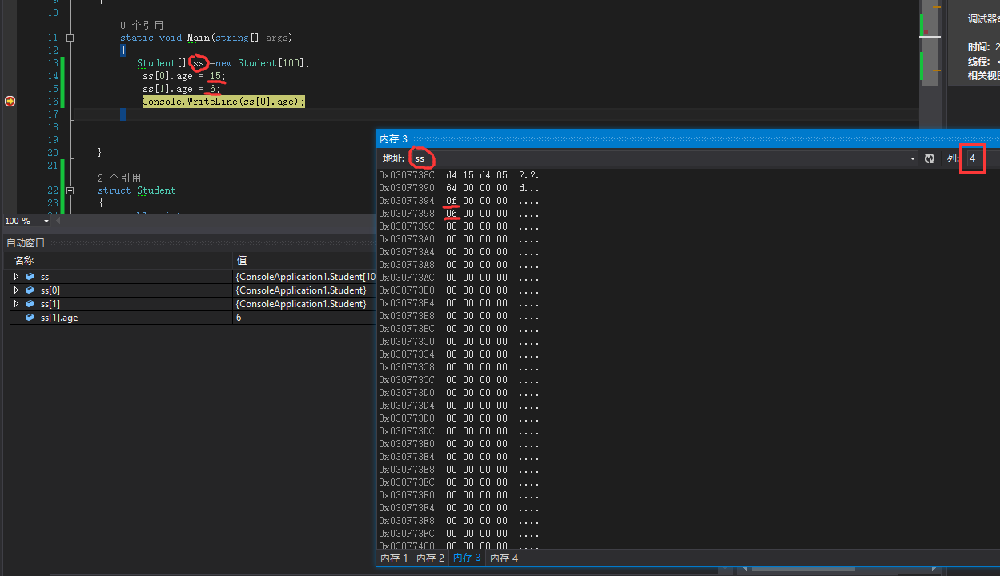

## 查看内存
有些人对程序运行时内存值的变化比较感兴趣。  
可以[参考](https://docs.microsoft.com/zh-cn/visualstudio/debugger/memory-windows?view=vs-2017)  
如图：  
调试前：启用地址级调试 工具 > 选项(或调试 > 选项) >调试 > 常规 >启用地址级调试  
调试中: 调试 > Windows > 内存，选择内存 1，内存 2，内存 3，或内存 4  

  
