[参考1](https://docs.unity3d.com/Manual/SL-DebuggingD3D11ShadersWithVS.html)

[参考2](https://forum.unity.com/threads/debugging-shaders-in-visual-studio.322186/)

##### 1. 在vs中安装图形调试器(Graphics Debugger)

1. 打开vs点击工具->获取工具和功能

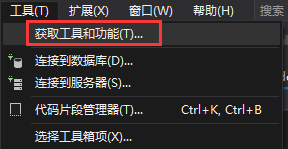

2. 点击单个组件->游戏和图形->勾选 用于DirectX的图形调试器和GPU探查器 选项

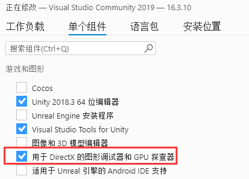

3. 点击右下角修改 进行安装

##### 2.在需要调试的shader上加调试标志

​	即在"CGPROGRAM"下一行添加`#pragma enable_d3d11_debug_symbols`

##### 3.将工程打包出exe文件

 1. 关掉抗锯齿Edit->Project Settings->Quality->Inspector->Disable  anti aliasing

    ​	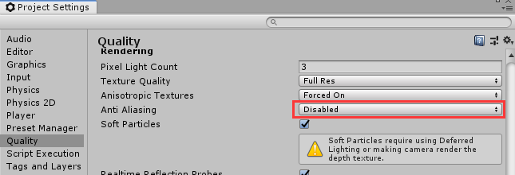

2. 改为可以用脚本调试 Go to File->Build Settings->Tick the box "Development Build" and "Script Debugging"

   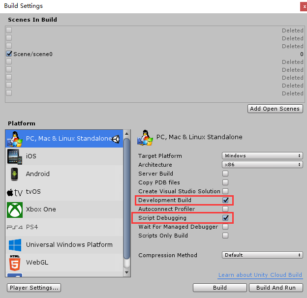

3. Player Settings->Inspector->Resolution and Presentation->Display Resolution Dialog->Disabled.

   Select Player Settings->Inspector->Other Settings. Untick "Auto Graphics API for Windows" and check that Direct3D11 is at the top of the list

   取消勾选Auto Graphics API for Windows，

   保证Direct3D11在列表的第一个

   还要确认下Unity Editor标题状态是<DX11>.

   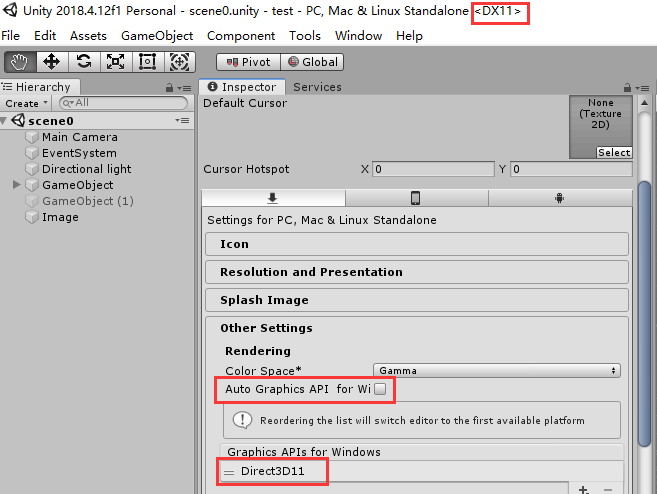

##### 4.新建一个C++空工程调试上一步打包出的xxx.exe文件

 1. File->New->Project->Installed->Templates->Other Languages->Visual C++->Empty Project.

    如果没有安装C++组件，可以参照1.在vs中安装图形调试器 步骤安装C++组件

    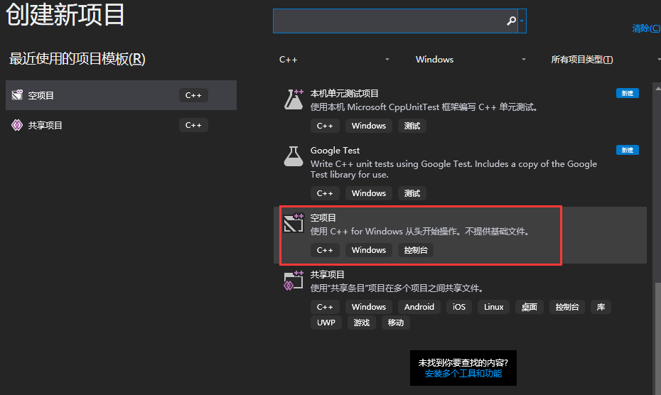

2. 空工程建好后点击 项目-> 属性

   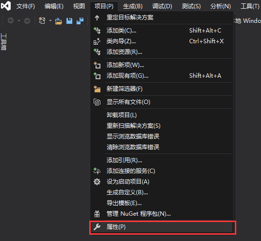

   将 "$(TargetPath)" 替换为刚刚打包出的exe文件的路径。并且命令参数改成"-force-d3d11"

   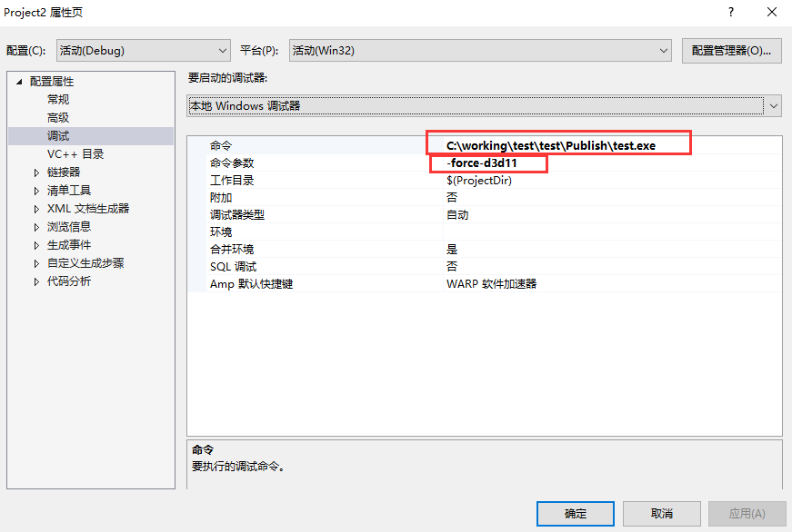

3. 点击 调试->图形->启动图形调试 开启调试窗口，这时候vs会运行该exe文件

   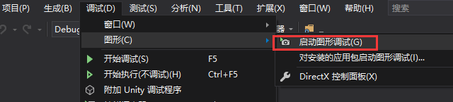

4. 点击 捕获帧 或者按下  Print Screen key(PrtScn SysRq) 即可捕获当前帧

   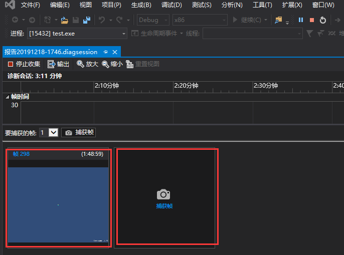

   

5. 双击捕获的帧即可打开个新窗口 对那一帧进行调试

   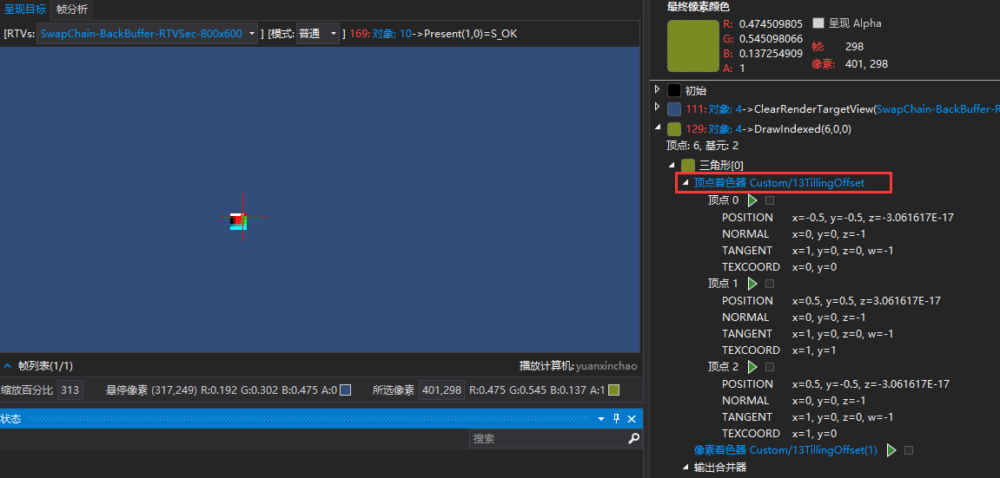

6. 像素历史记录窗口选中"obj:x DrawIndexed"

   选中右侧顶点0 后的绿色三角形，可以对vertex里的函数断点调试

   选中左边游戏界面的某个像素可以对fragment里的函数断点调试

   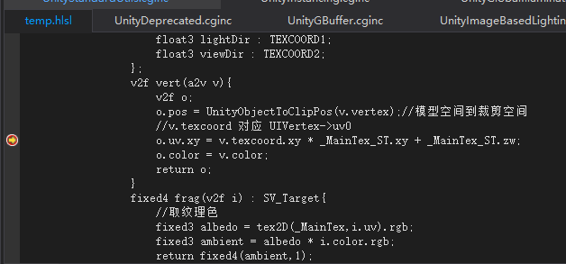

   

