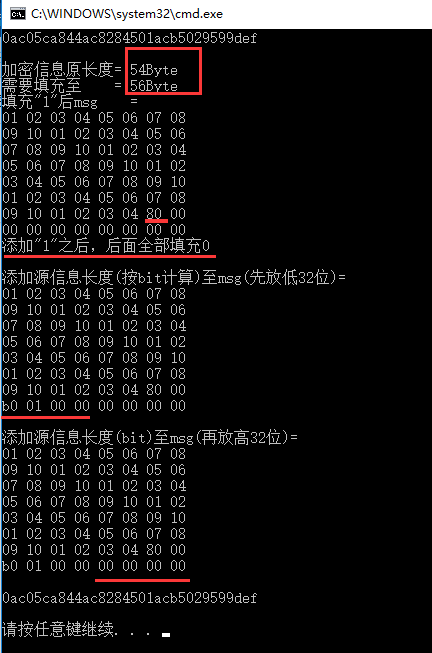

## MD5加密 
注意：  

* md5加密是对字节byte加密，所以对于一个字符串使用不同的编码方式(UTF-8,GB2312等)会产生不同的字节流最后导致加密结果不同。  
* 参考[在线MD5加密](http://tool.oschina.net/encrypt?type=2)的网址，下述代码字符串编码为UTF8.  

#### 加密步骤  

1. 处理的数据是512位为1组，补位数据的填充方式
2. 4个初始常数 A=0X67452301L，B=0XEFCDAB89L，C=0X98BADCFEL，D=0X10325476L (4个初始常数的值为主要特征)
3. 4个函数
4. 4轮Hash运算 (每轮的移位次数及运算的常量为主要特征)  

代码见cs文件。  
运行结果如图  
  

这里我们加密54byte(432bit)的数据   

步骤  

* 啥都不管先在整个数据后加一位"1" 也就是图中的80,因为1000|0000作为1byte解释为80，这个时候原本432位的数据变成了433，不符合bits mod 512 ≡ 448  
* 为什么是448bit，448bit是56byte，最后对数据的循环处理的时候是以512bit->64byte 为一个块进行处理，所以最后的数据应该是64byte的整数倍，448bit+64bit(这个64bit用来记录包长) 正好等于512bit，这也侧面反映了MD5的加密只能对2^64bit的文件进行加密。  
* 说回刚刚的433位，然后加了15位凑够448即80 00  
* 剩下的64位放进了 16进制表示的01b0就是加密数据的长度432bit
* 最后的对每一个块的4次循环处理见cs文件。