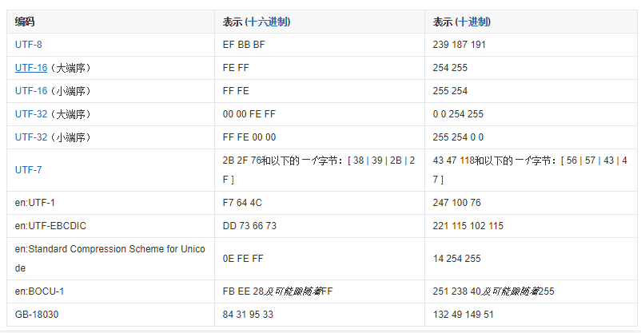
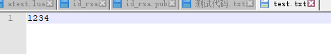
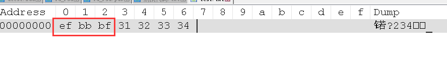
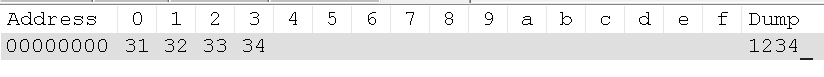

## 编码  
[参考网址](http://www.cnblogs.com/batsing/p/charset.html)  
[参考网址2](http://www.cnblogs.com/malecrab/p/5300486.html)  
对于各种文本，不同的编码格式储存时会用变成不同的字节码。常用的编码格式为GBK,Utf-8,Unicode。  

#### ANSI编码
* ANSI编码：其实ANSI并不是某一种特定的字符编码，而是在不同的系统中，ANSI表示不同的编码。控制台执行**chcp**指令即可看见当前系统默认编码格式。437为ASCII编码，936为GBK，950为Big-5 等等。  
* 我们可以通过修改系统区域来实现（“控制面板” =>“时钟、语言和区域”=>“区域和语言”=>“管理”=>“更改系统区域设置...”）来改变"ANSI编码"

#### 区位码， GB2312 ，Big5与GBK  
* **区位码**：区位码是早些年(1980)中国制定的一个编码标准，每一个字符都有对应一个编号。其中前两位为“区”，后两位为“位”，**中文汉字的编号区号是从16开始的**，**位号从1开始**。**前面的区号有一些符号、数字、字母、注音符号（台）、制表符、日文**等等。[区位码表](https://wenku.baidu.com/view/a3c8e3d176a20029bd642d48.html?from=search)  
* **GB2312编码**：是基于区位码的，用**双字节**表示中文和中文符号。如表中的 “安”，区位号是1618（十进制），那么“安”字的GB2312编码就是 0xA0+16  0xA0+18 也就是 0xB0 0xB2 。GB2312并没有覆盖全部汉字如"镕"。后来的GBK（1995）才补充了大量的汉字进去，且包含了Big5(简体)但是编码不兼容。
* **Big5**：Big5是与GB2312同时期的一种台湾地区繁体字的编码格式。
* **Unicode**：GBK是中国标准，并没有表示大多数其它国家的编码。各国又陆续推出各自的编码标准，互不兼容，非常不利于全球化发展。于是后来国际组织发行了一个全球统一编码表，把全球各国文字都统一在一个编码标准里，名为Unicode。**双字节**，形如 **\u535a\u5ba2\u56ed**。  
* **UTF8**：因为Unicode英文字符也全部使用双字节。所以Unicode编码大多数情况并没有被原始地使用，而是被转换编码成UTF8。转换公式见文章开头参考链接。根据转换公式。**一般中文会被转换成三字节**。   
#### BOM头 （字节顺序标记(ByteOrderMark)）
* Bom头可以用来区分编码格式。 [详情](https://baike.baidu.com/item/BOM/2790364?fr=aladdin) 
  
* 这里将1234以UTF-8格式保存

  
* 无BOM头则为  
   
* ps：notepad++ 查看字节码插件[戳](https://blog.csdn.net/u012125696/article/details/48594547)
#### 如何区分一个文本是无BOM的UTF8还是GBK
* 前面说到的几种编码，其中有的是有BOM头的，可以直接根据BOM头区分出其编码。有两个是没有BOM头的，UTF8和GBK，那么两者怎么区分呢？答案是，只能按大量的编码分析来区分。