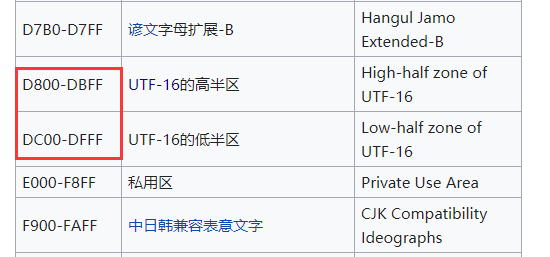

## Unicode编码详解
首先先将微软拉出来批判一番。微软把 UTF-16 称作 Unicode（因为早期的 UTF-16 编码单元可以和码位(Code Point) 一一对应，不过现在已经不行了）  

然后最近遇到了一个编码问题(见UGUI文件夹->emoji问题)，这使我下定了搞明白Unicode编码的决心。  
这真是个很长很长很长~~的故事了，搬来小板凳慢慢听~  

#### 1.ISO 10646
首先什么任何事情的发展和进步都少不了标准和统一。ISO(国际标准化组织)就是这样一个组织。比如**ISO 1**定义了[关于标准温度的国际标准](https://zh.wikipedia.org/wiki/ISO_1)。**ISO 4217**定义了[货币代码标准](https://zh.wikipedia.org/wiki/ISO_4217)(如：CNY代表人民币)。   

* ISO 10646 则定义了 **通用字符集(Universal Character Set, UCS)**  

* UCS不仅给每个字符分配一个代码，而且赋予了一个正式的名字。表示一个UCS或Unicode值的十六进制数通常在前面加上“U+”，例如“U+0041”代表字符“A”。   
#### 2.Unicode
* 由Xerox、Apple等软件制造商于1988年组成的**统一码联盟(The Unicode Consortium)**
* 其宗旨为最终以统一码取代现存的字符编码，因为现存编码不能够在多语言电脑环境中使用，而且字符数有局限。**同时它也制定了数种统一码转换格式（UTF，Unicode Transformation Format）**
* **统一码为每一个字符而非字形定义唯一的代码（即一个整数）**
#### 3.标准统一  

* 1991年前后，两个项目的参与者都认识到，世界不需要两个不兼容的字符集。于是，它们开始合并双方的工作成果，并为创立一个单一编码表而协同工作。
* 从Unicode 2.0开始，Unicode采用了与ISO 10646-1相同的字库和字码
* Unicode标准，额外定义了许多与字符有关的语义符号学。Unicode详细说明了绘制某些语言（如阿拉伯语）表达形式的算法，处理双向文字（比如拉丁文和希伯来文的混合文字）的算法，排序与字符串比较所需的算法，等等。
* 由于Unicode这一名字比较好记，因而它使用更为广泛。  
#### 4.Unicode字符平面映射  
也就是对应关系啦。
[参考：](https://zh.wikipedia.org/wiki/Unicode%E5%AD%97%E7%AC%A6%E5%B9%B3%E9%9D%A2%E6%98%A0%E5%B0%84#%E5%9F%BA%E6%9C%AC%E5%A4%9A%E6%96%87%E7%A7%8D%E5%B9%B3%E9%9D%A2)  

平面	|始末字符值|中文名称|英文名称
--|--|--|--
0号平面 |U+0000 - U+FFFF	|基本多文种平面						|Basic Multilingual Plane，简称BMP
1号平面 |U+10000 - U+1FFFF	|多文种补充平面						|Supplementary Multilingual Plane，简称SMP
2号平面 |U+20000 - U+2FFFF	|表意文字补充平面					|Supplementary Ideographic Plane，简称SIP
3号平面 |U+30000 - U+3FFFF	|表意文字第三平面（未正式使用）		|Tertiary Ideographic Plane，简称TIP
4号平面至13号平面|U+40000 - U+DFFFF	|（尚未使用）	                    |
14号平面|U+E0000 - U+EFFFF	|特别用途补充平面					|Supplementary Special-purpose Plane，简称SSP
15号平面|U+F0000 - U+FFFFF	|保留作为私人使用区（A区）			|Private Use Area-A，简称PUA-A
16号平面|U+100000 - U+10FFFF|	保留作为私人使用区（B区）		|Private Use Area-B，简称PUA-B	

######1.BMP Basic Multilingual Plane  
第0平面
包含有基本拉丁文，泰文，老挝文，易经六十四卦符号，中文等，日语平假片假等。如日文平假名就在 3040-309F 如图：  
  
另外有一点需要注意的是：  
  
D800-DBFF DC00-DFFF 这个范围是不放字符的。为什么空出2048个位置呢，见下面UTF-16
######2.第一辅助平面 SMP(Supplementary Multilingual Plan) 
第一辅助平面又称多文种补充平面  
包含有爱琴海数字，哥特字母，古突厥文，麻将牌，扑克牌。  
特别的1F600-1F64F 代表的是表情符号。1F650-1F67F 代表装饰符号。1F680-1F6FF 代表交通和地图符号 上述这些范围代表了大部分**[emoji](https://zh.wikipedia.org/wiki/%E8%A1%A8%E6%83%85%E5%9B%BE%E6%A0%87)**。还有一些emoji不在此范围  
######3.第二辅助平面
整个平面配置的都是一些罕用的汉字或地区的方言用字，如粤语用字及越南语的字喃。
######4.第三至十三辅助平面
第三辅助平面尚未使用，但打算用来摆放甲骨文、金文、小篆、中国战国时期文字等。  
######5.第十四辅助平面
第十四辅助平面又称特别用途补充平面（Supplementary Special-purpose Plane，简称SSP），摆放“语言编码标签”和“字形变换选取器”，它们都是控制字符。范围在U+E0000～U+E01FF。 
######6.第十五至十六辅助平面  
第十五至十六辅助平面都是私人使用区。它们的范围是U+F0000～U+FFFFD及U+100000～U+10FFFD.

####5.UTF-16 和 UTC-2
* U+0000至U+D7FF:这个范围内。UTF-16和UCS-2的数值对应码位。  
* U+10000到U+10FFFF：辅助平面(Supplementary Planes)的码位，在UTF-16中被编码为一对4字节的码元。
>编码规则：
基本多语言平面内，从U+D800到U+DFFF之间的码位区块是永久保留不映射到Unicode字符。UTF-16就利用保留下来的0xD800-0xDFFF区段的码位来对辅助平面的字符的码位进行编码。  

>* 码位减去0x10000,得到的值的范围为20比特长的0..0xFFFFF. 高10位|低10位
>* 高位的10比特的值（值的范围为0..0x3FF）被加上0xD800得到第一个码元或称作高位代理（high surrogate）。0xD800..0xDBFF
>* 低位的10比特的值（值的范围也是0..0x3FF）被加上0xDC00得到第二个码元或称作低位代理（low surrogate）。0xDC00..0xDFFF  

这样就实现了无歧义的对应。  
上述算法可理解为：辅助平面码位U+10000到U+10FFFF 一共FFFFF即2的20次方个。需要20位表示，UTF-16 4个字节表示一个字符时，前面放10位，后面放10位，要保证没歧义，前面要留1024个位置，后面留1024个位置。正好和上面**4.Unicode字符平面映射**对应。

* **对于UCS-2**：UTC-2就不管这么多了，直接占用了U+D800..U+DFFF，用于某些字符的映射。  
* 但只要不构成代理对，许多UTF-16编码解码还是能把这些不匹配Unicode标准的字符映射正确的辨识、转换成合规的码元[2].按照Unicode标准，这种码元序列本来应算作编码错误。  
* 所以：UTF-16可看成是UCS-2的父集。在没有辅助平面字符（surrogate code points）前，UTF-16与UCS-2所指的是同一的意思。但当引入辅助平面字符后，就称为UTF-16了。现在若有软件声称自己支持UCS-2编码，那其实是暗指它不能支持在UTF-16中超过2字节的字集。对于小于0x10000的UCS码，UTF-16编码就等于UCS码。

####6.UTF-32 和 UTC-4  
* UTF-32中的每个32位值代表一个Unicode码位，并且与该码位的数值完全一致。
* UTF-32的主要优点是可以直接由Unicode码位来索引。在编码序列中查找第N个编码是一个常数时间操作。相比之下，其他可变长度编码需要进行循序访问操作才能在编码序列中找到第N个编码。这使得在计算机程序设计中，编码序列中的字符位置可以用一个整数来表示，整数加一即可得到下一个字符的位置，就和ASCII字符串一样简单。  
* UTF-32的主要缺点是每个码位使用四个字节，空间浪费较多。在大多数文本中，非基本多文种平面的字符非常罕见，这使得UTF-32所需空间接近UTF-16的两倍和UTF-8的四倍（具体取决于文本中ASCII字符的比例）。
####7.UTF-8 和 UTC
UTF-8（8-bit Unicode Transformation Format）是一种针对Unicode的可变长度字符编码，也是一种前缀码。它可以用来表示Unicode标准中的任何字符，且其编码中的第一个字节仍与ASCII兼容，这使得原来处理ASCII字符的软件无须或只须做少部分修改，即可继续使用。因此，它逐渐成为电子邮件、网页及其他存储或发送文字的应用中，优先采用的编码。
> 编码占用空间：   
> 1.128个US-ASCII字符只需一个字节编码（Unicode范围由U+0000至U+007F）。  
> 2.带有附加符号的拉丁文、希腊文、西里尔字母、亚美尼亚语、希伯来文、阿拉伯文、叙利亚文及它拿字母则需要两个字节编码（Unicode范围由U+0080至U+07FF）。
> 3.其他基本多文种平面（BMP）中的字符（这包含了大部分常用字，如大部分的汉字）使用三个字节编码（Unicode范围由U+0800至U+FFFF）。
> 4.其他极少使用的Unicode 辅助平面的字符使用四至六字节编码（Unicode范围由U+10000至U+1FFFFF使用四字节）  

编码规则：  

PS：不同的操作系统，各有直接输入Unicode字符的方法：  
> * 基于X Window System的Linux系统，如Ubuntu的Gnome Terminal，首先按下Ctrl+Shift+U，然后输入16进制Unicode数，如interpunct间隔符输入00b7，最后按空格键；
* Microsoft Windows系统，按下Alt+0183表示interpunct间隔符。
* 另外按Alt + X组合键，MS Word也会将光标前面的字符同其十六进制的四位Unicode编码进行互相转换。