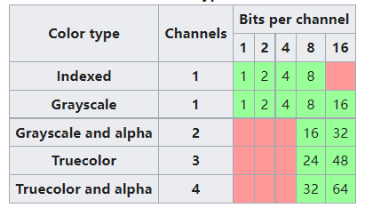
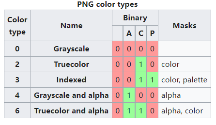

| 块的基本格式                                                 |
| ------------------------------------------------------------ |
| 长度:占4个字节  大端 指块数据:的长度                         |
| 块类型/名称:占4个字节 四个大小写敏感的ASCII的字母 第一个：大写：重要块 小写：不重要块 第二个：大写：公开(标准)  小写：私有(未标准化)   这确保了公有块的名字不会和私有块冲突 第三个：必须大写，表明是png文件，小写认为是未识别块 第四个：大写：在未更改重要块的情况下可以拷贝， 小写：该块任意扩展都可拷贝 |
| 块数据:                                                      |
| 冗余检测CRC:占4个字节 使用CRC-32 校验块类型和块数据 不包括长度 |

| 重要块                                                       |
| ------------------------------------------------------------ |
| IHDR：必须是第一个块，块的内容按照顺序是 括号里代表字节数。宽(4)，高(4)，色深(1采样的位数或调色板的位数)，颜色类型(1)，压缩方法(1)，滤波方法/插值方式？(1)，交错方式(1 0代表无交错 1代表Adam7 交错)总共13个字节，所以块长度是0x0d |
| PLTE：调色板，IHDR颜色类型为3(索引色模式)时必需的一个块，颜色类型为2(真彩)和6(带透明度的真彩)时，为可选的块。0(灰度)和4(带透明度灰度)时不应出现PLTE块。 |
| IDAT：包含真正的图片文件，可以被分割成多个IDAT块，这种分割稍微增加了文件大小，但是让流式生成png成为可能。压缩过的流 |
| IEND：标记文件结束，块长度是0                                |

| 辅助块(第一个字母都是小写)        可以储存gamma值，背景色，文本信息，颜色管理(如屏幕显示色和打印色，使用ICC色彩空间) |
| ------------------------------------------------------------ |
| bKGD:背景色                                                  |
| cHRM:原色和白色的色度坐标(包括色相(h)和饱和度(s))            |
| dSIG:数字签名                                                |
| eXIf:储存Exif的元数据                                        |
| gAMA:指定gamma，包含4个字节，代表gamma值的100000倍，如，gamma值为1/3.4 会被存储为(1/3.4)*(100,000) = 29412 |
| hIST:直方图。存储每种颜色的总量                              |
| iCCP:国际色彩联盟文件                                        |
| iTXt:一个关键词和UTF-8的文本，压缩编码和标记语言翻译。       |
| pHYs:包含 一个x轴的单位代表了几个像素(4字节)，一个y轴代表了几个像素(4字节)，一个单位说明(一个字节) |
| sBIT:代表源数据的颜色精确度。1-13个字节                      |
| sPLT:调色板                                                  |
| sRGB:标准的sRGB色彩空间，只有1个字节，值为(0,1,2,3)定义不同渲染意图 |
| sTER:立体图                                                  |
| tEXt:存储[ISO/IEC 8859-1](https://en.wikipedia.org/wiki/ISO/IEC_8859-1)代表的文本，key-value的方式储存，key是1-79长度的字符，空字符作为分隔，值可以为任意长度但不可以包含空字符， |
| tIME:存储图片上次被编辑的时间                                |
| tRNS:包含透明度信息，对于带有索引的图像，它包含了一个或多个调色板的透明度。对于真彩色或灰度图，它存储了被认为是完全透明的像素值 |
| zTxt:包含了压缩文本，和压缩方法，限制和tEXt相同。            |

无论是调色板还是真彩色，取样数据都是以同样的格式编码。

参照PNG指定的**位深度**，格式是使用固定数量的比特位将数字编码成无符号整型值。注意这里不同于**色深**，色深通常指代一个像素占多少位而不是每个通道占多少位。

不同color type 一个通道占的位数，和一个像素总共占的位数如下图

通道的数量取决于图像是否是灰度图或者是否有透明通道。
PNG允许的通道组合称作颜色类型(color type)

| $0 (000_2)$ | grayscale                                                    |
| ----------- | ------------------------------------------------------------ |
| $2 (010_2)$ | red, green and blue: rgb/truecolor                           |
| $3 (011_2)$ | indexed: channel containing indices into a palette of colors |
| $4 (100_2)$ | grayscale and alpha: level of [opacity](https://en.wikipedia.org/wiki/Opacity_(optics)) for each pixel |
| $6 (110_2)$ | red, green, blue and alpha                                   |

颜色类型占一个字节8位，但是只用到最低的3位。只有上述5中组合是被允许的

如果颜色类型是有效的，它的每一位可以被这样解释

* 第一位：调色板
* 第二位：1：包含三色通道， 0: 只包含灰度(亮度)通道
* 第三位：1：包含透明通道  0：不包含透明通道   当第一位是1的时候这样的组合无效。

如图：

调色板图片的调色板总是使用8bit存储三色。另外，8bit的透明度在调色板也是可选的。如果不包含透明度，那么会被认为是不透明的。

调色板的色彩数应该包含图片的所有颜色。

png规范允许调色板图片每个像素有1,2,4或者8位色深。无透明度的灰度图每个像素可以有1,2,4,8或16位bits。其他的都是8或16bits，

#### 图片透明度

PNG提供了多种透明度选项，真彩和灰度图的单个像素都可以声明透明度。调色板的透明度可以被添加到调色板色彩条目上，透明度的条目可能比调色板色彩条目少，因为剩下的有很多不透明的颜色。

透明度的储存可以分为  associated("[premultiplied](https://en.wikipedia.org/wiki/Alpha_compositing)") 和unassociated。

#### 压缩

两步

* 预压缩： filtering (prediction)
* 压缩：[DEFLATE](https://en.wikipedia.org/wiki/DEFLATE)

png使用deflate，一个无专利的无损压缩算法。涉及 [LZ77](https://en.wikipedia.org/wiki/LZ77_and_LZ78)和 [Huffman](https://en.wikipedia.org/wiki/Huffman_coding)编码。

比起使用有损压缩的JPG，

#### Filtering

deflate压缩方式应用前，是使用过滤法压缩，IHDR压缩方法的值为0标记 过滤法。

使用的是相邻像素相减产生大量0来压缩。

5种类型的filter type，

Interlacing

#### 动画

png不支持动画。

 [MNG](https://en.wikipedia.org/wiki/Multiple-image_Network_Graphics) 可以将png拓展成动画

 [APNG](https://en.wikipedia.org/wiki/APNG) 提供了动态不支持时的静态png展示。

简单的PNG文件结构

| PNG signature             | Image header | Image data | Image end |
| ------------------------- | ------------ | ---------- | --------- |
| `89 50 4E 47 0D 0A 1A 0A` | `IHDR`       | `IDAT`     | `IEND`    |

一个红色点像素png文件

|                             Hex                              |                        As characters                         |
| :----------------------------------------------------------: | :----------------------------------------------------------: |
| 89 50 4E 47 0D 0A 1A 0A 00 00 00 0D 49 48 44 52 00 00 00 01 00 00 00 01 08 02 00 00 00 90 77 53 DE 00 00 00 0C 49 44 41 54 08 D7 63 F8 CF C0 00 00 03 01 01 00 18 DD 8D B0 00 00 00 00 49 45 4E 44 AE 42 60 82 | .PNG........IHDR ..............wS .....IDAT..c.... .............IEN D.B`. |