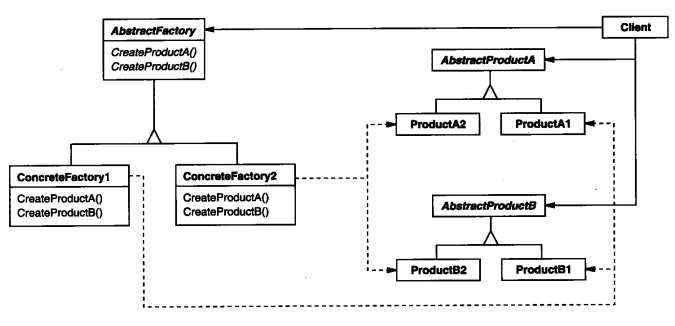

### 3.1 ABSTRACT FACTORY(抽象工厂)--对象创建型模式

#### 1.意图

提供一个创建一系列相关或相互依赖对象的接口，而无需指定它们具体的类。

#### 2.别名

Kit

#### 3.动机

考虑一个支持多种视感（look-and-feel）标准的用户界面工具包，不同的视感风格如滚动条、窗口和按钮会有不同的外观和行为。为保证视感风格标准间的可移植性，一个应用不应该为一个特定的视感外观硬编码它的窗口组件。在整个应用中实例化特定视感风格的窗口组件类使得以后很难改变视感风格。

参考[GUISpace文件夹](./code/1.设计一个文档编辑器/GUISpace)下的Button组件，我们在使用抽象工厂创建后Button后，在使用调用Button的通用接口时，其实并不关心(依赖)他是Motif风格还是Mac风格的。这样就算拓展了其他的风格，也不会影响调用端的使用(因为调用端依赖的是抽象的Button和ScrollBar，如下图)

#### 4.适用性

在以下情况可以使用Abstract Factory模式

* 一个系统要独立于它的产品的创建、组合和表示时。
* 一个系统要由多个产品系列中的一个来配置时。
* 当你要强调一系列相关的产品对象的设计以便进行联合使用时。
* 当你提供一个产品类库，而只想显示它们的接口而不是实现时。

#### 5.结构

#### 6.参与者

产品对象 = Button,ScrollBar

 客户 = 使用端

* AbstractFactory(GUIFactory)

  声明一个抽象类，包含创建产品对象的抽象接口

* ConcreteFactory(MotifFactory,PmFactory)

  继承AbstractFactory，实现创建产品的具体操作

* AbstractProduct(Button,ScrollBar)

  产品对象的抽象类，包含对应的抽象接口

* ConcreteProduct(MotifButton,PmButton)

  * 实现AbstractProduct接口
  * 一个具体的产品对象

* Client

  仅使用AbstractFactory和AbstractProduct，不依赖具体产品类

#### 7.协作

* 运行时创建ConcreteFactory类的实例。根据想要创建的产品对象，使用不同的具体工厂。
* AbstractFactory将产品对象的创建延迟到ConcreteFactory子类(MotifFactory,PmFactory)。

#### 8.效果

1. 分离了具体的类  客户通过产品的抽象接口操控实例。产品的具体类名也不会出现在客户代码中。

   Client仅使用AbstractFactory和AbstractProduct

2. 它使得易于交换产品系列   更换一个具体工厂比较容易。即整个产品系列也会统一改变

   AbstractFactory = new 任何Factory 即可改变

3. 它有利于产品的一致性   只能一个系列的产品一起使用。

   MotifFactory里只生产Motif风格产品

4. 难以支持新种类产品    

   如果增加一个种类如Text，那么

   * 需要抽象的Text类，
   * 每个工厂对于Text具体实现的类
   * AbstractFactory里添加创建Text的接口
   * 具体工厂里对于创建Text的接口的实现

#### 9.实现

1. 将工厂作为单件  一般每个产品系列只需要一个ConcreteFactory实例。因此搭配Singleton(3.5)可实现单个工厂

2. 创建产品   真正的创建是ConcreteFactory子类实现的。

   * 搭配Factory Method(3.3)为每个产品定义一个工厂方法。一个具体的工厂将为每个产品重定义该工厂方法以指定产品。虽然这样的实现很简单，但它却要求每个产品系列都要有一个新的具体工厂子类，即使这些产品的差别很小。

   * 搭配Prototype(3.4)具体工厂使用产品系列中每一个产品的原型实例来初始化，通过复制原型创建新产品。

3. 定义可拓展的工厂    针对8.效果中 ->4.难以支持新种类产品  

   * 一个更灵活但不太安全的设计是给创建对象的操作加上一个参数。这个参数指定将被创建的产品的种类(Button/ScrollBar/Text)，这样AbstractFactory只需要一个Make(xx)接口，但是实现类要使用switch区分将要创建的产品种类。

#### 10.代码示例

* 示例1 [GUISpace文件夹](./code/1.设计一个文档编辑器/GUISpace)
* 示例2  [3.1抽象工厂模式/地堡示例](./code/3.1抽象工厂模式/地堡示例)
  * 注意MazeFactory既作为AbstractFactory 也作为ConcreteFactory，这是抽象工厂模式的简单应用的另一种通常的实现。

• 如果C r e a t e M a z e调用虚函数而不是构造器来创建它需要的房间、墙壁和门，那么你可以 

    创建一个 M a z e G a m e 的子类并重定义这些虚函数，从而改变被例化的类。这一方法是 
    
     Factory Method （3 . 3 ）模式的一个例子。 
    
    • 如果传递一个对象给 C r e a t e M a z e作参数来创建房间、墙壁和门，那么你可以传递不同的 
    
     参数来改变房间、墙壁和门的类。这是 Abstract Factory            （3 . 1 ）模式的一个例子。 
    
    • 如果传递一个对象给 C r e a t e M a z e，这个对象可以在它所建造的迷宫中使用增加房间、墙 
    
     壁和门的操作，来全面创建一个新的迷宫，那么你可以使用继承来改变迷宫的一些部分 
    
     或该迷宫被建造的方式。这是 B u i l d e r    （3 . 2 ）模式的一个例子。 
    
    • 如果C r e a t e M a z e 由多种原型的房间、墙壁和门对象参数化，它拷贝并将这些对象增加到 
    
     迷宫中，那么你可以用不同的对象替换这些原型对象以改变迷宫的构成。这是                              P r o t o t y p e 
    
     （3 . 4 ）模式的一个例子。 