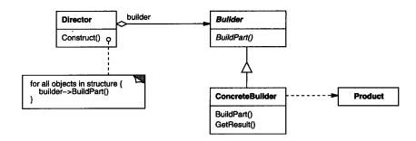
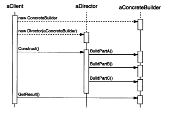

### 3.2 BUILDER(生成器)--对象创建型模式

#### 1.意图

讲一个复杂对象的构建与它的表示分离，使得同样的构建过程可以创建不同的表示。

即：构建类的过程不涉及到类的表示，如我想构造一个手机类，但是我并不知道手机类里包含什么结构，但我知道要构造显示模块，通讯模块，CPU模块，这些构造过程。

对于下面例子中就是：ASCIIText，TexText，TextWidget类的表示都在对应的Converter(Builder)里，RTFReader涉及的是构建的方法。

因为构造过程中不关心类的表示，所以使得同样的构建过程可以创建不同的表示。

例1：  [3.2生成器模式/RTF示例](./code/3.2生成器模式/RTF示例)

例2：[3.2生成器模式/地堡示例](./code/3.2生成器模式/地堡示例)

#### 2.动机

一个RTF（Rich Text Format）文档交换格式的阅读器应该能将RTF转换为多种正文格式。该阅读器可以将RTF文档转换成普通ASCII文本或转换成一个能以交互方式编辑的正文窗口组件。但问题在于可能转换的数目是无限的。因此要能够很容易实现新的转换的增加，同时却不改变RTF阅读器。

例子：

每种转换器类将创建和装配一个复杂对象的机制隐含在抽象接口的的后面。

转换器类:(ASCIIConverter/TeXConverter/TextWidgetConverter)

复杂对象:(ASCIIText/TexText/TextWidget)

抽象接口:(ConverCharacter/ConverFontChange/ConverParagraph)

转换器独立于阅读器，阅读器负责对一个RTF文档进行语法分析。

Builder模式描述了所有这些关系。每个转换器类在该模式中称为生成器（Builder），而阅读器则称为导向器（director）。

Builder模式将分析文本格式的算法(ParseToUnits)和描述怎样创建和表示一个转换后格式的算法分离开来。**即关注算法过程而不关心类的表示。**这使我们可以重用RTFReader的语法分析算法。

#### 3.适用性

在以下情况使用Builder模式

* 当创建复杂对象的算法应该独立于该对象的组成部分以及它们的装配方式时。

  构造过程与类的表示分离

* 当构造过程允许被构造的对象有不同的表示时

#### 4.结构

导向器弱引用生成器

#### 5.参与者

* Builder(TextConverter)

  为创建一个Product对象的各个部件指定抽象接口。

* ConcreteBuilder(ASCIIConverter/TeXConverter/TextWidgetConverter)

  实现Builder接口以构造和装配该产品的各个部件。

  定义并明确它所创建的表示

  提供一个检索产品的接口(GetASCIIText/GetTexText/GetTextWidget)

* Director(RTFReader)

  构造一个使用Builder接口的对象

* Product(ASCIIText/TexText/TextWidget)

  表示被构造的复杂对象。ConcreteBuilder创建该产品的内部表示并定义它的装配过程。

  包含定义组成部件的类(Widget)，包括将这些部件装配成最终产品的接口(GetWidget)。

#### 6.协作

* **客户**创建Director对象，并用它所想要的Builder对象进行配置

* 一旦产品部件被生成，导向器就会通知生成器。

* 生成器处理导向器的请求，并将部件添加到该产品中。

* 客户从生成器中检索该产品(GetASCIIText/GetTexText/GetTextWidget)

  有点像流水线啊

#### 7.效果

1. 改变产品内部表示  因为导向器中隐藏了产品的结构
2. 构造代码和表示代码分开 因为导向器中构造过程中并没有产品的结构
3. 它使你可以对构造过程进行更精细的控制 因为是导向器控制一步一步构造产品的。着重于构造**过程**

#### 8.实现

1. 装配和构造接口  Builder类接口必须足够普遍，**以便为各种类型的具体生成器构造产品**

   有时你可能需要访问前面已经构造了的产品组件，

   如例2中的`StandarMazeBuilder.BuilldDoor`里使用的房间就是`StandarMazeBuilder.BuildRoom`之前构造好的

2. 为什么产品没有抽象类 通常情况下，具体生成器生成的产品，它们的表示相差如此之大以至于给不同的产品(ASCIIText/TexText/TextWidget)以公共的父类没有太大意思。

   因为**客户**通常用合适的具体生成器来配置导向器。客户处于的位置使它**知道**Builder的哪一个具体生成器会被用到并能相应处理它的产品，

   如客户(Program.Main)中`CountingMazeBuilder.GetCounts`的使用

3. Builder缺省的方法为空 具体生成器只重定义他们所感兴趣的操作
   如，`CountingMazeBuilder`就没有重写`GetMaze`方法

#### 9.代码示例

例1：  [3.2生成器模式/RTF示例](./code/3.2生成器模式/RTF示例)

例2：[3.2生成器模式/地堡示例](./code/3.2生成器模式/地堡示例)
见例2，我们本可以将所有的StandardMazeBuilder操作放在Maze中并让每一个Maze创建它自身，但将Maze变得小一些使得它能更容易被理解和修改，而且StandardMazeBuilder易于从Maze中分离。更重要的是不同的MazeBuilder每一种使用不同的房间，墙壁和门的类。

#### 10.已知应用

#### 11.相关模式

[Abstract Factory](3.1抽象工厂(Abstract Factory))与Builder相似。

* **Builder模式着重于**一步步构造一个复杂对象的过程**。**不关心产品的内在结构和表示**，如例2中导向器MazeGame并不知道产品是什么(MazeBuilder里的Maze 或CountingMazeBuilder里的rooms )也不关心它们(Maze)的内在结构和表示，而把构造过程作为重点。

  **Abstract Factory着重于**多个系列的产品对象。

* **Builder**在最后一步返回产品

  **Abstract Factory**是立即返回的

Composite通常是用Builder生成的。

#### 与Abstract Factory具体对比

[3.1抽象工厂模式/地堡示例](./code/3.1抽象工厂模式/地堡示例)

抽象工厂模式

1. 将构造过程放在MazeGame中，且强依赖Maze类。

2. 使用不同的工厂类能构造不同的Room，Wall...

生成器模式

1. 将构造过程放在MazeGame，但是MazeGame弱依赖Maze，甚至可以不知道Maze的存在，这使得产品(Maze)部件的内部结构和组装仅需对应的生成器(StandarMazeBuilder)知道就行。
2. 使用不同的生成器可以构造不同Room，Wall...当然也可以在`BuildRoom`等方法里加参数来达到创建不同Room的目的
3. 生成器模式有种将产品放进生产线，导向器指挥后拿出产品的感觉

