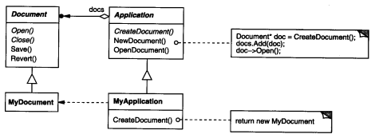
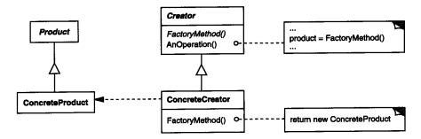
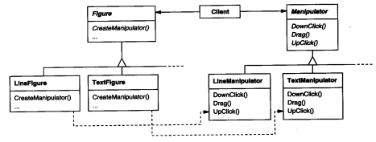

### 3.3 FACTORY METHOD--对象创建型模式

例1：参考下图Application和Document。

例2：[3.3工厂方法/地堡示例](./code/3.3工厂方法/地堡示例)

例3：[3.3工厂方法/带切页对话框](./code/3.3工厂方法/带切页对话框)

带切页对话框其实并不是工厂方法，但是它和Application和Document的结构有些类似，都是抽象的A使用抽象的B(们)，有值得借鉴的地方

#### 1.意图

定义一个用于创建对象的接口，让子类决定实例化哪一个类。Factory Method使一个类的实例化延迟到其子类。

#### 2.别名

虚构造器

#### 3.动机

**框架使用抽象类定义和维护对象之间的关系**(例3)。这些对象的创建通常也由框架负责。

考虑这样一个应用框架，他可以向用户显示多个文档，这个框架中，两个主要的抽象是Application和Document。这两个都是抽象的，如上面所说**框架使用抽象类定义和维护对象之间的关系**，客户必须通过它们的子类来做与具体应用相关的实现(如例3中继承`DialogWithTabs`的`_D_RemainsDraw`)。例如，为创建一个绘图应用，我们定义类DrawingApplication和DrawingDocument。Application类负责管理Document并根据需要创建它---例如，当用户从菜单中选择Open或New的时候。

> 当Application抽象类需要实例化Document类时，但是只有具体的Application(如DrawingApplication)才知道要创建什么Document(如DrawingDocument)时。可以在Application里给个`CreateDocument`抽象接口返回抽象类Document，而在具体的Application(如DrawingApplication)里重写该方法并生成具体Document(如DrawingDocument)。

这就是Factory Method模式，我们称CreateDocument是一个工厂方法(Factory Method)，因为它负责"生产"一个对象

它封装了哪个Document子类将被创建的信息并将这些信息中该框架中分离出来。如下图所示。

(不知道哪个Document子类将被创建时，你可以创建任何Document)




#### 4.适用性

下列情况可以使用Factory Method模式

* 当一个类不知道它所必须创建的对象的类的时候。(但是它一定知道这个对象有哪些必要的接口，把接口放到一起做个抽象类)
* 当一个类希望由它的子类来制定他所创建的对象的时候。
* 当类将创建对象的职责委托给多个帮助子类中的某一个，并且你希望将哪一个帮助子类是代理者这一信息局部化的时候。

#### 5.结构



#### 6.参与者

* Product(Document 或例2中的Wall/Room)

  定义工厂方法所创建的对象的接口。

* ConcreteProduct(MyDocument  或例2中的RoomWithABomb/EnchantedRoom)

  实现Product接口。

* Creator(Application  或例2中的MazeGame(MazeGame 既是Creator又是ConcreteCreator) )

  * 声明工厂方法(CreateDocument 或例2中的MakeRoom/MakeWall..)，该方法返回一个Product类型的对象。Creator也可以定义一个工厂方法的缺省实现(如例2中的MazeGame)，它返回一个缺省的ConcreteProduct对象。(这样BombedMazeGame里也可以使用缺省的方法建造基本Room了)
  * 可以调用工厂方法以创建一个Product对象。

* ConcreteCreator(MyApplication  或例2中的MazeGame/BombedMazeGame/EnchantedMazeGame)

  重定义工厂方法以返回一个ConcreteProduct实例

#### 7.协作

Creator依赖于他的子类来定义工厂方法，所以它返回一个适当的ConcreteProduct。

#### 8.效果

工厂方法不与特定应用有关的类绑定到代码中。代码仅处理Product接口(**Application类与Document的通用接口频繁交互而不关心是哪个具体Document**)。因此它可以与用户定义的任何ConcreteProduct类一起使用。(因为不知道哪个类，所以可以用任意具体Product)。

潜在缺点：客户可能仅仅为了创建一个特定的ConcreteProduct对象就不得不创建Creator的子类。

* 为子类提供挂钩(hook)  用工厂方法在一个类的内部创建对象通常比直接创建对象更灵活。这使得子类灵活的提供产品的拓展版本。(抽象类里使用抽象类会更灵活)

  **工厂方法可以层层嵌套**，上面Application类里有个工厂方法CreateDocument用来创建Document类，Document类里**也可以**有一个工厂方法如CreateFileDialog用来创建与具体Document类有关的对话框。Document子类可以重定义该方法以定义一个与特定应用相关的文件对话框。这里CreateFileDialog可以提供一个缺省的实现。

* 连接平行的类层次   工厂方法并不往往只是被Creator(如Application类)调用，客户可以找到一些有用的工厂方法，尤其在平行类层次的情况下。

  

  

#### 9.实现

大概是：两层抽象，抽象的A使用抽象的B(们)，抽象A里放实例化B的(抽象)工厂方法，具体a们继承抽象A并实现该工厂方法

1. 主要有两种不同的情况   

   1. Creator类(如Application类)是一个抽象类，声明工厂方法但不提供实现。

      必须子类定义实现(CreateDocument)

   2. Creator类是一个具体类，提供一个缺省的实现

2. 参数化工厂方法

   1. `DrawingApplication`可能不止使用`DrawingDocument`可能还有`SettingDocument`。

      这是在CreateDocument(xx)里传个参数就可以指定将要创建的文档的种类。子类可以重写`CreateDocument(xx)`来变更或拓展创建文档的种类，并在`return 目标文档`后加上` return base.CreateDocument(xx)`缺省实现来将子类不感兴趣的文档创建指责延迟给父类。

3. 特定语言的变化问题

   Lazy initialization：如果产品不存在，那就创建它。而不是一开始就创建。

   ```c#
   private Document product;
   public Document GetProduct()
   {
   	if (product == null)
           product = CreateProduct();
       return product;
   }
   public Document CreateProduct()
   {
   	return new XXXDocument();
   }
   ```

   


4. 使用模板以避免创建子类  `StandardCreator<xxxDocument>  myCreator`

   ​	`myCreator.CreateProduct<xxxDocument>()`

5. 命名约定  使用命名约定是一个好习惯
   makeXXX或者CreateXXX

#### 10.代码示例

例1：参考下图Application和Document。

例2：[3.3工厂方法/地堡示例](./code/3.3工厂方法/地堡示例)

例3：[3.3工厂方法/带切页对话框](./code/3.3工厂方法/带切页对话框)

#### 11.已知应用

#### 12.相关模式

[Abstract Factory](3.1抽象工厂(Abstract Factory).md)经常用工厂方法来实现(`EnchantedMazeFactory.MakeDoor/MakeRoom`)。这么看来抽象工厂模式包含工厂模式。

工厂方法通常在Template Method中被调用。

Prototypes不需要创建Creator的子类。但是它们通常需求一个针对Product类的Initialize操作。

#### 13.总结

* 核心就是父类需要使用实例化的Room，所以用抽象方法MakeRoom返回(Room)，不同子类继承实现MakeRoom返回不同Room(RoomWithABomb/EnchantedRoom)。

* 一个CreateMaze方法返回的Maze地图里肯定有各种各样的地图元素，而例2中的代码如果使用BombedMazeGame.CreateMaze则只包含RoomWithABomb和BombedWall或者基本Door，使用EnchantedMazeGame也是这样，这显然是不合理的。 不能过度使用设计模式而忽略了原本的需求，当然这里也是为了讲解模式

* 生成器模式中的MazeGame，MakeMaze/MakeRoom...的职责都交给了Builder

* MakeWall/MakeRoom就是工厂方法，由此可见可以定义多个工厂方法

  

