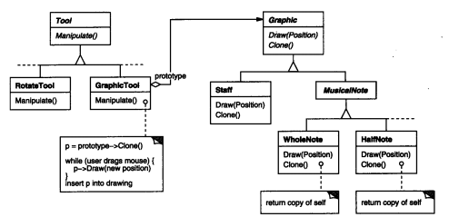
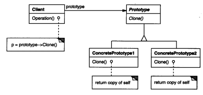

### 3.4 PROTOTYPE（原型）--对象创建型模式

例1：[3.4原型/乐谱编辑器](./code/3.4原型/乐谱编辑器)

例2：[3.4原型/地堡示例](./code/3.4原型/地堡示例)

#### 1.意图

用原型实例指定创建对象的种类，并且通过拷贝这些原型创建新的对象。

* 如：[3.4原型/地堡示例](./code/3.4原型/地堡示例)的Program中将`new RoomWithABomb()`新建的炸弹房间作为原型传入`MazePrototypeFactory`来进行复制创建。

#### 2.动机

想象一个图形编辑器框架，通过增加一些表示音符、休止符、和五线谱的新对象来构造一个乐谱编辑器。这个编辑器还有一个工具选择版用于将音乐对象添加到乐谱中。这个选择板可能还包括选择、移动和其他操纵音乐对象的工具。

操作1：复制一个已经编辑好的音符

操作2：复制一段已经编辑好的音符

操作3：将一个或一段已经编辑好的音符设为模板方便以后添加

这个这些创建型模式，很容易想到通过克隆添加到乐谱。也可以将克隆出的对象登记为原型方便再次克隆。



方案1

* 判断玩家复制的类型

* 新建对应的对象

* 同步对象的状态(大小，角度)

  ```c#
  switch(type){
      case typeof(WholeNode):
           var n = new WholeNode();
          //同步状态
  	...
  }
  ```

方案2：

* 使用原型模式

  ```
  Graphic _prototype;
  UserDragsMouse(out _prototype,out p);
  while (p !=null)
  {
  	var node = _prototype.Clone();
  }
  ```

  获取原型并克隆，这种方式减少了GraphicTool对于具体类(WholeNode/HalfNode)的依赖

#### 3.适用性

当一个系统应该独立于他的产品创建、构成和表示时，要使用Prototype模式：以及

* 当腰实例化的类是在运行时刻指定时，例如，通过动态装载；或者
* 为了避免创建一个与产品类层次平行的工厂类层次时；或者
* 当一个类的实例只能有几个不同状态组合中的一种时。建立相应数目的原型并克隆它们可能比每次用合适的状态手工实例化该类更方便一些。

#### 4.结构



#### 5.参与者

* Prototype(Graphic 或例2中的MapSite)

  声明一个克隆自身的接口

* ConcretePrototype(Staff、WholeNote、HalfNote 或例2中的Room/Wall/RoomWithABomb...)

  实现一个克隆自身的操作

* Client(Graphic Tool 或例2中MazePrototypeFactory)

  让一个原型克隆自身从而创建一个新的对象

#### 6.协作

客户(MazePrototypeFactory)请求一个原型(Room/Wall/RoomWithABomb)克隆自身

#### 7.效果

Prototype有许多和[Abstract Factory](3.1抽象工厂(Abstract Factory).md)和[Builder](3.2生成器(Builder).md)一样的效果：他对客户隐藏了具体的产品类，因此减少了客户知道的名字的数目。

优点

1. 运行时刻增加和删除产品

   注册新的原型实例就可以将一个新的具体产品类并入系统。(相当于有了该产品的生产线)。

   客户也可以在运行时建立和删除原型，**动态注册动态加载。**

2. 改变值以指定新对象

   为一个实例化的对象变量指定值(如例1中的HalfNode.tone)，并且将其**注册为客户对象的原型**，就可以有效定义新类别的对象(不同音调？)。

   克隆一个原型类似于实例化一个类。

3. 改变结构以指定新对象

   许多应用由部件和子部件在创建对象([1.设计一个文档编辑器.md](./code/1.设计一个文档编辑器)里的Glyph抽象类，[3.4原型/乐谱编辑器](./code/3.4原型/乐谱编辑器)里的Graphic抽象类，电路编辑器用子电路来构造电路)。这些应用允许你**实例化复杂的、用户定义的结构**，就像之前说的“将一个或一段已经编辑好的音符设为模板方便以后添加”。

   只要将对象Clone实现为一个深拷贝，具有不同结构的电路就可以是原型了。

   如上，类似于这种通过嵌套节点构成新节点的结构复制时也会嵌套复制。但是这种嵌套复制是写在节点的Clone里而不需要客户关心。

4. 减少子类的构造

   [Factory Method](3.3工厂方法(Factory Method))经常产生一个与产品类平行的Creator类层次。Prototype模式使得你克隆一个原型而不是请求一个工厂方法去产生一个新的对象(产品有克隆自己的能力)。

5. 用类动态配置应用

缺点

1. **每一个Prototype的子类都必须实现Clone操作**，这可能很困难。

   当内部包括一些不支持拷贝或有循环引用的对象时，实现克隆可能也会很困难

#### 8.实现

当实现原型时，要考虑

1. 使用一个原型管理器

   **保持一个可用原型的注册表**。客户(如例2 Program)不会自己来管理原型，但会在注册表中存储和检索原型。

   原型管理器是一个关联存储器(associative store)，它返回一个与给定关键字相匹配的原型。并且可在运行时更改、浏览这个注册表。

   (这个主要是用来将一个或一组元素作为模板存储和使用)

2. 实现克隆操作

   克隆一个对象是依次克隆它的实例变量呢，还是由克隆对象和原对象共享这些变量。

   (如例2 中的`Door.Clone()`，类变量`_room1`和`_room2`需要深拷贝吗)

3. 初始化克隆对象

   有客户会希望使用一些值来初始化克隆对象的一些内部状态。

   在Clone操作中传递参数会破坏克隆接口的统一性。

   引入Initialize(例2)

4. Clone接口不是new而是copy，会保存当前的状态(方向，大小)

#### 9.代码示例

例1：[3.4原型/乐谱编辑器](./code/3.4原型/乐谱编辑器)

例2：[3.4原型/地堡示例](./code/3.4原型/地堡示例)

#### 10.已知应用

#### 11.相关模式

Prototype和[Abstract Factory](3.1抽象工厂(Abstract Factory).md)模式在某些方面是相互竞争的。但是他们也可以一起使用(例2 `MazePrototypeFactory`)。

大量使用Composite和Decorator模式的设计通常也可从Prototype模式处获益。