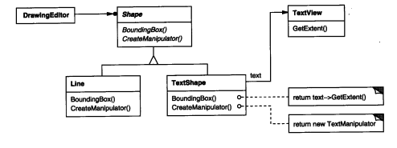
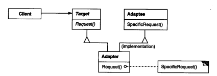
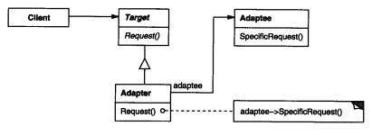

### 4.1 ADAPTER(适配器)——类对象结构型模式

例1：[绘图编辑器](./code/4.1适配器/绘图编辑器)

例2：[适配器1](./code/4.1适配器/适配器1)

例3：[适配器2](./code/4.1适配器/适配器2)

例1中的TextShape就是一个Adapter(适配器)

#### 1.意图

将一个类的接口(TextView)转换成客户希望的另外一个接口。Adapter模式使得原本由于接口不兼容而不能一起工作的那些类可以一起工作(如例1中客户使用的接口是`Shape.Bounding(Point bottomLeft, Point topRight`) 。经过TextShape适配后可以使用TextView里的对应接口)。

#### 2.别名

包装器Wrapper。

#### 3.动机

有时，为了复用而设计的**工具箱类**不能够被复用的原因仅仅是因为它的接口与专业应用领域所需要的接口不匹配。

如例1。

一个绘图编辑器，有LineShape和PolygonShape这样的基本几何图形，对于可以显示文本TextShape涉及到复杂的屏幕刷新和缓冲区管理，理想的情况是复用成品类(TextView)，但是接口不兼容。

我们定义一个TextShape类，由它来适配TextView的接口和Shape的接口。

两种方式：

1. 继承Shape类的接口和TextView的实现

2. 将一个TextView实例作为TextShape的组成部分，并且使用TextView的接口实现TextShape。

   例1中就是用的这种方式，因为C#不支持继承。

#### 4.适用性

以下情况使用Adapter模式

* 你想使用一个已经存在的类(TextView)，而它的接口不符合你的需求。
* 你想创造一个可以复用的类，该类可以与其他不相关的类或不可预见的类(即那些接口可能不一定兼容的类)协同工作。
* (仅适用于对象Adapter)你想使用一些已经存在的子类，但是不可能对每一个都进行子类化以匹配它们的接口。

#### 5.结构

**类适配器**。多重继承，**Is-A型**

**对象适配器**。对象组合：Has-A型

#### 6.参与者

* Target(Shape)

  定义客户使用的与特定领域相关的接口(如`BoundingBox(Point bottomLeft,Point topRight)`)

* Client(Program)

  与符合Target接口的对象协同。

* Adaptee(TextView)

  一个已经存在的接口，这个接口需要适配

* Adapter（TextShape）

  对Adaptee的接口与Target接口进行适配

#### 7.协作

Client在Adapter实例上调用一些操作。接着适配器调用Adaptee的操作实现这个请求。

#### 8.效果

类适配器和对象适配器有不同的权衡。

类适配器：

* 用一个具体的Adapter类对Adaptee和Target进行匹配。结构是当我们想要匹配一个类以及所有他的子类时，类Adapter将不能胜任工作(如例2中Bird有麻雀，鸽子等子类，该方式只能新建`麻雀Wrapper`，`鸽子wrapper`而对象适配器则可以将，这些麻雀鸽子子类放到一个BirdWrapper里)
* 使得Adapter可以重定义Adaptee的部分行为，因为Adapter是Adaptee的一个子类。
* 仅仅引入了一个对象，并不需要额外的指针以进阶得到Adaptee。

对象适配器：

* 允许一个Adapter与多个Adaptee，即Adaptee本身以及所有它的子类(如果有子类的话)同时工作。(如上麻雀例子)
* 使得重定义Adaptee的行为比较困难，这叫需要生成Adaptee的子类并且使得Adapter引用这个子类而不是Adaptee本身。

使用Adapter模式需要考虑的其他一些因素有：

1. Adapter的匹配程度 越相似越容易匹配

2. 可插入的Adapter  **当其他的类使用一个类时，如果所需的假定条件越少，这个类就更具可复用性。**

   见[适配器2](./code/4.1适配器/适配器2)

   * 可插入的适配器(pluggable adapter)的核心思想是**Client能够方便地调用可以变化的接口**
   * 假设一个**变量methodVariable**能够保存方法，即动态地变化方法，拥有变量methodVariable的类X的不同对象就可以拥有不同的方法。
   * 将方法视为数据”(treat methods as data)，是也函数式编程范式中的重要观点。

   本例中，我们没有使用RobotWrapper也实现了给RobotDog 充电(`Battery()`)

3. 使用双向适配器提供透明  不同的客户需要用不同的方式查看同一对象时。对于例2中的Being和Robot，有人希望把所有的Robot都作为Being，而有人希望把所有的Being都作为Robot，于是出现了双向适配器如DoubleWrapper。

#### 9.实现

1. Adapter类应该是Target的子类型，而不是Adaptee的子类型
2. 可插入适配器 
   1. 使用抽象对象
   2. 使用代理对象
   3. 参数化的适配器

#### 10.代码示例

例1：[绘图编辑器](./code/4.1适配器/绘图编辑器)

例2：[适配器1](./code/4.1适配器/适配器1)

例3：[适配器2](./code/4.1适配器/适配器2)

#### 11.已知应用

#### 12.相关模式

模式Bridge(4.2)的结构与对象适配器类似，但是Bridge模式的出发点不同：Bridge目的是将接口部分和实现部分分离，从而对它们可以较为容易也相对独立的加以改变。而Adapter意味着改变一个已有对象的接口。

Decorator(4.4)模式增强了其他对象的功能而同时又不改变它的接口。因此decorator对应用程序的透明性比适配器要好。结果是decorator支持递归组合，而纯粹使用适配器是不可能实现这一点的。

模式Proxy(4.7)在不改变它的接口的条件下，为另一个对象定义了一个代理。

#### 13.总结

* **适配器模式仅用于复用第三方工具类的情形**。如果是自己设计的类Robot，不应该将分析阶段得出的结论——它不是Being，由于代码复用的想法而将Robot再伪装成Being。

  (代码设计阶段不应考虑到适配器)

* 如例3，如果只是比较简单的将一个类的方法的调用转接成另一个类的方法调用，即使参数稍有不同，也可以使用可插入适配器注册类名和方法名来指明对应关系
  将一个方法看成变量储存起来，将方法视为数据”(treat methods as data)，是也函数式编程范式中的重要观点。