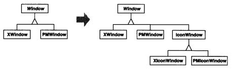
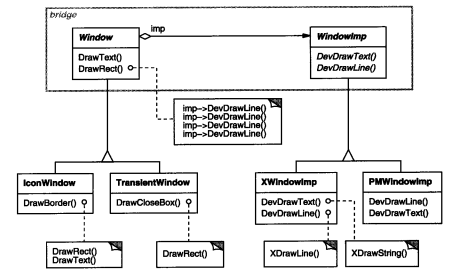
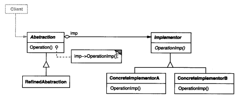

### 4.1 BRIDGE(桥接)——对象结构型模式

例1：[设计一个文档编辑器](code/1.设计一个文档编辑器/GlyphSpace)

#### 1.意图

将抽象部分与它的实现部分分离，使它们都可以独立的变化

将实现(例1 DrawRect/DrawPolygon..)委托/(转发) 给另一个抽象(WindowImp)，WindowImp不同的子类实现会让(DrawRect/DrawPolygon...)有不同的表现

#### 2.别名

Handle/Body

#### 3.动机

当一个抽象可能有多个实现时，通常用继承来协调它们。抽象类定义接口，具体子类实现接口。但是此方法又是不够灵活。**继承机制将抽象部分与它的实现部分固定在一起，使得难以对抽象部分和实现部分独立地进行修改、扩充和重用。**

考虑一个兼容不同平台(Mac/Windows)的界面工具箱。



* 为实现Window类下的在不同平台的(DrawRect/DrawLine...)接口。需要为IconWindow/DialogWindow新建n个(平台数量)子类(XIconWindow，PMIconWindow，MacIconWindow )
* Bridge模式解决以上问题的办法是，将Window.DrawRect/DrawLine等接口实现转发给一个抽象类(WindowImp)，这样，**接口和实现分别放在了独立地类层次结构中**，具体平台子类(MacWindowImp/XWindowImp)使用不同实现。我们将Window与WindowImp之间的关系称之为桥接，因为它在抽象类与它的实现之间起到了桥梁作用，使他们可以独立地变化。
  

#### 4.适用性

以下情况使用Bridge模式

* 你不希望抽象和它的实现部分之间有一个固定的绑定关系。有可能你希望在运行时刻实现部分可以被选择或切换。

  如例1中Window里的_imp可以动态切成MaxWindowImp或XWindowImp

* 类的抽象以及它的实现都应该可以通过生成子类的方法加以扩充。这时，Bridge模式使你可以对不同的抽象接口和实现部分进行组合，并分别对他们进行扩充。

  一个抽象类的很多子类继承来修改实现-> 两个(多个)类的很少子类继承组合实现

  XIconWindow，PMIconWindow，MacIconWindow 

  XDiaLogWindow，PMDiaLogWindow，MacDiaLogWindow，

  -> IconWindow，DiaLogWindow  +  XWindowImp，PMWindowImp，MacWindowImp

* 对一个抽象的实现部分的修改应对客户不产生影响，即客户代码不必重新编译

  Window图像系统升级XWindowImp里DrawRect需要使用新的系统接口，这时调用端的客户无需改代码。

  但是如果使用原来的方式可能就需要修改XIconWindow，XDiaLogWindow...里的DrawRect接口

* 你想对客户完全隐藏抽象的实现部分

* 将一个对象分解成两个部分，嵌套的普化

* 多个对象间共享实现。

#### 5.结构



#### 6.参与者

* Abstraction(Window)
  * 定义抽象类接口 (DrawRect/DrawLine)
  * 维护一个指向Implementor类型对象的指针 (Window._imp)

* RefinedAbstraction(IconWindow/DialogWindow)

  扩充由Abstraction定义的接口

* Implementor(WindowImp)

  * 定义 实现类 的接口，接口不一定要与Abstraction的接口完全一致；事实上可以完全不同。(类似适配器)
  * 一般来讲，Implementor接口仅提供基本操作，而Abstraction则定义了基于这些基本操作的较高层次的操作。

* ConcreteImplementor(XWindowImp，PMWindowImp)

  * 实现Implementor接口并定义具体实现

#### 7.协作

**Abstraction将client的请求转发给它的Implementor**

#### 8.效果

1. **分离接口和实现**

   运行时刻切换实现(_imp = xxxWindowImp)

   有助于分层，从而产生更好的结构化系统。系统高层仅需知道Abstraction和Implementor

2. 提高可扩充性 

   **对Abstraction和Implementor分别扩充**

3. 实现细节对客户透明

   隐藏实现细节，客户知道接口但完全不知道实现

#### 9.实现

1. 仅由一个Implementor的时候

   这是Bridge模式退化的情况，这时没必要创建一个抽象的Implementor。

   (但是依然分离了接口和实现)

2. 创建正确的Implementor对象

   * 方法一：

     如果Abstraction(Window)知道所有的ConcreteImplementor(PMWindowImp/MacWindowImp)类，他就可以在构造器中对其中一个实例化

     代码类似

     ```
     public Window(Platform p)
     {
     	if(p is MacPlatform)
     		_imp = new MacWindowImp;
         if(p is PMPlatform)
         	_imp = new PMWindowImp;
     }
     ```

   * 方法二：

     代理给另一个对象，由它一次决定，该对象的唯一职责就是封装系统平台的细节。

     即例1中的使用[Abstract Factory](3.1抽象工厂(Abstract Factory).md)创建

     这样Abstraction类不和任何一个Implementor类直接耦合

3. 共享Implementor对象

4. 采用多重继承机制

#### 10.代码示例

例1：[设计一个文档编辑器](code/1.设计一个文档编辑器/GlyphSpace)

#### 11.已知应用

#### 12.相关模式

使用[Abstract Factory](3.1抽象工厂(Abstract Factory).md)创建和配置一个特定的Bridge模式

[Adapter](4.1适配器(Adapter).md)模式用来帮助无关的类协同工作，通常在系统设计完成后才会被使用。

Bridge模式则是在系统开始时就被使用，它使得抽象接口和实现部分可以独立进行改变

#### 13.总结

对Window进行抽象使得使用Window的客户不需要考虑具体平台
对Window里与平台有关的DrawLine/DrawText等接口封装到抽象类WindowImp，使得使用WindowImp接口的客户(Window)不需要考虑具体平台。这么看来多了一层工具类的抽象接口，使得Window不用考虑与平台相关的子类(XIconWindow和PMIconWindow)，而关注于具体的Window类型(IconWindow、TranslentWindow)

桥接模式可以防止子类数量太多


转发给不同种类的Implementor

* Abstraction(Window)既可以有多个Implementor，(如Window里面放一个`_imp2`的引用)，也可以有多种Implementor(如Window再放一个`_colorImp`引用一个具体的ColorImp类)


