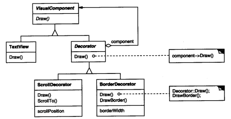
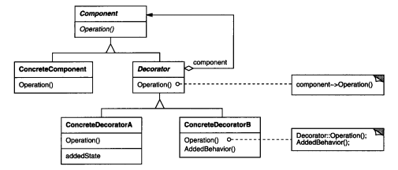
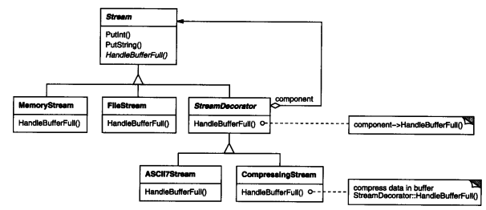

### 4.4 DECORATOR(装饰)——对象结构型模式

例1：[设计一个文档编辑器](code/1.设计一个文档编辑器/DecoratorSpace)

#### 1.意图

**动态的给一个对象添加一些额外的职责**。就增加功能来说，Decorator模式相比生成子类更为灵活

#### 2.别名

包装器Wrapper

#### 3.动机

希望给某个对象而不是整个类添加一些功能。给一个文本加上滚动条，而不是给所有文本类都加上滚动条。

对于客户来说，使用上应该没有什么不同，即这个滚动条对客户是透明的。

**透明：如果添加上滚动条后使用接口没有变化，则称为透明。**

因此，添加的装饰(滚动条)接口应和组件(文本)接口一致(即继承同一抽象类)

如例1

当然使用这种结构，滚动条可以装饰任何继承了VisualComponent类的组件

#### 4.适用性

以下情况使用Decorator模式

* 在不影响其他对象的情况下，以**动态、透明**的方式给**单个对象**添加职责、
* 处理那些可以撤销的职责。
* 当不能采用生成子类的方法进行扩充时。一种情况是，可能有大量独立的扩展，为支持每一种组合将产生大量的子类(ScrollTextView,ScrollImageView,BorderTextView...)，使得子类数目成爆炸性增长。另一种情况可能是因为类定义被隐藏，或类定义不能用生成子类。

#### 5.结构

#### 6.参与者

* Component(VisualComponent)

  定义一个对象接口，可以给这些对象动态的添加职责

* ConcreteComponent(TextView)

  定义一个对象，可以给这个对象添加一些职责

* Decorator

  维持一个指向Component对象的指针，并定义一个与Component接口一致的接口

  转发接口请求至Component 转发操作也可以放至ConcreteDecorator中

* ConcreteDecorator(ScrollDecorator/BorderDecorator)

  向组件添加职责

#### 7.协作

Decorator将请求**转发**给它的Component对象，并有可能在转发前后执行一些**附加的动作**

这些附加的动作就是我们要添加的职责的一部分。

Decorator对于客户是透明的，客户在使用的时候TextView(例1)或FileStream(下图)时并不知道中间有没有装饰器(但是在新建的时候可能会涉及到)，因为decorator也继承了VisualComponent/Stream的必要的抽象接口。新建的时候使用不同的装饰器，会使具体TextView/MemoryStream有不同的表现(decorator可以在具体步骤前或者后添加一些操作)。

使用时感受不到存在，但是新建时使用不同的Decorator搭配可以让接口添加些不同表现
可以通过嵌套，添加多种职责如例1中

`w.SetContents(new BorderDecorator(new ScrollDecorator(textView), 2));`

#### 8.效果

1. 比静态继承灵活  

   见适用性第三条

2. 避免在层次结构高层的类有太多特征

   一个Decorator仅添加一个职责，多个Decorator嵌套可以逐步添加功能。

   这样，应用程序不必为不需要的特征付出代价

3. Decorator与它的Component不一样   使用装饰时不应依赖对象标识，(不依赖具体TextView/ImageView)

4. 有许多小对象  

   采用Decorator模式进行系统设计往往会产生许多看起来类似的小对象，这些对象仅仅是连接方式的不同(嵌套方式不同组合出不同职责)。

   可能难以学习，排错也很困难

#### 9.实现

使用Decorator模式时应注意以下几点

1. 接口的一致性

   Decorator和它所装饰的Component应该有同一个公共父类

   保证透明

2. 省略抽象的Decorator类  

   仅需要一个职责时，将抽象Decorator类退化为一个具体类。实现该职责

3. 保持Component类的简单性

   为了保证接口一致，组件和装饰必须有一个公共父类。

4. 改变对象外壳与改变对象内核

   将Decorator看作一个对象的外壳，他可以改变这个对象的行为(转发前后+操作)，另外一种方法是改变对象的内核。例如 Strategy模式

#### 10.代码示例

例1：[设计一个文档编辑器](code/1.设计一个文档编辑器/DecoratorSpace)

#### 11.已知应用

#### 12.相关模式

[Adapter模式](4.1适配器(Adapter).md)，Decorator模式不同于Adapter模式，因为装饰器仅改变对象的职责而不改变它的接口。而适配器将给对象一个全新的接口。

[Composite模式](4.3组合(Composite).md)：可以将装饰器视为一个退化的、仅有一个组件的组合。然而，装饰仅给对象添加一些额外的职责。它的目的不在于对象聚集

Strategy模式：用一个装饰你可以改变对象的外表，而Strategy使得你可以改变对象的内核。这是改变对象的两种途径。