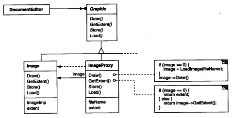
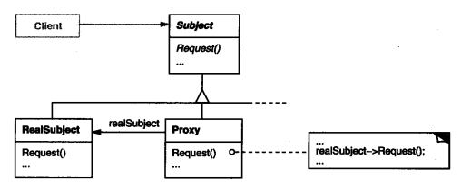
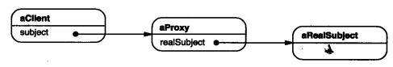

### 4.7 PROXY(代理)——对象结构型模式

例1：[保护代理：关键字查询](code/4.7代理/关键字查询)  代码来源:https://www.cnblogs.com/noKing/p/9064946.html

例2：[设计一个文档编辑器](code/1.设计一个文档编辑器/GlyphSpace)里的ImageProxy

#### 1.意图

**为其他对象提供一种代理以控制对这个对象的访问**

#### 2.别名

Surrogate

#### 3.动机

代理后，对对象的访问要经过代理，这是，我们可以根据实际使用情况控制被代理**对象的创建和初始化**。

考虑一个嵌入图像的文档编辑器。打开文档必须很迅速，而有些图像会很大，而且在文档中也不是同时可见。所以没必要同时创建这些对象。

1. 创建的开销很大

2. 只有在真正用到时才实例化

3. 对客户是透明的 (客户并不知道有没有使用代理) (可选)

基于第3点很容易想到[装饰模式](4.4装饰(Decorator).md)，即代理类和被代理的类使用同样的接口(继承同一**抽象父类/接口**)，对客户透明。

如下图：

可以看到：调用Draw()接口时加载Image，实现了和Imgage相同的接口

#### 4.适用性

1. 远程代理(Remote Proxy)：

   远程代理使得客户端可以像访问本地对象一样访问在远程机器上的对象；

   RPC

2. 虚代理(Virtual Proxy)

   实际使用时才创建开销很大的对象。

   上面的例图

3. 保护代理(Protection Proxy)

   控制对原始对象的访问。常用于鉴权

   如例1

4. 智能指引(Smart Reference)取代了简单的指针，在访问对象时执行一些附加操作，用途包括

   * 对指向时机对象的引用计数，这样当该对象没有引用时，可以自动释放它
   * 第一次引用一个持久对象时，将它装入内存
   * 在访问一个实际对象前，检查是否已经锁定，以确保其他对象不能改变它。(有利于将锁定/检测锁定的功能和对象分离开？)

#### 5.结构

这是运行时刻一种可能的代理结构的对象图。

#### 6.参与者

* Proxy(ImageProxy)

  * 保存一个引用(Image/Graphic)使得代理可以访问实体。若RealSubject和Subject的接口相同，Proxy可以引用Subject
  * 提供一个与Subject的接口相同的接口，这样代理就可以用来代替实体。
  * 控制对实体的存取，并可能负责创建和删除它
  * 其他功能依赖于代理的类型
    * Remote Proxy负责对请求及其参数进行**编码**，并向不同地址空间实体发送已编码的请求。(RPC)
    * Virtual Proxy可以缓存实体附加信息，以便延迟对它的访问。(例2：ImageProxy)
    * Protection Proxy 检查调用者/客户 是否具有实现一个请求所必需的访问权限 (例1：[保护代理：关键字查询](code/4.7代理/关键字查询))

* Subject(Graphic)

  定义RealSubject和Proxy的共用接口，这样就可以在使用RealSubject的地方**使用Proxy代替**

* RealSubject(Image)

  定义Proxy所代表的实体

#### 7.协作

代理根据其种类，在**适当的时候**向RealSubject**转发**请求。

#### 8.效果

Proxy模式在访问对象时引入了一定程度的间接性。根据代理的类型，附加的间接性有多种用途。

1. Remote Proxy可以隐藏一个对象存在于不同地址空间的事实。(RPC访问远程数据就像在使用本地数据)
2. Virtual Proxy 可以在合适的时候创建对象
3. Protection Proxies 和 Smart Reference都允许在访问一个对象时有一些附加的内网处理。

Proxy模式还可以对用户隐藏另一种称为Copy-on-write的优化方式，即根据需要创建对象。拷贝一个庞大复杂的对象开销很大，如果这个拷贝没有被修改，那这个开销就没有必要。用代理延迟拷贝这一过程，我们可以保证只有当这个对象被修改时才对它进行拷贝。

#### 9.实现

1. 重载C++中的存取运算符->

2. 使用Smalltalk中的doesNotUnderstand

3. Proxy并不总是需要知道实体的类型  ，若Proxy类能够完全通过一个抽象接口处理它的实体，则无需为每一个RealSubject类都生成一个Proxy类。这时候RealSubject们有一个抽象父类，这个父类与proxy同级并被proxy引用

   即Proxy(ImageProxy)有一个指向Subject(Graphic)的引用。

   但是如果Proxy要实例化RealSubject(例如virtual proxy)，那么他们必须知道具体的类。

#### 10.实现

例1：[保护代理：关键字查询](code/4.7代理/关键字查询)   **(Protection Proxy)**

参照例1，用户使用时新建一个代理，使用代理时就像使用真正的RealSearch类一样(因为接口相同)，最后代理类ProxySearch会在验证参数决定**是否转发**，或在**转发前后添加操作**日志，当然这些对于客户都是透明的。

例2：[设计一个文档编辑器](code/1.设计一个文档编辑器/GlyphSpace)里的ImageProxy   **(Virtual Proxy)**

参照例2，客户在使用Image某些接口时可能有时不需要载入图片(假设是 `public override Rect Bounds()`)，只有在真正使用的时候才去调用Load接口载入图片。

#### 11.已知应用

#### 12.相关模式

[Adapter(4.1)](4.1适配器(Adapter).md)，适配器Adapter为它所适配的对象提供了一个不同的接口。相反，代理提供了与它的实体相同的接口。适配器偏向于调整参数转接不同方法名。代理则偏向于是否转发，或转发前后验证(鉴权)、添加日志等，所以并不像适配器一样一定会转发消息。

[Decorator(4.4)](4.4装饰(Decorator).md)，尽管decorator的实现部分与代理相似，但是decorator的目的不一样，Decorator为对象添加一个或多个功能，而**代理则控制对对象的访问**

代理+反射  可对于方法的鉴权(方法名startwith("set"))