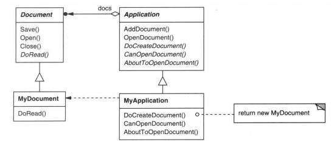
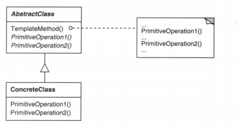

### 5.10 TEMPLATE METHOD(模板方法)——类行为型模式

例1：[模板方法](code/5.10模板方法/模板方法)

#### 1.意图

定义一个操作中的算法的骨架，而将一些步骤延迟到子类中。TemplateMethod使得子类可以不改变一个算法的结构即可重定义该算法的某些特定步骤。

这些特定步骤多是**原语操作(即粒度很细的方法)**

#### 2.动机

考虑一个Application和Document类的应用框架。Application类负责打开一个已有的以外部形式存储的文档，如一个文件。一旦一个文档中的信息从改文件中读出后，它就由一个Document对象表示。

如下图：

Application和Document是两个抽象类

具体子类可以是DrawApplication和DrawDocument 、SpreadsheetApplication和SpreadsheetDocument

抽象的Application类定义了打开和读取文档的算法：

如例1。

* 我们称`OpenDocument`为一个模板方法(template method)。
* 一个模板方法用一些抽象的操作定义一个算法，而子类将重定义这些操作以提供具体的行为。

#### 3.适用性

模板方法应用于下列情况：

* 一次性实现一个算法的不变的部分，并将可变的行为留给子类来实现。
* 各子类中公共的行为应该被提取出来并集中到一个公共父类中以避免代码重复。
* 控制子类拓展 

#### 4.结构

即

* 抽象类中使用抽象方法们完成一个行为
* 具体类中实现抽象方法。

#### 5.参与者

* AbstractClass(抽象类，如Application)
  * 定义抽象的原语操作(primitive operation)，具体的子类将重定义它们以实现一个算法的各步骤
  * 实现一个模板方法，定义一个算法骨架。该模板方法不仅调用原语操作，也调用定义在AbstractClass或其他对象中的操作。
* ConcreteClass(具体类，如MyApplication)
  * 实现原语操作以完成算法中特定子类相关的步骤。

#### 6.协作

ConcreteClass靠AbstractClass来实现算法中不变的步骤。

#### 7.效果

模板方法是一种代码复用的基本技术。它们在类库中尤为重要，它们提取了类库中的公共行为。

模板方法导致一种反向的控制结构，这种结构被称为"好莱坞法则"，即"别找我们，我们找你"。这指的是一个父类调用一个子类的操作。

模板方法调用下列类型的操作：

* 具体的操作(ConcreteClass或对客户类的操作)。
* 具体的AbstractClass的操作
* 原语操作
* Factory Method
* 钩子操作(hook oprations)，它提供了缺省的行为，子类可以在必要时进行扩展。一个钩子操作在缺省操作通常是一个空操作。

#### 8.实现

1. 使用访问控制

   一个模板方法调用的原语操作可以被定义为保护成员`protected`，这保证它们只被模板方法调用。

   模板方法不需要被重写，可以定义为一个非虚成员函数

2. 尽量减少原语操作

   * 尽量减少需要重定义的原语操作
   * 这意味着模板方法里的代码可能要比较复杂

3. 命名约定

   可以给应被重定义的那些操作名字加个前缀以识别他们。如"Do-"，"DoCreateDocument"，"DoRead"

#### 9.代码示例

例1：[模板方法](code/5.10模板方法/模板方法)

#### 10.已知应用

#### 11.相关模式

[Factory Method模式(3.3)](3.3工厂方法(Factory Method).md)常被模板方法调用。即

* 工厂方法是创建型的方法延迟到子类。
* 模板方法是一堆抽象操作组合，然后将这堆抽象操作的实现延迟到子类

[Strategy(5.9)](5.9策略(Strategy).md)模板方法使用继承来改变算法的一部分。Strategy使用委托来改变整个算法。

#### 12.总结

与其说和工厂方法像，不如说和[生成器(3.2)](3.2生成器(Builder).md)模式有点类似

都是给了抽象算法的步骤。但是每一步都是由具体子类进行重写的。

区别：

*  生成器更注重创建一个产品，有固定流程，子类完成部件的创建，最终得到产品
* 模板方法更注重一个框架，或解决方式，然后由具体子类实现原语方法
* 一个类里也可以多个模板方法

这个试卷的例子有点意思：模板给了题目，但是答案要自己写(实现)。https://blog.csdn.net/u013393958/article/details/80231327

