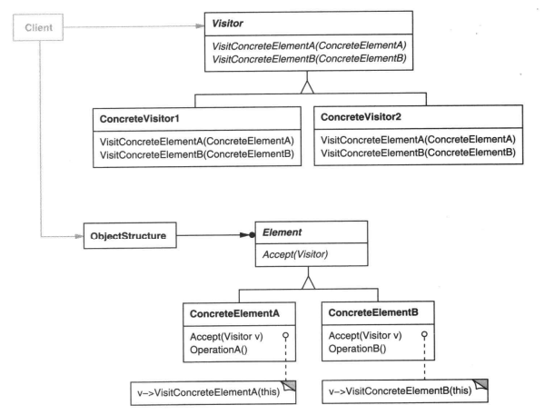
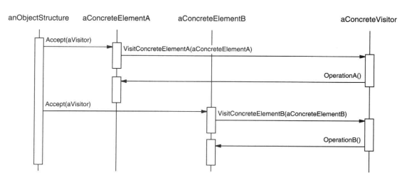

### 5.11 VISITOR(访问者)——对象行为型模式

例1：[拼写检查](code/1.设计一个文档编辑器/VisitorSpace)

#### 1.意图

表示一个作用于某对象结构中的各元素的操作。它使你可以在不改变各元素的类的前提下定义作用于这些元素的新操作(`SpellingCheckingVisitor`)。

#### 2.动机

例1中，我们需要对每个Glyph节点进行拼写检查和添加连字符等功能。这需要对不同的节点进行不同的处理。

直觉上，如果要添加这两个功能，我们可能会在每个Glyph节点上添加诸如`CheckSpell、CheckHyphenation`等方法，但是这些操作分散到各个节点类会导致整个系统难以理解、维护和修改。而且增加新的操作也需要为每一个类都添加新的方法。

如果可以独立地增加新的操作(`SpellingCheckingVisitor`)，并且使节点类(Glyph,Character,Image)独立于这些操作，将会好一点。

> 解决办法：我们将每一个节点类中相关的操作包装在一个独立的对象xxVisitor(`SpellingCheckingVisitor`)中，并且在遍历Glyph节点时，将xxVisitor传递给当前访问的节点(如Character)，当一个节点接受该访问者(xxVisitor)时，该节点向访问者(xxVisitor)发送一个包含自身类的请求(如`v.VisitCharacter(this);`)。访问者为该节点执行操作(即`SpellingCheckingVisitor`里`VisitCharacter`方法里包裹的代码)。

上面这个逻辑就将操作从节点里移到了xxVisitor中。**这样在节点中增加操作(方法)就可以通过增加Vistor子类来解决。**

#### 3.适用性

以下情况使用Visitor模式：

* 一个对象结构包含很多类对象(节点)，他们有不同的接口，而你想对这些对象实施一些依赖于其具体类的操作(例如`SpellingChecking,Hyphenation`，这些操作都是需要这个类本身的一些数据)

* 需要对一个对象结构中的对象(不一定是树形的对象节点)进行很多不同且不相关的操作，而你又想避免这些操作"污染"这些对象的类。Visitor可以将相关操作集中起来定义在一个类中。当该对象结构被很多应用共享时，用visitor模式让每个应用仅包含需要用到的操作(如Program里调用SpellingCheckingVisitor)

* 适用于定义对象结构的类很少改变，但经常需要在此结构上定义**新的操作**。改变对象结构类需要重定义所有访问者的接口，这可能需要很大的代价。如果对象结构类经常改变，那么可能还是在这些类中定义这些操作较好。

  即新增操作多，但是不改变对象节点本身结构。因为可能有很多访问者(xxVistor)，这些访问者都依赖于对象节点的结构。

#### 4.结构

#### 5.参与者

* Visitor(访问者，如例1中的Visitor类)

  为该对象结构中ConcreteElement的每一个类声明一个Visit操作。该操作的名字和特征标识了发送Visit请求给该访问者的那个类。这使得访问者可以确定正被访问元素的具体的类。这样访问者就可以通过该元素的特定接口直接访问它。

  `abstract class Visitor`中定义的抽象接口`VisitCharacter(Character c)，VisitRow(Row r)，VisitImage(Image I)`

* ConcreteVisitor(具体访问者，SpellingCheckingVisitor)

  实现Visitor中的操作。ConcreteVisitor为该算法提供了上下文并存储它的局部状态。这个状态常常在遍历该结构的过程中累积结果

  遍历可以通过[迭代器模式](5.4迭代器(Iterator).md)实现

* Element(元素，例1中的Glyph)

  定义一个Accept操作，它以一个访问者为参数。` Accept(Visitor v)`

* ConcreteElement(具体元素，如Character)

  实现Accept操作。

* ObjectStructure(对象结构，如Program的` var a = new PreorderIterator<Glyph>(g);`就是用的迭代器)

  * 能枚举它的元素
  * 可以提供一个高层的接口以允许该访问者访问它的元素
  * 可以是一个复合[4.3组合(Composite).md](4.3组合(Composite).md)结构，或一个集合，一个列表，或一个无序集合。

#### 6.协作

* 一个使用Visitor模式的客户必须创建一个ConcreteVisitor对象，然后**遍历该对象结构**，并用访问者访问每一个元素

  遍历的职责时交给客户的

* 当一个元素被访问时，它调用对应于它的类的Visitor操作。如有必要，该元素将自身作为这个操作的参数以便该访问者访问它的状态。

  如例1Character中的`v.VisitCharacter(this);`

  

#### 7.效果

下面是访问者模式的一些优缺点：

1. 易于增加新的操作  

   **在节点中增加操作(方法)就可以通过增加Vistor子类来解决。**

   相反，如果每个功能都分散在多个类之上的话，定义新的操作时必须修改每一个节点类

   **分离了功能**

2. 访问者集中相关的操作而分离无关的操作 

   类中的行为不分布在节点类上，而是集中在一个访问者中。这就简化这些元素的类。也简化了在这些访问者中定义的算法。**算法结构可以被隐藏在访问者中**

3. 缺点：增加新的ConcreteElement类很困难

   Visitor模式使得难以增加新的Element子类，比如例1中如果加了一个Text节点类继承Glyph，那么所有的Visitor子类都要添加VisitText(Text t)方法。

   **所以Visitor适用于稳定的Element层次**

4. 通过类层次进行访问

   例1中就是使用了[迭代器模式](5.4迭代器(Iterator).md)通过调用节点对象的特定操作来遍历整个对象结构。

5. 累积状态

   如`SpellingCheckingVisitor._currentWord`，将之前遍历的节点内容也会存下来

6. 破坏封装

   访问者常常会调用元素内部状态的公共操作，或需要一些私有数据。

   这可能会破坏它的封装性

#### 8.实现

1. 双分派

   `Accept(Visitor v)`方法里判断是哪种类型的访问者进行区别操作？

#### 9.代码示例

例1：[拼写检查](code/1.设计一个文档编辑器/VisitorSpace)

#### 10.已知应用

#### 11.相关模式

[Composite(4.3)](4.3组合(Composite).md)：访问者对一个Composite模式定义的对象结构进行操作

[Interpreter(5.3)](5.3解释器(Interpreter).md)：访问者可以用于解释

