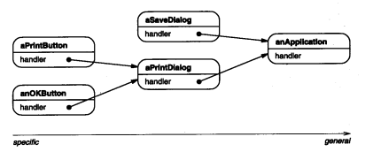
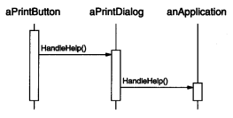
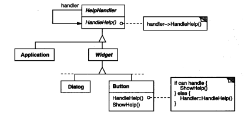
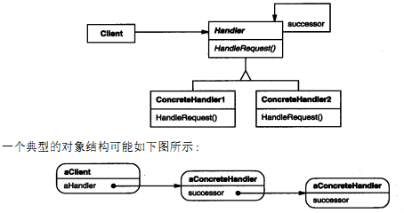

### 5.1 CHAIN OF RESPONSIBILITY(职责链)——对象行为模式

例1：[界面帮助](code/5.1职责链/界面帮助)

#### 1.意图

使多个对象都有机会处理请求，从而**避免请求的发送者和接收者之间的耦合关系**。讲这些对象连成一条链，并沿着这条链传递该请求，**直到有一个对象处理它为止**。

#### 2.动机

考虑一个图形用户界面中与上下文有关的帮助信息。用户在界面任一部分点击可得到帮助信息。

如图：

从特殊到通用。

链上的对象仅需保持一个指向其后继者的引用，和迭代器差不多，知道的信息最小化

HelpHandle可为

* 所有候选对象类的父类
* 一个混入(mixin)类 即使用组合的方式

例1：[界面帮助](code/5.1职责链/界面帮助)中就是使用的第一种方式。因为后继者和界面节点的组成方式几乎相同，所以可以简化职责链的新增和维护。

HelpHandle的缺省操作是将请求转发给后继。子类重定义这一操作在适当情况下提供帮助，否则转发给后继者

#### 3.适用性

在以下条件下使用Responsibility链

* 多个对象可以处理一个请求，哪个对象处理该请求运行时刻自动确定
* 你想在不指明接受者的情况下，向多个对象中的一个提交一个请求。
* 可处理一个请求的对象几何应该被动态指定

#### 4.结构

#### 5.参与者

* Handle(例1中的HelpHandler)

  * 定义一个处理请求的接口 (HandleHelp)
  * (可选)实现后继链

* ConcreteHandle(如Button，Dialog)

  * 处理它所负责的请求
  * 可访问它的后继者
  * 可处理则处理，否则就转发请求到后继者

* Client (Program)

  向链上的具体处理者(ConcreteHandler)对象提交请求。

#### 6.协作

当客户提交一个请求，请求沿链传递直至有一个ConcreteHandler对象负责处理它

#### 7.效果

优点

* 降低耦合度

  * 发送请求时不知道谁会处理，但是知道请求会被"正确处理。
  * 接收者和发送者都没有对方的明确信息
  * 接收者和发送者都不知道链的结构

  结果是，职责链可简化对象的相互连接。他们仅需保持一个指向后继者的引用，而不需要保持它的所有候选接收者的引用。(是不是有点迭代器的意思)

* 增强了给对象指派职责的灵活性

  * 因为可以动态增加或修改链

  * 增加或改变一个职责(HandleHelp() ,PrintWidget())

缺点：

* 不保证被接受 

  因为没有明确的接收者，所以请求可能到末端都得不到处理。

#### 8.实现

1. 实现后继者链

   1. 定义新的链接，通常在Handler中定义，也可由ConcreteHandlers来定义

      例1：[界面帮助](code/5.1职责链/界面帮助)

   2. 使用已有的链接

      当已有的链接能够支持你所需的链时，完全可以使用他们。

2. 连接后继者

   如果没有已有的链接结构，那么就要引入新的链接，不仅要定义该请求的接口，还要维护后继者链接。

   缺省实现转发信息给后继者。

3. 表示请求

   即HandlerHelp()接口。

   * 如果硬编码(hard-coded)使用一个确定的名字，那么只能转发固定的请求，

     需要新增的话只能添加一个新方法如PrintWidget()

   * 使用一个处理函数，用**参数标记一个请求**。

     如：ProcessEvent(int request)  //request:1 代表HandlerHelp  2代表PrintWidget 这样

     这要求发送方和接收方(request)编码一致

     但是这种方式不是类型安全的

   * 使用独立的请求对象来封装参数

     如：例1：[界面帮助](code/5.1职责链/界面帮助)
     
             //封装参数的使用方式
             public virtual void HandleRequest(Request request)
             {
                 var t = request.GetType().ToString();
                 switch (t)
                 {
                     case "PrintRequest":
                         HandlePrint((PrintRequest) request);
                         break;
                     case "HelpRequest":
                         break;
                 }
             }
         
             public virtual void HandlePrint(PrintRequest request)
             {
             }
   
4. 在Smalltalk中自动转发

#### 9.代码示例

例1：[界面帮助](code/5.1职责链/界面帮助)

#### 10.已知应用

#### 11.相关模式

职责链常与[Composite(4.3)](4.3组合(Composite).md)一起使用，这种情况下，一个构件的父构件可作为它的后继。

#### 12.总结

* 如果是定义新的链接而不是使用已有链接(如Composite)后继者的维护会很繁琐，例1，中窗口节点和后继者有公共的地方，也有区别考虑的地方

* 主要逻辑也是转发，但是这个是链式转发。**一个或一堆请求沿链后传**，**特定节点**自行判断是否有自己**感兴趣的请求**，且定义上**只会有一个对象**处理该请求。

* 当鼠标点击或按键盘，一个事件产生并沿链传播可以使用

  但是UGUI的鼠标事件和这个不太像，

  * UGUI中通过eventSystem.RaycastAll 方法获取所有可以被点击的组件
  * 遍历并通过 module.Raycast判断是否被射线击中
  * 得到第一个被击中的物体
  * 然后for循环该组件挂载的OnEnter,OnClick等事件，选择符合条件的触发