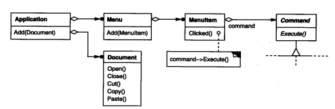
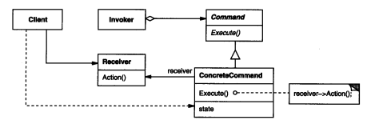

### 5.2 COMMAND(命令)——对象行为模式

写在前面：

* 对象.动作(参数)

  xxx.Function(参数)

例1：[复制粘贴](code/5.2命令/复制粘贴)

#### 1.意图

注重操作，想要操作单独出来，进行撤销。或多个操作组合执行

将一个请求封装成一个对象(Command)，从而使你可用不同的请求(Open/PasteCommand)对客户进行参数化；对请求排队(MacroCommand)或记录(Excute方法里)请求日志，以及支持可撤销(Unexcute)的操作。

**将方法视为数据”(treat methods as data)，是也函数式编程范式中的重要观点。**

**和UGUI的鼠标命令有点像**

* ExecuteEvents.Execute(对象(一个或多个)，参数(一个或多个)，操作(接口或委托，预留对象和参数))
  **对象.操作(参数)**

可以多条元命令串联起来

#### 2.别名

动作(Action)，事务(Transaction)

#### 3.动机

如上，我们了解一个请求/操作/命令 (Paste/Open/Press)，这些是一个动作。

但是执行操作的**对象**和所需要的**参数**可能运行时才能确定。

这是可以用命令模式。

将请求/操作本身变成一个对象。

如例1：[复制粘贴](code/5.2命令/复制粘贴)

操作好定义，难点在如何在**运行时将对象和参数**告诉command对象。

* 主动传递过去(依赖注入)。

* Command里主动获取

#### 4.适用性

* 需要抽象出待执行的动作/操作

  使用回调，委托，或接口

* 不同时刻指定、排列和执行请求。

* 支持取消操作

* 支持修改日志

  系统崩溃时，因为命令被保存了，所以可以把命令拿出来重做一遍

* 在元操作上的高层操作构造一个系统。

  这样一种结构在支持事务(transaction)的信息系统中很常见

#### 5.结构

#### 6.参与者

* Command

  声明执行操作的接口

* ConcreteCommand(PasteCommand，OpenCommand)

  将一个接收者对象绑定于一个动作。

  调用接收者相应的操作，以实现Execute

* Client(Appliction)

  创建一个具体命令对象

* Invoker(MenuItem)

  要求该命令执行这一请求

* Receiver(Document，Application)

  知道如何实施与执行一个请求相关的操作。任何类都可能作为一个接收者。

  UGUI中ExecuteEvents.Execute，Gameobject就是一个接收者，执行OnClick的操作

#### 7.协作

* Client创建一个ConcreteCommand对象并指定它的Receiver对象(Document，Application)

  这个可以是运行时动态获取的

  UGUI的鼠标事件的Receiver就是GameObject。

* 某Invoker对象存储该ConcreteCommand对象。(就是生成的命令对象open/paste/close索引给谁用)

* 该Invoker通过调用Command对象的Excute操作来提交一个请求。若该命令是可撤销的，ConcreteCommand就在执行Excute操作之前存储当前状态用于回退该命令。

* ConcreteCommand对象调用它的Receiver的一些操作以执行该请求

#### 8.效果

1. 将调用操作的对象(Program)和实现操作(Document)的对象解耦

   UGUI中就是，EventSystem里的按键交互与 GameObject里的OnClick实现 分离

2. 命令可以被操纵和拓展
3. 可以组合小命令装备成复合命令(MacroCommand)
4. 增加新的Command很容易

#### 9.实现

实现Command模式时需要考虑以下问题

1. 一个命令对象应达到何种智能程度

   命令的粒度大小，接收对象(Receiver(Document，Application)的范围

   要有足够的信息动态找到的接收者

2. 支持取消(undo)和重做(redo)

   需要存储额外的信息，比如执行操作时的**对象和参数**(本文最开头)，如果操作改变了某些值，这些值也需要存储。

   多级取消，需要有一个已被执行命令的历史表列(history list)

   还可以结合Prototype模式复制命令列表

3. 避免取消操作过程的错误积累

   由于命令重复的执行、取消执行、和重执行的过程中可能会积累错误，一直一个应用的状态最终偏离初始值。这就有必要在Command中存入更多的信息以保证这些对性可被精确地复原成它们的初始状态。可以使用Memento模式来让该Command访问这些信息而不暴露其他对象的内部信息。

4. 使用C++ 模板 

   对不能取消和不需要参数的命令

   如例1中的SimpleCommand

#### 10.代码示例

例1：[复制粘贴](code/5.2命令/复制粘贴)

#### 11.已知应用

#### 12.相关模式

[Compsite模式(4.3)](4.3组合(Composite).md)可被用来实现宏命令

Memento模式(5.6)可用来保持某个状态，命令用这一状态来取消它的效果。

拷贝历史列表可以使用[原型模式(3.4)](3.4原型(Prototype).md)

#### 13.总结

执行Command的对象(Document)很有可能是运行时获取的而不是提前指定的，参数(PasteCommand._paste)也是。要有足够的信息动态找到的接收者(例1中的Document UGUI中的GameObject)