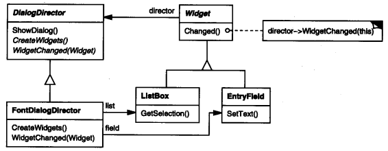
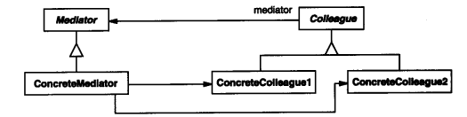

### 5.5 MEDIATOR(中介者)——对象行为型模式

例1：[对话框和各组件](code/5.5中介者/对话框和各组件)

#### 1.意图

用一个中介对象(FontDialogDirector)来封装一系列的对象(Button/ListBox)的交互。中介者使用各对象不需要显式的相互引用。从而使其耦合松散，而且可以独立地改变它们之间的交互。

导控者FontDialogDirector

#### 2.动机

* 面向对象设计鼓励将行为分布到各个对象
* 这样导致各个对象间会有很多相互引用。
* 我们使用一个中介者来传递各个对象间的交互

如例1中

* `ListBox`中选中的选项发生变化
* 触发了中介者`FontDialogDirector`的`WidgetChanged`
* 中介者调用`EntryField.SetText`设置文本

这样各个组件间就没有了相互的引用，而是同时引用中介者

#### 3.适用性

在下列情况下使用中介者模式：

* 一组对象以定义良好但是复杂的方式进行通信。产生的**相互依赖关系结构混乱**且难以理解

* 一个对象**引用其他很多对象**并且直接与这些对象通信，导致难以复用该对象
* 想定制一个分布在多个类中的行为，而又不想生成太多的子类

#### 4.结构

#### 5.参与者

* Mediator(中介者，如DialogDirector)

  中介者定义一个接口用于与各同事(Colleague 如例1中的:EntryField,ListBox)对象通信

* ConcreteMediator(具体中介者，如FontDialogDirector)

  * 协调各同事对象实现协作行为
  * 了解并维护它的各同事

* Colleague class(同事类，如例1中的:EntryField,ListBox)

  每个同事类都知道它的中介者对象(可以引用Mediator或ConcreteMediator)

  每个同事在需要与其他同事通信时，与它的终结者通信

#### 6.协作

* 同事向一个中介者对象发送和接收请求。中介者在各同事间适当的转发请求以实现协作行为。

#### 7.效果

中介者模式的优缺点

1. 减少了子类生成

   Mediator将原本分布于多个对象间的行为集中在了一起(例1中的WidgetChanged里)。改变这些行为只需生成Mediator子类即可。 这样各个Colleague类可被重用。

   不同的Dialog新建不同的Mediator子类就可以复用(ListBox,Button,EntryField)，如果不使用Mediator模式，那么ListBox包含其他组件的引用，如果布局变了就不能复用了。

2. 它将各Colleague解耦

   有利于Colleague之间的松耦合，可以独立地改变和复用各Colleague类和Mediator类(如上一条所说)

3. 它简化了对象协议

   用Mediator和各Colleague间一对多的交互来代替多对多的交互。一对多的关系更易于理解、维护和拓展。

4. 它对对象如何协作进行了抽象

   使你将注意力从各个组件间本身的行为转移到了它们之间的交互上来。(都放在了一个方法中FontDialogDirector.WidgetChanged)

   这有助于弄清楚一个系统中的对象时如何交互的

5. 它使控制集中化

   中介者模式将交互的复杂性变为中介者的复杂性。

   因为中介者封装了协议，他可能变得比任一个Colleague都复杂。这可能使得中介者自身成为一个难于维护的庞然大物。

#### 8.实现

1. 忽略抽象的Mediator类 、

   如果仅有一个中介者，那就没必要定义一个抽象的Mediator类。

2. Colleague—Mediator通信

   当一个感兴趣的时间发生时，Colleague必须与其Mediator通信。

   * 一种实现方法是使用Observer(5.7)模式，将Mediator实现为一个Observer，各Colleague作为Subject，一旦其状态改变就发送通知给Mediator。Mediator做出相应将状态改变的结构传播给其他的Colleague

   * 另一种方法是在Mediator中定义一个特殊的通知接口，各Colleague在通信时直接调用该接口。(使用委托，或者接口)

     [例1委托版代码示例](code/5.5中介者/对话框和各组件使用委托版)

#### 9.代码示例

例1：[对话框和各组件](code/5.5中介者/对话框和各组件)

WidgetChange的复杂度随对话框的复杂度增加而增加。在实践中，大对话框可能并不会使用Mediator模式，其原因是多方面的，其中一个重要原因是中介者的复杂性可能会抵消该模式在其他方面带来的好处

#### 10.已知应用

#### 11.相关模式

[Facade(4.5)](4.5外观(Facade).md)与中介者的不同之处在于它是对一个对象子系统进行抽象，从而提供了一个更为方便的接口，它的协议是单向的。即Facade对象对这个子系统类提出请求。但反之则不行。

相反，Mediator提供了各Colleague对象不支持或不能支持的协作行为，而且协议是多向的。

Colleague可使用Observer(5.7)模式与Mediator通信

#### 12.总结

* 把所有的变化通知放到了一个接口里，判断引用(`if (theChangeWidget == _fontList)`)得知变化的是哪个组件，然后区分处理

* 对于像这种界面上一个组件变化影响到另一组件的状态适用这种模式
* 当然游戏中对话框(Dialog)的一些组件交互也可以使用这种模式