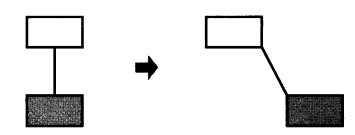
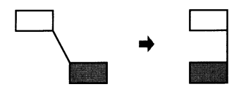
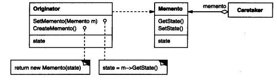

### 5.6 MEMENTO(备忘录)——对象行为型模式

例1：[备忘录1](code/5.6备忘录/图形移动回退)

例2：[备忘录2窄接口](code/5.6备忘录/图形移动回退窄接口)

#### 1.意图

在不破坏封装性的前提下(例2窄接口版)，捕获一个对象的内部状态(如`MoveCommand._state`)，并在该对象之外保存这个状态。这样以后就可以将该对象恢复到原先保存的状态(`SetMemento(_state)`)。

#### 2.别名

Token模式   、快照模式(SnapShot)

#### 3.动机

例1/例2中是一个图形编辑器，它支持图形对象间的连线。

如图，

我们将黑图形向右移动`MoveCommand.Excute() -> _target.Move(_delta)`，然后回退操作`MoveCommand.Unexcute() -> _target.Move(-_delta)`，虽然移动距离在命令中有保存，但是如果没有移动前的状态可能没有办法恢复连线。如上图，所以我们需要考虑**保存执行命令前的状态**

* 为了取消某个操作或者从错误中恢复过来，需要**保存一个内部状态**。

* 一个对象的状态通常是通过这个对象的私有变量(如例2中的`ConstraintSolver._connectList`)确定的，而私有变量不容易被外部对象保存。

  如果被**私有变量暴露出来又会违反封装性的原则**，可能有损应用的可靠性和可拓展性

**所以我们需要**

* 一个对象(原发器Originator)**暴露**出获取自己状态的**接口**给外部(负责人/管理者CareTaker)调用

  如例2中的`ConstraintSolver.CreateMemento`

* 外部(负责人/管理者CareTaker)可以将状态**回传**给该对象(原发器Originator)用于**恢复**状态

  如例2中的`ConstraintSolver.SetMemento`

* 而且我们希望这个状态对于负责人/管理者(CareTaker)来说只是一个黑盒，**仅仅负责保存**而不去审查或修改

  所以例2中使用了**窄接口**`IMemento`使得不暴露操作状态(ConstraintSolverMemento)的接口

#### 4.适用性

一下情况使用备忘录模式

* 必须保存一个对象在某一时刻的(部分)状态，需要时恢复

* 如果一个用接口来让其他对象直接得到这些状态，将会暴露对象的实现细节并破坏对象的封装性。

  (涉及到一些接口是否暴露的问题?用窄接口解决?)

这一方案允许ConstraintSolver把恢复先前状态所需的信息(`ConstraintSolverMemento`)交给其他的对象，而又不暴露它的内部结构和表示(如例2中的窄接口IMemento)

#### 5.结构

#### 6.参与者

* Memento(备忘录 如ConstraintSolverMemento)

  * 备忘录**存储**(`CreateMemento`)原发器对象的**内部状态**(`_connectList`)。原发器根据需要决定备忘录存储原发器的哪些内部状态

  * 放至原发器以外的其他对象访问备忘录。备忘录实际上有两个接口

    管理者(MoveCommand)只能看到备忘录的窄接口，它只能将备忘录传递给其他对象而不能修改

    原发器(ConstraintSolver)能看到一个宽接口，允许它访问状态所有数据。**理想情况下只允许生成本备忘录的那个原发器访问本备忘录的内部状态**

* Originator(原发器，如ConstraintSolver)

  * 负责创建一个备忘录`CreateMemento`记录状态
  * 同时暴露一个回传状态的接口`SetMemento`

* Caretaker(负责人，如MoveCommand/ConnectCommand)

  * 负责调用原发器创建备忘录
  * 不能操作备忘录内容，仅保存

#### 7.协作

* 负责人/管理器(Caretaker)调用原发器创建备忘录保存**状态(原发器私有变量)**，待需要时送回原发器
* 只有原发器能操作备忘录内容

#### 8.效果

备忘录模式有以下效果

1. 保持封装边界

   避免将原发器的状态(私有变量)暴露出来

   可以将原发器复杂的内部信息对其他对象屏蔽起来

2. 简化了原发器

   保存状态的职责交给了Caretaker，原发器不需要管理很多状态

3. 使用备忘录可能代价很高

   因为要存储状态，如果状态里的信息过多，而且频繁存储的话，可能会导致非常大的开销

4. 定义窄接口和宽接口

   在一些语言中可能难以保证只有原发器(ConstraintSolver)可以访问备忘录(ConstraintSolverMemento)的内部状态

5. 维护备忘录的潜在代价

   管理器负责删除它所维护的备忘录

   可能会产生大量存储开销

#### 9.实现

1. 语言支持

   宽窄接口

2. 存储增量式改变

   例1，例2都是这种方式，我们并没有存储图形的绝对位置，而只是在命令中知道移动的距离，以及通过连接状态进行连线的重建(`ConstraintSolver.Solve()`)

#### 10.代码示例

例1：[备忘录1](code/5.6备忘录/图形移动回退)

例2：[备忘录2窄接口](code/5.6备忘录/图形移动回退窄接口)

#### 11.已知应用

#### 12.相关模式

[Command(5.2)]()：命令可使用备忘录来为可撤销的操作维护状态

[Iterator(5.4)]():基于备忘录的迭代接口

#### 13.总结

* 其实就是将一个类(Originator`(ConstraintSolver)`)的内部状态(`ConstraintSolverMemento`)封装起来交给一个类(CareTaker`(MoveCommand)`)保存(不准修改，即不暴露接口)，恰当时机回传状态。
* 状态里是很多原发器的私有变量
* 可以用json的字符串保存状态?
* 可以解决一些类似私有变量的需要保存但不允许修改的类似情况？