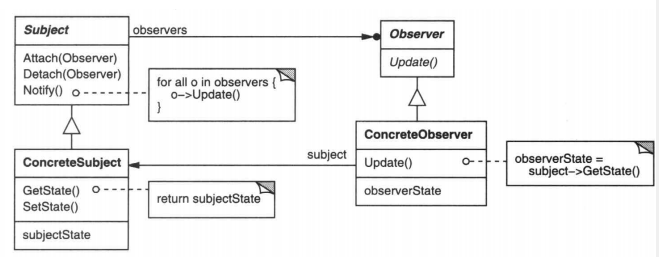
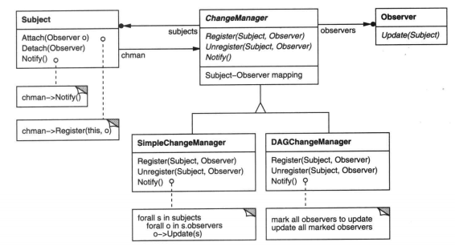

### 5.7 OBSERVER(观察者)——对象行为型模式

例1：[舰长界面](code/5.7观察者/舰长界面)

例2：

#### 1.意图

定义对象间的一种一对多的依赖关系，当一个对象(目标Subject)的状态发生改变时，所有依赖于它的对象(观察者Observe)都得到通知并被自动更新。

#### 2.别名

依赖(Dependents)，发布-订阅(Publish-Subscribe)

#### 3.动机

* 当多个界面依赖同一个数据，那么在数据变化的时候，那些界面都应该要被通知到

* Observer模式描述了如何建立这种关系。这一模式中的关键对象是目标(subject)和观察者(observer)。一个目标可以有任意数目的依赖它的观察者。一旦目标的状态发生改变，所有的观察者都应得到通知。然后观察者可以查询目标以使其状态与目标的状态同步。

* 这种交互也称为发布-订阅(publish-subscribe)。目标是通知的发布者。它发出通知时并不需要知道谁是它的观察者。可以有任意数目的观察者订阅并接收通知。

#### 4.适用性

在以下任一情况下可以使用观察者模式：

* 当一个抽象模型有两个方面，其中一个方面依赖于另一方面。将这二者封装在独立的对象中以使它们可以各自独立的改变和复用

* 当对一个对象的改变需要同时改变其他对象，而不知道具体有多少对象有待改变

* 当一个对象必须通知其他对象，而它又不能假定其他对象是谁。换言之，你不希望这些对象是紧密耦合的。

  例1中例子算不算紧密耦合，目标Subject仅仅知道的是IObserver对象，应该不算吧

#### 5.结构

#### 6.参与者

* Subject(目标)
  * 目标要知道它的观察者，可以有任意多个观察者观察同一个目标
  * 提供注册和删除观察者对象的接口
* Observer(观察者)
  * 为那些在目标发生改变时需要通知的对象定义一个更新接口
* ConcreteSubject(具体目标，`CaptainInfo`)
  * 将有关状态存入各ConcreteObserver对象
  * 当状态改变，向它的各个观察者发出通知
* ConcreteObserver(具体观察者`_D_Captain`)
  * 维护一个指向ConcreteSubject对象的引用(例1`_D_Captain._info`)
  * 存储有关状态，这些状态应该与目标状态保持一致
  * 实现Observer的更新接口(例1`_D_Captain.Update()`)使自身状态与目标的状态保持一致

#### 7.协作

* 当目标发生变化，通知观察者
* 观察者收到通知，查询最新状态

#### 8.效果

Observer模式允许你独立改变目标和观察者。

1. 减少两个类之间的耦合。

   将类之间的关系，转变成方法相关的调用

2. 支持广播通信 

   不关心接收者(是谁，数量有多少)，唯一的职责就是通知

3. 意外的更新  

   观察者不知道其他观察者的存在，所以如果一个观察更新了目标的数据->目标发出通知->可能有很多观察者也要更新。最终的代价一无所知。

   所以为了性能起见，如在例1中，`_D_Captain`界面在关闭，或销毁时可以移除监听。

#### 9.实现

1. 创建目标到观察者之间的映射

   例1中`CaptainInfo._observerList`里面显式保存了引用

2. 观察多个目标

   某些情况下，一个界面可能要观察多个目标如 例2：[舰长界面多目标多通知](code/5.7观察者/舰长界面接口版)

   这里也可以将代码中的`IObserverCaptain`和`IObserverDaily`合并到一个接口类，并将各自的两个接口都放进新的接口类里

3. 谁来触发更新

   1. 由目标对象更新状态后调用Notify

      缺点：多个连续的操作频繁的更新了状态会频繁调用Notify

   2. 客户`Program`负责在适当的时候调用Notify。

      多个连续的操作完成后，统一调用一次Notify，这样只要更新一次

      缺点：客户可能会忘记调用Notify，这种方式容易出错

   其实，可以添加一个每帧更新一次的通知，这样在一帧内通知了无数次也仅会在一帧结束后通知一次。

4. 对己删除目标的悬挂引用

   删除一个目标，需要删除观察者对目标的引用

   方法：当一个目标被删除时，让它通知它的观察者将对该目标的引用**复位**。

5. 在发出通知前确保目标的状态自身是一致的

   即，先更新自身状态，再发出通知

6. 避免特定于观察者的更新协议——推/拉模型

   如例2

   * 推模型：类似接口`IObserverCaptain.CaptTrainTimesChange(int cid,int trainTimes);`，即将观察者所需要的的信息随广播携带出去

     缺点：可能并不是所有观察者都需要该信息，可能使观察者相对难以复用

   * 拉模型：类似接口`IObserverCaptain.NewCaptainGet();`，即目标除了最小通知外什么也不送出，而在此之后由观察者显式的向目标询问细节。如`CaptainInfo.Instance.GetCaptList().Count`

     缺点：可能效率较差，因为多了一个查询

7. 显式的指定感兴趣的改变

   即例2里的多通知，一个目标有多种通知，观察者注册感兴趣的那个

   也可以将两个接口合成一个`Update(Subject s, Aspect interest)`接口，用Aspect标记

8. 封装复杂的更新语义

   当目标和观察者之间的依赖关系特别复杂时，可能需要一个维护这些关系的对象，我们称这样的对象为更改管理器(ChangeManager)。

   如下图，SimpleChangeManager总是更新每一个目标的所有观察者，DAGChangeManager处理目标和其观察者之间依赖关系构成的无环有向图。当通知的更新有嵌套，Observer有重复更新的情况时，可以通过DAGChangeManager将Observer过滤。减少性能损失

   通常只有一个ChangeManager且全局可见

   

   

#### 10.代码示例

##### 例1：[舰长界面](code/5.7观察者/舰长界面)

>这个就是参考5.结构写出的Observer模式代码。
>
>缺点：
>
>* 只是通知了CaptainInfo变化，但是没有具体哪个信息变化(训练次数，新获取)，因为不同的信息变化界面需要刷新不同的部分
>* 一个界面可能要订阅多个XXInfo的通知，这会使逻辑变得复杂
>
>

##### 例2：[舰长界面多目标多通知](code/5.7观察者/舰长界面接口版)

>例2中就是
>
>* 一个观察者观察了多个目标
>* 且一个目标会有多种通知
>
>缺点：
>
>* 添加一个新的目标及其通知比较繁琐

所有的接口实现，我们都可以用委托实现

##### 例3：[舰长界面委托版](code/5.7观察者/舰长界面委托版)

> 还是很繁琐

##### 例4：[舰长界面EventCenter](code/5.7观察者/舰长界面EventCenter)

> 我们将所有的发布和订阅都移到一个EventCenter统一管理，并且使用c#自带的Action替换我们自定义的delegate。
>
> 缺点：
>
> * 每次新增一个订阅都要新增
>   * 一个定义(Action，既用于储存所有待执行的Action，也用于直接调用**发布广播**)
>   * 两个方法(**订阅**AddListener，移除RemoveListener)

#### 11.已知应用

#### 12.相关模式

[Mediator(5.5)](5.5中介者(Mediator).md)，上面8.封装复杂的更新语义 里的ChangeManager充当目标和观察者之间的中介者

[Singleton(3.5)](3.5单例(Singleton).md)，ChangeManager可使用Singleton模式来保证唯一且可全局访问

#### 13.总结

* 设计模式里的示例代码非常简陋，可能还无法满足实际的项目，项目代码很多都是结合了各个模式，我们需要解放思想，活学活用，忘记代码，抓住精髓，比如发布订阅模式和单例模式结合等等。
* 涉及到通知的都可以使用发布订阅模式。
  如果以后用到某个模式但是感觉写法很复杂，可以去**网上看一些比较成熟的方案**