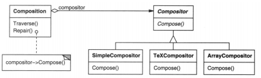
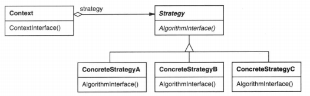

### 5.9 STRATEGY(策略)——对象行为型模式

例1：[策略](code/5.9策略/例1)

#### 1.意图

定义一系列的算法，把它们一个个封装起来，并且使它们可以相互替换。本模式使得算法可独立于使用它的客户而变化。

#### 2.别名

政策(Policy)

#### 3.动机

一个文本文档需要判断在何时换行，有许多算法可以完成这个任务。

为了可以动态替换我们想要使用的算法，必须将算法和文本文档类分开。即**把干什么(语境类如例1中的Composition)和怎么干(策略接口如例1中的Compositor)分开**，互不依赖。

如下图

#### 4.适用性

当存在以下情况时使用Strategy模式

* 许多相关的类仅仅是行为有异，"策略"提供了一种用多个行为中的一个行为来配置一个类的方法
* 需要使用一个算法的不同变体。
* 算法使用客户不应该知道的数据，(如Program中`_composition.Repair();`就没有暴露数据)
* 一个类定义了多种行为，并且这些行为在这个类中以多个条件语句的形式出现，将相关的条件分支移入各自的Strategy类中以代替这些条件语句。

#### 5.结构

#### 6.参与者

* Strategy(策略，如Compositor)

  定义所有支持的算法的公共接口。Context使用这个接口调用某ConcreteStrategy定义的算法。

* ConcreteStrategy(具体策略，如SimpleCompositor，TexCompositor)

  以Strategy接口实现某具体算法

* Context(上下文，如Composition)

  * 用一个ConcreteStrategy对象来配置。(即`new Composition(_compositor);`)
  * 维护一个对Strategy对象的引用。(`Composition._compositor`)
  * 可定义一个接口来让Strategy访问它的数据。(`Compositor.Compose(xxxx)`)

#### 7.协作

* Strategy和Context相互作用以实现选定的算法。当算法被调用时，Context可以将该算法所需要的所有数据都传递给该Strategy。或者，Context可以将自身作为一个参数传递给Strategy操作。这就让Strategy在需要时可以回调Context

  即

  * `_compositor.Compose(natural,stretchability,shrinkability,componentCount,_lineWidth,breaks);`
  * `_compositor.Compose(this)`

* Context将它的客户的请求转发给它的Strategy。客户通常创建并传递一个ConcreteStrategy对象给该Context。这样，客户仅与Context交互。通常由一系列的ConcreteStrategy类可供客户从中选择。

#### 8.效果

1. 相关算法系列 可供重用的算法或行为。

   继承有助于析取出这些算法中的公共功能。

   封装算法，抽象算法接口

2. 一个替代继承的方法 

   将方法的实现和使用分离了出来。使它易于切换、理解、扩展

3. 消除了一些条件语句

4. 实现的选择 

   权衡后选择合适的策略

5. 客户必须了解不同的Strategy 

   缺点，客户必须要知道每个具体策略并且做出选择。

6. Strategy和Context之间的通信开销

   无论各个ConcreteStrategy实现的算法是简单还是复杂，它们都共享Strategy定义的接口。因此很可能某些ConcreteStrategy不会用到所有信息。

7. 增加了对象的数目

   Strategy增加了一个应用中对象的数目。有时可以将Strategy实现为可供各Context共享的无状态的对象来减少这一开销。任何其余的状态都由Context维护。Context在每一次对Strategy对象的请求中都将这一状态传递过去。共享的Strategy不应在各层次调用之间维护状态

   参考[Flyweight(4.6)](4.6享元(Flyweight).md)

   其实就是相同具体策略使用同一个实例类。这样有几个具体策略该应用最多就只会出现几个策略实例类

   

#### 9.实现

1. 传递Context里的数据或者直接传递Context
   * `_compositor.Compose(natural,stretchability,shrinkability,componentCount,_lineWidth,breaks);`
   * `_compositor.Compose(this)`

2. 将Strategy作为模板参数

   类似`Composition _composition = new Composition<TeXCompositor>();`

3. 使Strategy对象成为可选的

   Context在访问某Strategy前先检查它是否存在，如果有，那么就使用它；如果没有，那么Context执行缺省行为。

#### 10.代码示例

例1：[策略](code/5.9策略/例1)

#### 12.相关模式

上面7.增加了对象的数目 中提到的享元模式[Flyweight(4.6)](4.6享元(Flyweight).md)

#### 13.总结

算法重用，和一些业务逻辑一样，将算法细分成小方法可以复用。

与[State5.8](5.8状态(State).md)模式的对比

* 策略的选择由Client完成且没有状态变迁
  State模式下的多种状态对客户来说是透明的，当对象的内部状态变迁，是由Context或状态自己。而不是由客户决定的（或者客户并不知情）
* 状态模式的状态间往往是具有耦合性的，而策略模式算法簇之间完全解耦。