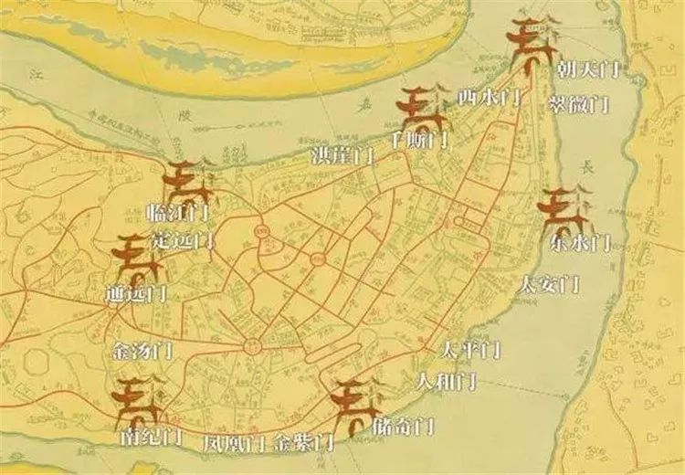

### 重庆城

文本内容来自《重庆老城》何智亚

对于为何选择重庆作为陪都，她说：“这与重庆特殊的地理位置有关，重庆四周环山，长江和嘉陵江环绕，易守难攻。尤其是长江三峡，是一个天然屏障，日本的陆军和海军始终没有攻入重庆。只有靠空袭。后来日军对重庆进行了长达五年的大轰炸，造成几十万平民死伤。”

明洪武四年（1371年），重庆府指挥使戴鼎在宋代旧城基础上大规模修筑石城，形成九开八闭十七道城门的格局。

十七道城门分别为朝天、东水、太平、储奇、金紫、南纪、通远、临江、千厮九道开门和翠微、金汤、人和、凤凰、太安、定远、洪崖、西水八道闭门。

如图：

命名：首先，不能与京城的城门相同或相似，例如宣武、崇文、朱雀、玄武之类是不能用的，否则就有僭越之嫌

我们从中可以体会到诸如天下太平、国泰民安、人寿年丰、平定安远、金城汤池、仓廩丰满、政通人和之类的意思。但是，诸如东水、西水、洪崖、临江、通远、南纪、凤凰、金紫又是实在的，反映了这些城门所在地方的某种特征或特性。

朝天门的取名具有政治意味，而诸如千厮、储奇、金紫这些个城门的取名又具有经济的意义。例如千厮门，很早以前就是重庆货物的集散地，被看作是重庆城的仓廪。又例如金紫门，据说金紫门城内一直是重庆的金库，藏有金子，以致金紫门被误传为金子门。

* “滔滔江汉，南国之纪”

* 千厮门则取自《诗经·小雅·甫田》：乃求千斯仓，乃求万斯箱，黍稷稻梁，农夫之庆。报以介福，万寿无疆。盖以当年城门内有贮存粮棉的千仓万仓而得名，是祈祷风调雨顺，丰收满仓之意，预祝农事丰收。
* 翠微门与涂山隔江相望，站在翠微门上，远望涂山，苍翠幽深，正是“翠微”之义

浑浊的江水与嘉陵江的清流在离朝天门沙嘴约4公里的地方相汇。

1926年至1927年初，潘文华发起筹办自来水厂。重庆自来水厂开建后，挑水工唯恐影响生计，还举行集会抗议。

抗日战争爆发后，国民政府西迁重庆，大量机关、学校、工厂、银行、研究单位和职员、家属搬迁重庆。原设于南京的各国外交机构也迁往重庆，重庆由一个西部区域性商业城市，一跃而成为抗战大后方的政治中心、军事指挥中心和经济、金融中心。

1938年2月到1943年8月，日军对战时首都重庆进行了长达五年半的大轰炸，企图摧毁中国人民的抗战意志。

1946年4月30日，国民政府颁布还都南京令。
1950年2月22日，西南军区在重庆正式成立。

#### 朝天门：

古时朝天门为地方官员恭迎皇上圣旨和钦差大臣之地，邻近朝天门有接圣街（今信义街）

1949年，朝天门地区发生的“九·二”火灾是重庆城损失最大，人员伤亡最多的特大火灾之一。1949年9月2日下午3时40分左右，下半城赣江街17号协合油腊铺不慎失火，火势迅猛蔓延，东水门至朝天门、陕西街至千厮门一带顿成一片火海，至次日晨大火方才熄灭。据市警察局调查，这次火灾共烧毁大小街巷39条，学校7所、机关10处、银行钱庄33家、仓库22所，拆卸房屋236户，受灾9601户、41425人，有户口可查的死者2568人，掩埋尸体2874具，伤4000余人。

#### 洪崖洞：

城西雉堞下有洞曰洪崖，复以巨石，其下嵌空，飞瀑时至，亦名滴水崖。有元丰时苏轼、任仲仪、黄庭坚题刻

洪岩洞岩坡绿树成荫、野花遍地，大雨之后苍翠欲滴，时有瀑布飞流而下，故称“洪岩滴翠”，被列为巴渝十二景之一。清乾隆《巴县志》对“洪岩滴翠”有如下描述：

“洪崖洞在洪崖厢，悬城石壁千仞。洞可容数百人，上刻‘洪崖洞’三大篆字，诗数章漫灭不可读。城内诸水逾堞，抹崖额而下。夏秋如瀑布，冬春溜滴，汇为小池入江，石苔叠翠，池水翻澜，夕阳反照，五色陆离，莫可名状。至若渔舟唱晚，响达崖音，又空色之别趣也。”

#### 中央公园(人民公园)：

郭沫若、茅盾、巴金等社会名流经常在中央公园的茶楼聚会交流，著名音乐家冼星海曾在中央公园举行音乐会。

1929年8月完工，公园建成之初，入内要收取铜钱100文，后因老百姓反对，并写顺口溜在报上讽刺而取消收费。

#### 重庆市消防人员殉职纪念碑

位于人民公园内。1938年2月到1943年8月，日军对战时首都重庆进行了长达五年半的大轰炸，企图摧毁中国人民的抗战意志。当时消防人员本着服务精神，奋不顾身，宵旰竭力抢救，或被弹炸死，或塌房伤亡，罹难长员计八十一员。

#### 火麻巷

因清代此处有堆放火麻的行栈而得名。

该种茎皮纤维长而坚韧，可用以织麻布或纺线，制绳索，编织渔网和造纸。种子榨油，含油量30%，可供做油漆，涂料等，油渣可作饲料。果实中医称“火麻仁”或“大麻仁”入药，性平，味甘，功能：润肠，主治大便燥结。花称“麻勃”，主治恶风，经闭，健忘。

#### 白象街

白象街位于重庆城的下半城，街长约500米，宽约10米。此街在清初建有白象池，故而得名。又有一说：据传此地有白色石象与南岸狮子山相对，有“青狮白象锁大江”之说，也是重庆最早的富人区之一

#### 解放西路

台湾亲民党主席宋楚瑜童年时曾在解放西路172号居住生活过。

#### 十八梯

十八梯中段有一处防空洞洞口，从洞口进入洞底后，平伸约2000米，中间分叉形成2个出口，一个出口通较场口磁器街（劳动电影院对面），另一个出口在石灰市（较场口转盘与新民街相连的一条巷子，后作自由市场）。隧道高宽各2米左右，每隔三四十米点上一盏油灯，无通风、防火、防毒、医疗等设施，最多能容纳约5000人。1941年6月5日晚，日机20余架分批空袭重庆，上万市民拥进防空洞躲避。由于天气炎热，人多拥挤，隧道内空气极差，市民因窒息挤压死伤近4000人（其中死亡992人），造成震惊全国的较场口“六·五”大隧道惨案。第二天清理现场，十八梯洞口和梯道上横七竖八铺满了死者的尸体，其状惨不忍睹。1945年9月5日，重庆市政府公布重庆大轰炸死伤初步统计数：死亡6569人，伤9141人，大隧道窒息死亡确切人数当时未予公布。

#### 较场口

1946年2月10日，在较场口广场召开“陪都各界庆祝政治协商会议成功大会”，大会由23个社会群众团体组织发起，计有政协陪都各界协进会、民主建国会、中国劳动协会、全国邮务总工会、中国经济事业协进会、中国农业协会、中国妇女联谊会、东北文化协会、社会大学、育才学校、重庆青年会三民主义同志联合会、中国职业青年会、中国木刻协会等。大会推举沈钧儒、郭沫若、马寅初、李公朴、施复亮、章乃器、陶行知、李德全等20余人组成大会主席团。当天大会正待举行之时，遭到大批暴徒的冲击破坏，章乃器、马寅初、郭沫若、李公朴、施复亮等著名人士被打，造成震惊中外的“较场口事件”。

#### 官井巷

官井巷民办工业中学名气很大，学校实行半工半读，建有供学生实习的小工厂。在1958年大放“卫星”的浪潮中，该校曾雄心勃勃地提出要将学校办成从小学到大学的一条龙。

#### 五四路

原名蹇家桥、鸡街，“五四路”得名于抗战时期。1939年5月3日、4日，日军出动数十架飞机对重庆城区进行大规模轰炸，给山城人民造成巨大损失和灾难，史称“五三、五四大轰炸”。

#### 大韩民国临时政府旧址

大韩民国临时政府于1919年4月13日在上海成立，曾得到孙中山的支持。之后，全国各地相继成立了中韩互助会、中韩协会等组织，声援韩国独立运动。毛泽东、何叔衡当时就是长沙中韩互助会的主要成员，分别担任通讯主任和宣传主任。1932年4月29日，迫于日军压力，韩国临时政府离开上海，经杭州、嘉兴、镇江、长沙、广州、柳州等地，在各地租房临时办公。

1938年春，韩国临时政府辗转来到重庆，初在重庆綦江沱湾镇，后迁巴县土桥办公。1940年临时政府进驻重庆城内，先后在杨柳街、石板坡、吴师爷巷办公，1945年1月迁到七星岗莲花池38号办公。莲花池正街38号是大韩民国临时政府办公条件最好的一处，也是临时政府在中国辗转流离26年最后一处办公地。自1945年1月搬入办公至临时政府成员离渝回国，在此时间不到一年。抗战胜利后，1945年11月5日，韩国临时政府29人乘专机经上海回国。

### 江北城

殷周时代，江北城即成为巴人聚居地之一。巴郡、江州最早的治所曾设于江北城，据今已有2300余年历史。公元前316年秦灭巴后，秦将张仪于公元前314年在现渝中半岛和对岸的江北嘴一带修筑江州土城，当时的市井中心应在今渝中半岛小什字与朝天门之间，也就是后世所称的“南城”。

嘉庆二年（1797年），川、陕、鄂三省爆发白莲教起义。白莲教义军由河南、陕西入川，经达县抵达离江北城仅30里的鸳鸯桥驻扎。3个月后，义军奔长寿而去。为防义军卷土重来，嘉庆三年（1798年），江北同知署同知李在文组织乡绅士民捐款，修筑周长5华里的土城墙，开设**嘉陵、镇安、问津、岷江**4个城门，史称“嘉庆四门土城”。

道光十三年（1833年），新任同知高学濂发动绅商集资万金，从巴县请来通晓工程的黄云衢主持改建城垣，将土城改筑为石城。后高学濂调任新职，工程中断。继任同知满洲正白旗人福珠朗阿上任后，又再次张贴告示，劝谕乡绅富商捐助重新修筑城门。福珠朗阿率先捐银一千两，共集资白银三万八千五百余两。工程历时19个月，于道光十五年（1835年）三月建成**文星、问津、镇安、保定、金沙、汇川、觐阳、东升**八门江北石城。城墙长1011丈（合3370米），高三丈（合10米），各门均用条石券拱，券拱空高一丈三四至一丈六七不等，城门进深因地形而异，最浅一丈，最深二丈。各道城门拱顶之上筑城楼一座。镇安门至文星门之间的宝盖山弋阳观设4座炮台。城墙上筑有堞垛，又称“女墙”，以备战时防御射击之用。各道城门上建有城楼，供驻军观察、守备之用。此次筑城，史称“**道光八门石城**”。八门石城建成后，福珠朗阿用“同知福润田”之名作序，立碑于问津门外。辛亥革命推翻满清朝廷后，因福珠朗阿是满人，此碑被民众打断。抗战时期，残碑下半截还弃于路旁。

咸丰十年（1860年），江北厅新任同知符葆巡视江北城垣之后，感到西北方向防守薄弱，遂筹资重新修筑外城墙，增建嘉陵、永平二门。二门修建后，与正西的镇安门之间形成一处新的区域，称为“江北新城”，符葆把同知署迁至新城。至此，江北城共建有10个城门，分别是：**保定门、觐阳门、汇川门、东升门、问津门、文星门、金沙门、镇安门、永平门、嘉陵门**，城垣围合面积近1平方公里，史称“**咸丰十门石城**”。

* 问津门：问津门名称来源系因城门外有一渡口，古名大江津渡，有停靠渔船的打渔湾，故取千家诗中“渔人来问津”

#### 弹子石正街

弹子石名称来源于长江边有三块岩石上顶着一巨石，形似“弹子”，故而得名。

1926年夏，“弹子”被雷击毁。亦有传说为“诞子石”。相传大禹娶**涂山**氏为妻后离家治水，三过家门而不入。涂山氏在长江边等候夫君归来，天长日久，变成一块石头。大禹治水归来，见妻子已变为石头，遂抱着石头哭喊涂山氏之名，石头突然裂开，迸出一个婴儿，这个婴儿后来成为夏的君王“启”。久之，人们把“诞子石”叫为弹子石。