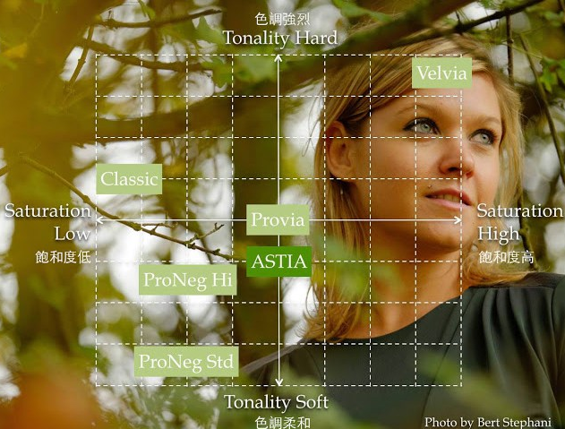

富士公司光學電子影像產品部門及研發中心部門

#### 胶片模式

富士最大的特色**“胶片模式”**，必须选择一种胶片模式，富士的"归零直出"一般指的是PROVIA胶片模式

#### 人像摄影：

* PRO Neg.STD

  橙光、现场元素和姿势都是最佳化的场景而设计

* PRO Neg.Hi

  只有简易橙光配置且主体移动的场景设计

* ASTIA

  橙光不足，甚至在没有光源的场景下，针对移动中的主题所使用。

  只比PROVIA柔和一些。肤色部分

  阴暗处增加了对比，使照片看起来更为锐利。

  

  

* Classic Chrome

  色调表现，相对明暗程度，诉说故事

* Velvia

  色彩表现。特殊高飽和度的顏色，情感丰富

**黄镜：**由于黄色是红色和绿色光混合而成，所以除黄色被大幅提亮外，红色和绿色也有一定提亮，蓝色则被压暗，很适合提高画面反差并压暗天空。

**红镜：**只接收了红色光，红色被大幅提亮，黄色也有一定程度提亮，蓝色的压暗程度比黄镜更重，从而得到了比黄镜更强的反差和更暗的天空。

 **绿镜：**只接收绿色光，绿色被大幅提亮，黄色有一定程度的提亮，红色被严重压暗。机内的菜单说明是绿镜适合表现肤色，但是在黑白摄影中，黄镜才是一直被认为最适合表现肤色的滤镜

**DR**功能抑制高光溢出的效果很明显，但是对于暗部细节几乎没有帮助。所以DR功能应该主要在容易高光溢出的场景下使用，如果要在暗光下增加暗部细节，不如把阴影的对比度调低一些。

