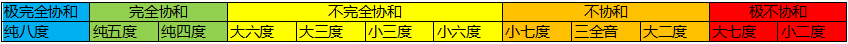
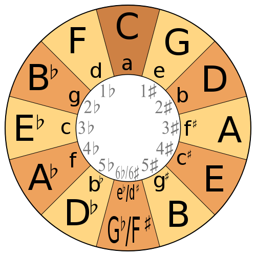
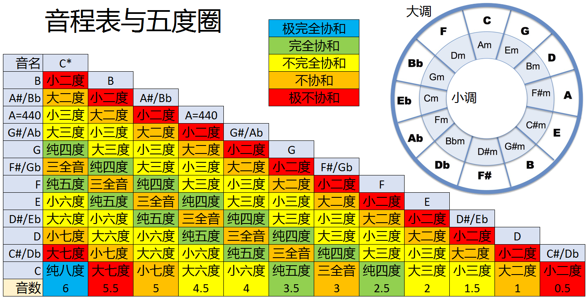

参考：https://www.cnblogs.com/devymex/p/3385179.html

| 相差音数 | 0.5        | 1          | 1.5        | 2          | 2.5        | 3          | 3.5        | 4          | 4.5        | 5          | 5.5        | 6          |
| -------- | ---------- | ---------- | ---------- | ---------- | ---------- | ---------- | ---------- | ---------- | ---------- | ---------- | ---------- | ---------- |
| 音程名称 | **小二度** | **大二度** | **小三度** | **大三度** | **纯四度** | **三全音** | **纯五度** | **小六度** | **大六度** | **小七度** | **大七度** | **纯八度** |

| 音程   | 近似频率比 | 近似整数比 | 最小公倍数 |
| ------ | ---------- | ---------- | ---------- |
| 小二度 | 1:1.06     | 15:16      | 240        |
| 大二度 | 1:1.12     | 8:9        | 72         |
| 小三度 | 1:1.19     | 5:6        | 30         |
| 大三度 | 1:1.26     | 4:5        | 20         |
| 纯四度 | 1:1.34     | 3:4        | 12         |
| 三全音 | 1:1.41     | 7:10       | 70         |
| 纯五度 | 1:1.50     | 2:3        | 6          |
| 小六度 | 1:1.59     | 5:8        | 40         |
| 大六度 | 1:1.68     | 3:5        | 15         |
| 小七度 | 1:1.78     | 5:9        | 45         |
| 大七度 | 1:1.89     | 8:15       | 120        |
| 纯八度 | 1:2        | 1:2        | 2          |

### 1.三和弦

分为大三和弦、小三和弦、增三和弦和减三和弦

| 名称     | [n1,n2] | [n1,n3] |
| -------- | ------- | ------- |
| 大三和弦 | 大三度  | 纯五度  |
| 小三和弦 | 小三度  | 纯五度  |
| 增三和弦 | 大三度  | 增五度  |
| 减三和弦 | 小三度  | 减五度  |

### 2.调式

**主音、上主音、中音、下属音、属音、下中音和下主音**

#### 2.1 自然大调

全全半全全全半

如 降E大调 `<Eb、F、G、Ab、Bb、C、D>`

#### 2.2 自然小调

全半全全半全全

如 c小调`<C、D、Eb、F、G、Ab、Bb>`

### 3. 工尺谱

上、尺、工、凡、六、五、乙，大

### 4.  调性

五度圈

上午11点，猫饿了，所以**F**at **C**at **G**o **D**own **A**nd **E**at **B**read； 

到下午6点猫又饿了，再次**G**o **D**own **A**nd **E**at **B**read

**小大小大纯三纯，小大小大纯**