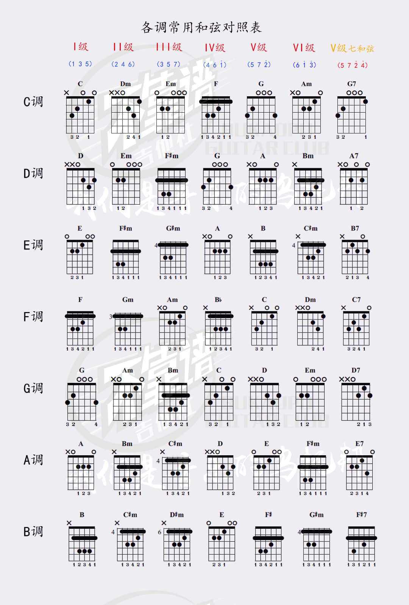

I，II，III，IV，V，VI，VII，VIII，IX，X，XI，XII

i，ii，iii，iv，v，vi，vii，viii，ix，x，xi，xii

|                              级                              |                    中文名称                    |     英文名称      |                            意思                            | C自然大调中的例子 | c和声小调中的例子 |
| :----------------------------------------------------------: | :--------------------------------------------: | :---------------: | :--------------------------------------------------------: | :---------------: | :---------------: |
| /Ⅰ |   [主音](https://zh.wikipedia.org/wiki/主音)   |       Tonic       | [音阶](https://zh.wikipedia.org/wiki/音階)中最**主**要的音 |         C         |         C         |
| /Ⅱ | [上主音](https://zh.wikipedia.org/wiki/上主音) |    Supertonic     |                          主音之上                          |         D         |         D         |
| /Ⅲ |   [中音](https://zh.wikipedia.org/wiki/中音)   |      Mediant      |                    主音与属音的**中**间                    |         E         |        ♭E         |
| /Ⅳ | [下属音](https://zh.wikipedia.org/wiki/下屬音) |    Subdominant    |                          属音之下                          |         F         |         F         |
| /Ⅴ |   [属音](https://zh.wikipedia.org/wiki/屬音)   |     Dominant      |                        第二重要的音                        |         G         |         G         |
| /Ⅵ | [下中音](https://zh.wikipedia.org/wiki/下中音) |    Submediant     |                     主音和下属音的中间                     |         A         |        ♭A         |
| /Ⅶ |   [导音](https://zh.wikipedia.org/wiki/導音)   | Leading tone/note |                        导向主音的音                        |         B         |         B         |

xx和弦

主和弦：C调中就是$I$即C和弦

下属和弦：C调中就是$VI$和弦即F和弦

### 1.万能和弦

#### 1.1 

* 1-6-4-5

  在C大调调是： C—Am—F—G
  放到G大调是：G—Em—C—D

#### 1.2 卡农和弦(15634145)

* 15634145

* 15634345

#### 1.3 四级和弦开头的歌

* 4536251

### 2.编配逻辑

#### 1.决定调性

判断大调小调

#### 2.初配

1. 歌曲开头和结尾配上 和弦， 大调为C，小调为Am  C大调的关系小调是A小调
2. 结尾前一小节一般配属和弦或属七和弦。 大调为G 或G7，小调为Em或 E7
3. 属七和弦前如合适的话，最好配 下属和弦。大调为F ，小调为Dm
4. 明显倾向某和弦的小节配上该和弦：
   1. 小节中的音均为某和弦内音；
   2. 小节中强拍上的音决定和弦；
   3. 小节中时值较长的音决定和弦；
   4. 小节中反复出现的音决定和弦；
   5. 小节中被装饰的音决定和弦；

#### 3.修缮

1. 一级和弦，即主和弦C ，是唯一具有决定性和控制性的和弦，所以常用于开头和结尾。
2. 二级和弦Dm、D7、Dm7，由于音色接近G7和弦，所以可作G7的先行和弦，使和弦进行地更圆滑。
3. 三级和弦E 、Em是较弱的一种和弦，它通常在一级和弦所占小节太多时用来作一级和弦的代理和弦。
4. 四级和弦F建立在音阶第四度音上，它使和弦音色富于变化，被用来联接主和弦及属和弦。
5. 五级和弦G 、G7有强烈地向主和弦拢的性质，故又称之为导和弦。
6. 六级和弦Am的音色介于一级与四级之间，可用来代理这两种和弦或用来连接两者.

#### 4.和弦其它连接规律

(1)C ---C7---F 

(2) F ---Fm---C 

(3) Em---A7---Dm/D7 

(4) Dm/Am---Dm7---Dm6

(5) Am7---Am6 

(6) Cdim---C7 

(7) C ---Cmaj---C7 

(8) C7---Cdim 

(9) C ---Cang

#### 5.歌曲结束式和弦配法

1、大调式

* (1)C ---Cmaj7 

* (2)C ---Fm---C

* (3)C ---bA---C

* (4)C ---bE---C

2、小调式

* (1)Am---Dm6 
* (2)Am---A
* 

方法1:在旋律中找出关系为五度的两个音。如果有，就在这两个音中分辨出主音和属音。该小节的和弦就以找出的主音为根音。比如旋律中含有3和7，它们是主属关系，3是主音，所以这一小节应该使用Ⅲ级和弦。（这种方法是将旋律中的其中两个音分别当做了和弦的根音和五音）

方法2：寻找是否存在七度关系的两个音，其实七度和二度是一样的，两音是纯七度关系就意味着它们也是小二度关系；两音是减七度关系就意味着它们也是大二度关系。1和2，2和3，3和4，4和5，5和6，6和7，7和1，我们让二度音关系的后者(也是七度音关系的前者)做和弦的根音，选取的和弦为七和弦。比如旋律中含有3和4，那就以4为根音，选用Ⅳ级的大七和弦。再比如如果旋律中含有2和3，那么就以3为根音，选择Ⅲ级的小七和弦。（这种方法是将旋律中找到的两个音分别当做和弦的根音和七音）

方法3:寻找是否有存在三度关系的两个音，即寻找在音阶中只相隔一个音的两个音：1和3，2和4，3和5，4和6，5和7，6和1，7和2。如果有，那么以前一个音为根音。比如旋律中含有7和5，那么就以5为根音选择Ⅴ级和弦。（这种方法是将旋律中找到的两个音分别当做了和弦的根音和三音）

方法4：如果该小节中的旋律只有一个音，最笨的方法就是把所有含有该音的和弦找出来依依试一遍。比如旋律只有一个2，那么Ⅱ级、Ⅴ级、Ⅶ级和弦都可以试试，因为它们都含2这个音。

然后，拿起吉他，以简单的C调简单地试一下这些和弦是否适合，最后我们发现：方法1找出的和弦要优于方法2找出的和弦，方法2找出的和弦要优于方法3找出的和弦。

善用音阶上下行来连接和弦

属音往主音走

从三音半音上行到四音”和“从五音半音下行到四音

